# FORMULA 1 AERODYNAMICS
## A Technical Study Guide & Handbook

**From fluid mechanics to CFD-driven development — a structured reference for an engineering student**

*Constructed September 2026 from verified public sources (FIA regulations, peer-reviewed literature, canonical textbooks, reputable technical press). Claims are tiered: verified / engineering inference / estimate — see the Engineering Audit (Part XVIII).*

**Level markers:** 🟢 FOUNDATION · 🟡 ENGINEERING · 🔴 AERODYNAMIC DEVELOPMENT

**How to use this handbook:** each part opens with purpose and course-connection lines; worked problems end with a mandatory *engineering interpretation*; quick-recall sections are for spaced repetition; misconception boxes correct the folklore. The single-file edition concatenates all parts — the folder edition (README.md + part files + diagrams/) is the same content for chapter-by-chapter study.

---

## CONTENTS

- PART I — Fluid Mechanics Foundations
- PART II — Aerodynamics Fundamentals
- PART III — From Aircraft Aerodynamics to Race-Car Aerodynamics
- PART IV — F1 Aerodynamic Architecture
- PART V — Ground Effect
- PART VI — Vortices and Flow Structures
- PART VII — Wings and Downforce
- PART VIII — Drag
- PART IX — Tyres, Wheels and Wakes
- PART X — Aero Balance
- PART XI — Wind Tunnel
- PART XII — CFD Fundamentals
- PART XIII — CFD for F1
- PART XIV — Reading CFD Results
- PART XV — F1 Aerodynamic Development
- PART XVI — Aerodynamics Knowledge Map
- PART XVII — Final Engineering Checklist
- PART XVIII — Engineering Audit
- Appendix A — Notation and Units
- Appendix B — Formula Sheet
- Bibliography

---

# PART I — Fluid Mechanics Foundations

**Purpose:** build the physical vocabulary every later part depends on. Nothing here is optional: "ground effect" (Part V) is continuity plus a pressure field; "porpoising" (Part V) is an aerodynamic instability read through suspension; "y+" (Part XII) is boundary-layer scaling. Master this part and the rest of the handbook reads like application.

**Course connection:** this material corresponds to the opening modules of any aerodynamics course — canonical anchors are Anderson, *Fundamentals of Aerodynamics*, ch. 1–3, and any introductory fluid-mechanics text (continuity, Bernoulli, Reynolds number). Mark the module numbers here when you reach them: ____________

---

## 1.1 What is a fluid? 🟢

A **fluid** is any substance that flows — it deforms continuously under an applied shear stress, no matter how small. Liquids and gases are both fluids; air is a compressible fluid whose behaviour at F1 speeds is *almost* incompressible (§1.6).

**TERM — Fluid**
- **Simple:** anything that flows and takes the shape of its container.
- **Technical:** a continuum that deforms continuously under shear stress; characterised by density, pressure, temperature, viscosity.
- **F1 relevance:** the working "material" of the entire sport. Every component on the car is shaped to do something to this material.

**Why the continuum idea matters.** We treat air as a continuous medium even though it is molecules. That is valid when the object's length scale is much larger than the molecular mean free path (~70 nm at sea level) — trivially true for a race car. It is what allows us to define fields (velocity, pressure, density) at every point in space, which is exactly what CFD (Part XII) computes.

**ENGINEERING INTUITION**
> If you remember only one thing: aerodynamics is the management of a continuous fluid — everything an F1 car does is done *to air*, using geometry.

---

## 1.2 Density 🟢

**Definition:** mass per unit volume, $\rho = m/V$. **Units:** kg/m³.

| Condition | ρ (kg/m³) |
|---|---|
| ISA sea level, 15 °C, 101.325 kPa | **1.225** |
| Hot track day, ~35 °C sea level | ~1.15 |
| Mexico City (~2,200 m altitude) | ~0.98–1.00 |

Density enters every force: from $F = \tfrac12 \rho V^2 C A$, aerodynamic force scales *linearly* with density.

**F1 application:** Mexico City's altitude costs both engine power (less oxygen) and aerodynamic load (less dense air). Teams run maximum-downforce packages there and still corner slower than the wing levels suggest — the air itself is "thinner". Approximately 1% density change ≈ 1% downforce change at fixed speed (direct from the force equation).

**ENGINEERING INTUITION**
> Air is the working fluid AND the load-bearing structure. Half the reason setups differ between circuits is simply how much air there is per cubic metre that day.

---

## 1.3 Pressure 🟢

**Definition:** normal force per unit area, $p = F/A_\perp$. **Units:** Pa = N/m² (1 bar = 10⁵ Pa).

A fluid exerts pressure on every surface it touches, always *normal* to that surface. This single fact is the origin of **all** aerodynamic force: integrate the pressure over the car's surface and you have the pressure part of the aerodynamic force (Part II). The remaining part is skin friction, which is orders of magnitude smaller on most of the car — but decisive for how the pressure field develops (boundary layers, §1.5 and Part II).

**Static vs stagnation (total) vs dynamic pressure** — three names you must keep separate:

- **Static pressure $p$:** what a pressure gauge moving *with* the flow would feel; the random molecular "push" of the fluid.
- **Dynamic pressure $q$:** the kinetic energy per unit volume of the flow, $q = \tfrac12 \rho V^2$. It is the *currency* of aerodynamic force.
- **Stagnation (total) pressure $p_0$:** the static pressure the flow would reach if brought isentropically to rest: $p_0 = p + q$.

**F1 application:** pitot-static probes measure $p$ and $p_0$ to give airspeed. Surface pressure taps and pressure-sensitive paint map $p$ on wings. The whole of downforce generation is a *redistribution of static pressure* over the car's surfaces, paid for out of dynamic pressure.

---

## 1.4 Temperature 🟢

**Definition:** measure of molecular kinetic energy. **Units:** K (use Kelvin in every formula).

Through the ideal gas law $p = \rho R T$ (with $R_{air} = 287$ J/(kg·K)), temperature sets density at a given pressure: hot air is less dense, cold air denser. Temperature also raises viscosity (Sutherland's law: $\mu \propto T^{1.5}/(T+110.4)$), which slightly changes Reynolds numbers (§1.9).

**F1 application:** a hot afternoon moves $\rho$, $\mu$, and the boundary-layer behaviour simultaneously. This is one reason "track temperature" correlates with setup and why identical wing levels produce different speeds at the same circuit across a weekend. Approximately: 10 K of air-temperature rise at constant pressure costs ~3% density (engineering inference from the ideal gas law).

---

## 1.5 Viscosity 🟢

**TERM — Viscosity**
- **Simple:** the fluid's internal "stickiness" — its resistance to shearing.
- **Technical:** dynamic viscosity $\mu$ [Pa·s] relates shear stress to velocity gradient: $\tau = \mu \, du/dy$. Kinematic viscosity $\nu = \mu/\rho$ [m²/s].
- **F1 relevance:** without viscosity there is no boundary layer (Part II), no separation, no wheel wake, no vortex roll-up with well-defined cores — and also no lift-generating pressure fields as we know them. Viscosity is tiny in its magnitude and enormous in its consequences.

For air at 15 °C: $\mu \approx 1.79\times10^{-5}$ Pa·s, $\nu \approx 1.46\times10^{-5}$ m²/s.

**The no-slip condition:** at a solid surface the fluid sticks — velocity equals the wall's velocity (zero for a static wall). Every velocity profile you will ever see in a boundary layer starts from this condition. On a rotating wheel (Part IX) the *wall itself moves*, which is why wheel aerodynamics is its own discipline.

**ENGINEERING INTUITION**
> Viscosity is the tax collector of aerodynamics: it takes momentum away from the flow near surfaces and converts orderly kinetic energy into heat and turbulence. Almost every "bad" thing that happens to an F1 car (separation, stall, dirty air) is a downstream consequence of the tax.

---

## 1.6 Compressibility and the Mach number 🟢

**Mach number** $Ma = V/a$, where $a = \sqrt{\gamma R T}$ is the speed of sound (≈ 340 m/s at 15 °C, $\gamma = 1.4$).

Below roughly $Ma \approx 0.3$, density changes in the flow are small (order $Ma^2/2$: about 4.5% at Ma = 0.3) and the incompressible assumption is acceptable.

**F1 application:** a car at 330 km/h has $Ma_\infty \approx 0.27$ — F1 is a low-Mach problem in the free stream. Local accelerations (wing suction peaks, venturi throats) push local Mach somewhat higher, but Formula 1 aerodynamics is fundamentally an **incompressible** subject. Contrast this with propellers, or with the 2026-era power units' compressor side, where compressibility dominates. Keep the term "compressibility effects" out of your F1 explanations unless you are talking about local flow detail — it is almost never the mechanism you think it is.

---

## 1.7 Conservation laws: mass, momentum, energy 🟢→🟡

All of fluid mechanics, and all of CFD, is three conservation statements applied to a control volume:

**Mass (continuity).** Mass is neither created nor destroyed. For incompressible flow:

$$\nabla \cdot \vec{V} = 0 \qquad \text{(3-D form)}, \qquad A_1 V_1 = A_2 V_2 \qquad \text{(1-D streamtube form)}$$

| Variable | Meaning | Units |
|---|---|---|
| $A$ | cross-sectional area of the streamtube | m² |
| $V$ | mean velocity through that area | m/s |

*Meaning:* if the tube narrows, the flow must speed up — velocity is not a free parameter, it is a *consequence* of geometry and mass conservation.
*Assumptions:* incompressible, steady, single inlet/outlet for the 1-D form.
*F1 application:* the 2022+ floor **venturi tunnels** (Part V) are a designed streamtube: ramp and roof geometry squeeze the area, the flow accelerates, the static pressure drops, the floor is pushed down. Sidepod inlets, cooling ducts and brake ducts obey the same law.

**Momentum.** Newton's second law for a control volume: the sum of forces (pressure + viscous + body) equals the net flux of momentum out of the volume. Two uses you must internalise:

1. *Integral form* — you can compute the force on a body by surrounding it with a control volume and measuring momentum change at the boundaries. This is how wake surveys and aero rakes (Parts IX, XI) measure drag without touching the car.
2. *Differential form* — the **Navier–Stokes equations** (written out and dissected in Part XII) are the momentum statement made local. CFD solves exactly this.

**Energy.** Energy is conserved; for flowing air it trades between kinetic energy, pressure work, and heat (via viscosity and turbulence). No moving surface does work on the air except through moving walls (rotating wheels, the ground belt) — the car's engine pays for every joule the air carries away.

---

## 1.8 The Bernoulli equation 🟢 (and how not to misuse it)

For steady, incompressible, inviscid flow **along a single streamline** (or across a boundary layer where viscous effects are negligible):

$$p + \tfrac12 \rho V^2 + \rho g z = \text{constant}$$

| Variable | Meaning | Units |
|---|---|---|
| $p$ | static pressure | Pa |
| $\tfrac12\rho V^2$ | dynamic pressure $q$ | Pa |
| $\rho g z$ | hydrostatic head (negligible for air at car scale) | Pa |

**Physical meaning:** it is an energy statement. Along the streamline, pressure energy and kinetic energy convert into each other with no losses. Where the flow accelerates, static pressure *must* fall; where it decelerates, static pressure *must* rise.

**Assumptions — and they are strict:** steady, incompressible, **inviscid along that streamline**, no shaft work, no heat addition. Cross a wake, a separation region, or a shock, and Bernoulli's constant changes. This is why the total pressure in a tyre's wake (Part IX) is *lower* than the free stream: viscosity destroyed mechanical energy into heat.

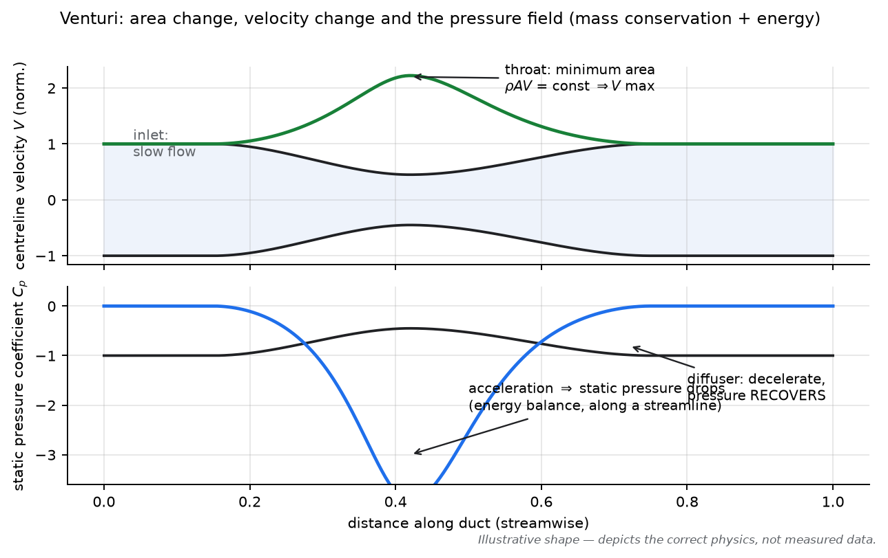
*Figure 1.1 — A venturi is mass conservation (top) and the energy/pressure relationship (bottom) working together. The F1 floor tunnel is this device, inverted and run under a moving car.*

**COMMON MISCONCEPTIONS**
> ❌ **"Bernoulli explains lift."** Incomplete. Bernoulli is a *bookkeeping relation* between velocity and pressure along a streamline — it says nothing about *why* the velocity field has the shape it does. The causal chain is: body geometry + flow constraints → streamline curvature and momentum change → pressure field → (and only then) you may use Bernoulli to relate that pressure to local speed. Lift is caused by the fluid being *deflected* — a momentum change — and the pressure field that goes with it (Part II).
>
> ❌ **"Fast air has low pressure because of Bernoulli."** Reversed logic. The pressure gradient is set by the flow's momentum balance (curvature, deflection); the speed change accompanies it. Bernoulli is the accounting identity, not the mechanism.
>
> ✅ **Correct use in F1:** quantitative bookkeeping between known states — e.g., estimating the static pressure drop along the floor throat from the velocity ratio.

**ENGINEERING INTUITION**
> If you remember only one thing: Bernoulli tells you what pressure goes with a velocity; it does not tell you why the velocity is there. The *why* is always geometry + conservation of momentum.

---

## 1.9 Reynolds number 🟢→🟡 (the master parameter)

$$Re = \frac{\rho V L}{\mu} = \frac{V L}{\nu}$$

| Variable | Meaning | Units |
|---|---|---|
| $V$ | characteristic velocity | m/s |
| $L$ | characteristic length (chord, car length…) | m |
| $\nu$ | kinematic viscosity | m²/s |

**Meaning:** the ratio of inertial to viscous forces. Two flows with the same $Re$ (and the same geometry and Mach) are dynamically similar — this is the entire theoretical basis of scale-model testing (Part XI) and of mesh/y⁺ reasoning in CFD (Part XII).

**F1 numbers (order of magnitude, engineering inference from public geometry):**
- Front-wing element, chord ~0.2–0.3 m at 80 m/s: $Re \approx 1.1$–$1.6\times10^6$.
- Full car at 80 m/s, length ~5.5 m: $Re \approx 3\times10^7$.
- A 50%-scale wind-tunnel model at ~40 m/s: $Re$ roughly an order of magnitude lower than full scale — small enough to matter for laminar/turbulent behaviour, handled with transition trips and experience (Part XI).

**Why it matters:** $Re$ sets where boundary layers transition from laminar to turbulent, how thick they are, where they separate, and hence lift, drag, stall behaviour and wake structure. A wing at $Re = 10^5$ is a *different aero device* from the same wing at $10^6$.

---

## 1.10 Streamlines and flow fields 🟢

- A **flow field** is the vector field $\vec{V}(x,y,z,t)$ of fluid velocity — the complete state of the air.
- A **streamline** is the instantaneous line everywhere tangent to $\vec{V}$. In steady flow, streamlines are the paths fluid particles follow. In unsteady flow they are not — a distinction CFD post-processing constantly abuses (Part XIV).
- A **streamtube** is a bundle of streamlines; the 1-D continuity law applies to it.
- **Pathlines / streaklines:** actual particle trajectories / smoke trails. Smoke wand tests visualise streaklines.

**F1 application:** "flow field" is the mental object every aerodynamicist carries: pressure maps, velocity slices, streamlines and vortices are all views of the same underlying $\vec{V}(x,y,z)$ and $p(x,y,z)$. Getting fluent at mentally switching between these views is most of "learning to read CFD" (Part XIV).

---

## 1.11 Laminar vs turbulent flow 🟢→🟡

At low $Re$ flows are **laminar**: fluid moves in smooth sheets, mixing only by molecular diffusion. Above a critical $Re$ (with disturbance amplitude, surface roughness and free-stream turbulence all involved) flow becomes **turbulent**: superimposed chaotic, three-dimensional fluctuations that transport momentum violently.

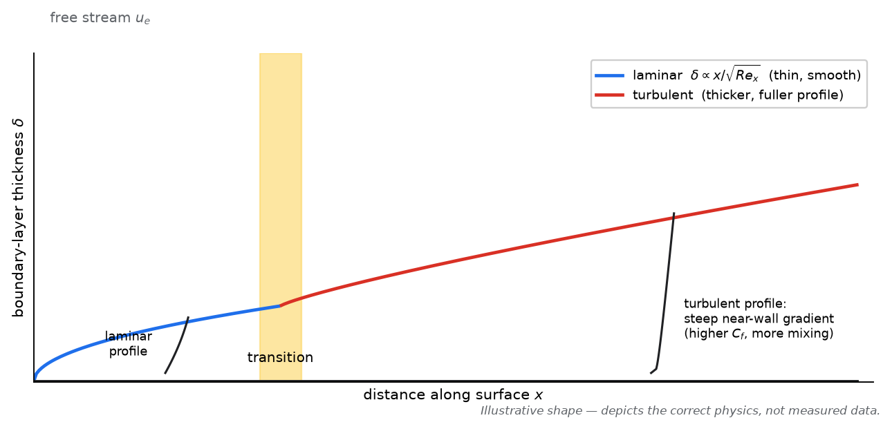
*Figure 1.2 — Laminar layers are thin and orderly; turbulent layers are thicker, fuller, and mix far more. Both properties matter: skin friction is higher in turbulent flow, but resistance to separation is also higher.*

Key consequences to hold simultaneously in mind:

| Property | Laminar | Turbulent |
|---|---|---|
| Skin friction (same $Re$) | lower | **higher** |
| Mixing / momentum transport | weak | **strong** |
| Resistance to adverse pressure gradients | poor | **better** |
| Separation behaviour | separates earlier | separates later |
| Predictability in CFD | exact equations suffice | requires turbulence modelling (Part XII) |

**F1 application:** teams would love laminar flow over much of the car (less drag) but must accept turbulent boundary layers wherever separation looms (wings at high load, the diffuser). Wind-tunnel models use **trip dots** to force realistic transition at model $Re$. "Laminar vs turbulent" is not a good-vs-bad choice; it is a local trade you place deliberately (Part II, §boundary layers).

**ENGINEERING INTUITION**
> Laminar flow is a friction-cheap but separation-fragile business partner; turbulent flow is expensive but robust. Engineering is deciding, location by location, which one you hire.

---

## COMMON MISCONCEPTIONS (Part I)

> ❌ **"Air accelerates because pressure drops." / "Pressure drops because air accelerates."** Neither is a cause; both accompany each other through the momentum balance. The cause is geometry constraining the flow, plus Newton's second law.
>
> ❌ **"The flow in a venturi speeds up so the pressure can drop."** Teleology — flows have no intentions. The throat *forces* acceleration via continuity; the pressure field follows from momentum conservation.
>
> ❌ **"Compressibility matters at F1 speeds."** Free-stream Mach at 330 km/h ≈ 0.27. Density effects are second-order. (Wave drag, Mach cones etc. belong to other vehicles.)
>
> ❌ **"Reynolds number matching is optional in model tests."** Without managing $Re$ (and transition), model data does not scale — this is the first thing that breaks wind-tunnel-to-track correlation.
>
> ❌ **"Turbulence = bad, laminar = good."** Turbulence costs skin friction but buys separation resistance. Wheels and wakes are turbulent whether you like it or not; the design question is where you want the *transition line* and what you do with the turbulent momentum.

---

## F1 ENGINEERING QUESTIONS (Part I)

**Conceptual**
- Why does the same car produce less downforce in Mexico City than at Monza at the same speed — and why is the *drag* also lower?
- What physically happens to the Bernoulli constant of fluid passing through a tyre wake?
- Why is the free-stream Mach number a nearly irrelevant parameter for F1 but the Reynolds number a nearly decisive one?

**Engineering**
- The air is 5 °C cooler on Sunday than Friday. Which parts of the aero map move, and in which direction?
- A rule change mandates a 15 mm higher floor edge. Where does the mass flow under the car go?

**CFD**
- Your CFD domain inlet is set to 45 m/s at sea-level ISA conditions. What three derived quantities does this fix before the solver runs?
- Why do CFD practitioners care about matching Reynolds *number*, not just velocity?

**Design**
- You are told a new floor increases underbody mass flow by 8% at fixed speed. What do you expect to happen to throat velocity and static pressure, assuming no separation?
- Where on the car would you deliberately *want* a turbulent boundary layer, and why?

---

## MINI PROBLEMS (Part I)

**Problem 1 — The currency of aerodynamics**
*Given:* car speed 300 km/h, ISA sea level ($\rho = 1.225$ kg/m³). *Required:* dynamic pressure $q$.
*Solution:*
$V = 300/3.6 = 83.3$ m/s. $q = \tfrac12 \rho V^2 = 0.5 \times 1.225 \times 83.3^2 \approx 4{,}253\ \text{Pa} \approx 4.25\ \text{kPa}$.
*Engineering interpretation:* the entire downforce budget of the car is this ~4.3 kPa times surface areas times coefficients. A floor area of ~1.5 m² working at an average $C_p$ of −1 would already see ~6 kN — the magnitudes in Part V are not exotic; they are this number multiplied by good design.

**Problem 2 — Scale-model similarity**
*Given:* full-scale wing chord 0.25 m at 80 m/s; 50% model at 40 m/s; $\nu = 1.46\times10^{-5}$ m²/s. *Required:* both Reynolds numbers, and the mismatch.
*Solution:*
Full scale: $Re = 80 \times 0.25 / 1.46\times10^{-5} \approx 1.37\times10^6$.
Model: $Re = 40 \times 0.125 / 1.46\times10^{-5} \approx 3.4\times10^5$ — a factor ~4 lower.
*Engineering interpretation:* the model runs at much lower $Re$, so its boundary layers are relatively thicker and its transition points different. Teams respond with trips, higher model speeds, and correlation experience. When someone tells you "wind tunnel says +2% downforce", the correct question is: "and how does that survive the Reynolds gap?"

---

## QUICK RECALL (Part I)

1. Write down the incompressible continuity equation and state what it says about velocity in a narrowing duct.
2. State the three forms of pressure and their relationship at a stagnation point.
3. What four assumptions sit behind the Bernoulli equation, and which one breaks inside a tyre wake?
4. Why does viscosity matter for lift even though lift is mostly a pressure force?
5. Compute (mentally) the order of $Re$ for a 0.25 m chord at 80 m/s in air.
6. What is the no-slip condition, and why does a rotating wheel make it interesting?
7. Why is F1 aerodynamics an incompressible problem, quantitatively?
8. What is the difference between a streamline and a pathline, and when does the difference matter?
9. Hot day at the track: what happens to $\rho$, $\mu$, and downforce at fixed speed?
10. Name two places on an F1 car where the 1-D continuity equation is the central design driver.

### ANSWERS

1. $\nabla \cdot \vec V = 0$; narrowing area ⇒ velocity must rise ($A_1V_1 = A_2V_2$) — velocity is set by geometry and mass conservation.
2. Static $p$, dynamic $q=\tfrac12\rho V^2$, stagnation $p_0$; at a stagnation point $p_0 = p + q$ (all of $q$ converted to $p$).
3. Steady, incompressible, inviscid (along the streamline), no work/heat. Inside a wake viscosity destroys mechanical energy — $p_0$ is no longer conserved.
4. Viscosity builds the boundary layer; boundary-layer state controls separation and where the pressure field can be maintained — without it the pressure field (hence lift) cannot be sustained.
5. $Re = VL/\nu \approx 80 \times 0.25 / 1.46\times10^{-5} \approx 1.4\times10^6$.
6. Fluid velocity equals wall velocity at the surface. A wheel's surface moves — the wall itself drags the air, creating jetting and an upward-pumped wake (Part IX).
7. $Ma = 83.3/340 \approx 0.25$–0.27 at 300+ km/h; density change ~$Ma^2/2 \lesssim 4\%$ — small enough to ignore for force estimation.
8. Streamline = tangent to instantaneous velocity; pathline = actual trajectory. They differ in unsteady flow — e.g., behind any oscillating/pulsed wake, or in URANS/LES post-processing (Part XIV).
9. $\rho$ falls (ideal gas law), $\mu$ rises slightly (Sutherland), so downforce falls roughly in proportion to $\rho$ and $Re$ shifts slightly.
10. Floor venturi tunnels and sidepod/cooling inlets (also brake ducts; any internal duct).

---

## SOURCES (Part I)

- Anderson, J. D., *Fundamentals of Aerodynamics*, McGraw-Hill (6th ed., 2017) — fluid properties, control-volume laws, Bernoulli, Reynolds number. [Tier 1]
- White, F. M., *Fluid Mechanics*, McGraw-Hill (8th ed., 2015) — continuum assumption, viscosity, laminar/turbulent distinction. [Tier 1]
- Katz, J., *Race Car Aerodynamics: Designing for Speed*, Bentley Publishers (1995) — race-car application of dynamic pressure, density effects. [Tier 1]
- FIA Formula 1 Technical Regulations (current edition) — geometry context for tunnels/inlets; see bibliography for the edition consulted. [Tier 1]


---

# PART II — Aerodynamics Fundamentals

**Purpose:** answer the deepest question in the syllabus — *where does aerodynamic force actually come from* — and build the boundary-layer machinery that explains separation, stall, vortices and most F1 failures.

**Course connection:** canonical anchors are Anderson ch. 1.7–1.8 (force origins), ch. 4 (incompressible flow over airfoils), ch. 15–17 depending on edition (boundary layers, transition); Katz ch. 2 (race-car force coefficients). Module mapping: ____________

---

## 2.1 What actually generates aerodynamic force? 🟢

Two, and only two, mechanisms act on any body in a flow:

1. **Pressure** — the normal stress $p$ acting perpendicular to every wetted surface.
2. **Shear stress** — the tangential friction $\tau$ acting along every wetted surface.

$$\vec{F}_{aero} = \oint_{S} (-p\,\vec{n} + \vec{\tau}) \, dS$$

| Variable | Meaning | Units |
|---|---|---|
| $p$ | local static pressure | Pa |
| $\vec{n}$ | outward surface normal | — |
| $\vec{\tau}$ | wall shear stress vector | Pa |

Everything else — lift, drag, downforce, pitching moment, "ground effect", "vortex sealing" — is bookkeeping on this integral. If a design change doesn't alter the pressure distribution or the shear distribution, it changes nothing.

**The two equivalent explanations of lift.** The same physics can be viewed two ways, and a competent aerodynamicist switches between them freely:

- **Pressure-field view:** the body curves the streamlines; curved streamlines require a centripetal pressure gradient (Newton's 2nd law applied to fluid elements); integrating the resulting pressure difference over the body gives the force.
- **Momentum view:** the body deflects the airflow — turning it down (for lift) or up (for downforce). The rate of change of momentum of the air equals the force on the body (Newton's 3rd law). Measure the momentum deficit/deflection in the wake and you have measured the force without touching the body.

Both are exact descriptions of the same phenomenon. **Circulation** ($\Gamma$, §2.6) is the mathematical bridge: the Kutta–Joukowski theorem $L' = \rho V_\infty \Gamma$ ties the lift per unit span to the circulation, which exists *because* the pressure field and the boundary-layer behaviour allow flow to leave the trailing edge smoothly (the Kutta condition).

**COMMON MISCONCEPTIONS (lift — read this twice)**
> ❌ **"Air must travel faster over the top to meet the same parcel at the trailing edge (equal transit time)."** Experimentally false — the upper-surface air arrives *early*. There is no transit-time requirement anywhere in physics.
>
> ❌ **"Fast air has lower pressure, and that's why there's lift."** Backwards as causality (Part I). The pressure field is set by momentum/curvature; Bernoulli then relates the speeds to that field.
>
> ❌ **"Lift comes only from the bottom surface pushing air down."** False — on a conventional wing the *upper* surface contributes most of the lift through suction. On an F1 wing, the *lower* surface suction dominates. The integrand in §2.1, not folklore, decides.
>
> ❌ **"Downforce wings 'push' air down off their underside like a wedge."** The force is a distributed pressure/suction field plus the associated momentum change of a large volume of air — the deflection region extends many chord lengths around the wing, not just "under it".
>
> ✅ **The correct compact statement:** geometry + flow constraints create a curved, deflected flow; momentum conservation demands a pressure field to deliver that curvature; integrating that field over the surfaces gives the force; circulation is its quantitative signature.

---

## 2.2 Pressure distribution and the pressure coefficient 🟢

The workhorse of all aerodynamic analysis:

$$C_p = \frac{p - p_\infty}{q_\infty}, \qquad q_\infty = \tfrac12 \rho V_\infty^2$$

| Variable | Meaning | Units |
|---|---|---|
| $p$ | local static pressure | Pa |
| $p_\infty, V_\infty$ | free-stream static pressure / velocity | Pa, m/s |
| $C_p$ | pressure coefficient | dimensionless |

Reference values: stagnation point $C_p = +1$; free stream $C_p = 0$; suction peaks go strongly negative (values beyond −2 are common on F1 wing elements near the ground — engineering inference from underbody pressure levels).

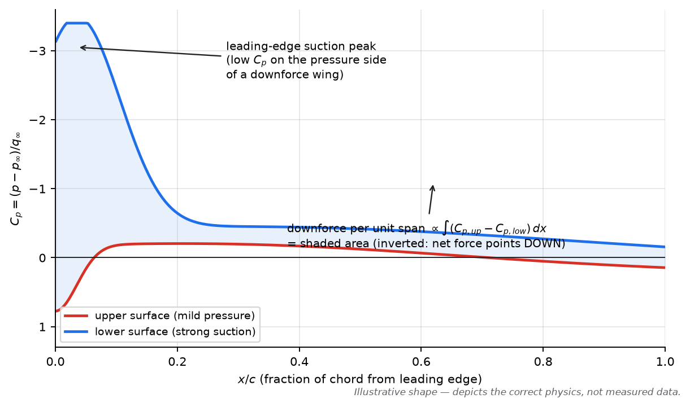
*Figure 2.1 — An inverted wing lives on its lower-surface suction peak. The shaded area is the net load. Reading and manipulating this picture is 70% of wing-development work (Part XV).*

**F1 application:** every wing element, the floor throat, the diffuser — each is a *pressure distribution shaping problem*. Designers push suction peaks where load is needed while managing the pressure *recovery* behind them (which is where separation lives).

---

## 2.3 Lift, drag, pitching moment — and their coefficients 🟢

With reference area $S$ (or "area" $A$) and dynamic pressure $q$:

| Quantity | Definition | Coefficient |
|---|---|---|
| Lift (up) | $L$ | $C_L = L/(qS)$ |
| Drag (rearward) | $D$ | $C_D = D/(qS)$ |
| Pitching moment | $M$ | $C_M = M/(qSc)$ |

For an F1 car the lift is *negative* — teams speak of **downforce** $= -L$, and quote **downforce area $C_L A$** and **drag area $C_D A$** [m²] because reference-area conventions differ. Useful orders of magnitude (public-domain estimates, mid-2020s cars, mid-wing settings — treat as approximate):

- $C_L A \approx 3.5$–$5\ \text{m}^2$ (high downforce ~5+, Monza ~2.5–3)
- $C_D A \approx 1.0$–$1.7\ \text{m}^2$
- Effective lift-to-drag ratio of the whole car: roughly 2.5–3.5 — *terrible* by aircraft standards (gliders exceed 40), and that trade-off is the central economic problem of the sport (Parts VII–VIII).

**Pitching moment** matters because the car is a lever: the distribution of lift between front and rear axles, and the drag height, create moments that load and unload the tires (Part X).

---

## 2.4 Airfoil geometry, angle of attack, camber 🟢

- **Chord $c$:** reference length, leading edge to trailing edge.
- **Angle of attack $\alpha$:** angle between the chord line and the free stream. For a downforce wing the flow approaches the *pressure* (upper) side, i.e., negative $\alpha$ in the aviation convention, or you flip the wing upside down and keep $\alpha$ positive in the F1 convention — sign conventions are team/regulation artifacts; the physics is symmetric.
- **Camber:** the curvature of the mean line. Camber is the primary lever for generating circulation at zero α. Inverted camber → downforce.
- **Thickness & leading-edge radius:** set the suction-peak sharpness, and therefore how much adverse gradient (§2.5) the boundary layer must survive. F1 wing elements are thin with small leading-edge radii — high load, but fragile to stall.

---

## 2.5 The boundary layer 🟢→🟡 (the most important concept in this handbook)

**TERM — Boundary Layer**
- **Simple:** the thin region near a surface where the air is slowed down by friction.
- **Technical:** the region in which velocity rises from the no-slip wall value to the external velocity $u_e$; thickness $\delta_{99}$; governed by viscous diffusion of momentum. $\delta \sim 5x/\sqrt{Re_x}$ (laminar), $\sim 0.37x/Re_x^{-1/5}$ (turbulent); flat-plate skin friction $C_f = 0.664/\sqrt{Re_x}$ (laminar), $\approx 0.059 Re_x^{-1/5}$ (turbulent).
- **F1 relevance:** its state decides separation, stall, wing load limits, diffuser stability and wake character. Most F1 "packages" are, at bottom, boundary-layer management devices.

Inside the layer, the flow's momentum budget is: friction and pressure gradients spend it; the free stream and any slots/jets replenish it. Two outcomes matter:

**Adverse pressure gradient ($dp/dx > 0$).** Where the flow must decelerate (rear of a wing element, diffuser expansion), the slow near-wall fluid is the first to run out of momentum.

**Flow separation.** When the near-wall flow stops moving forward (wall shear $C_f \to 0$) and then reverses, the boundary layer separates: the flow leaves the surface, a low-energy recirculating region forms, and the *intended pressure distribution collapses*. Separation is the mechanism behind stall, stalled diffusers, and dead wing elements.

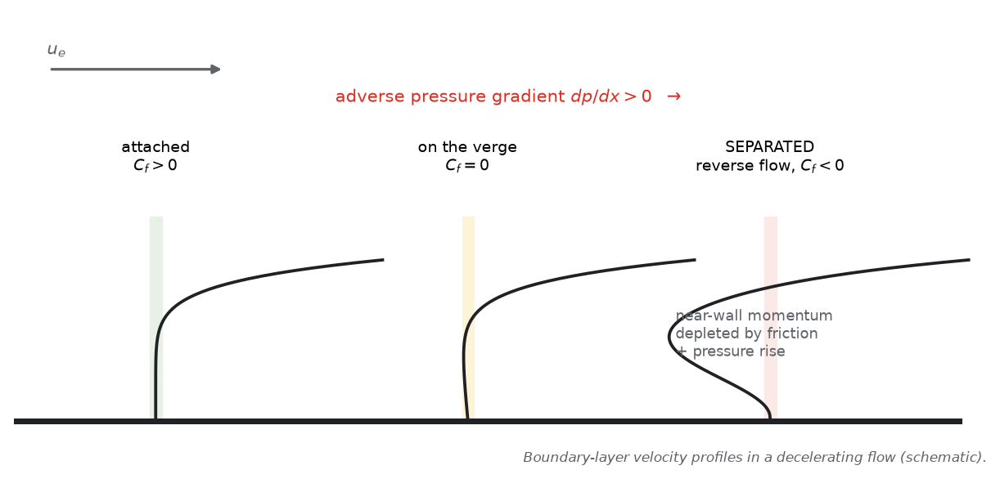
*Figure 2.2 — Separation is a momentum bankruptcy: friction + pressure rise consume the near-wall momentum budget.*

**Stall** is the large-scale loss of load when separation eats the suction surface. On thin, highly loaded F1 elements it can be abrupt and is often **three-dimensional** (vortex-induced, tip-driven, or flap stall) — 2-D intuition under-predicts its violence.

**Transition** (laminar → turbulent) is managed, not avoided: turbulent layers resist separation better. Devices: natural transition, pressure-field design, or **vortex generators / trips**. In the tunnel, trip dots force realistic transition at model Re (Part XI).

**ENGINEERING INTUITION**
> If you remember only one thing: an F1 car is a system for keeping boundary layers attached where they pay rent (wing elements, floor throat, diffuser) and paying them off where they don't. Every "the car lost the rear" story of the last decade — including porpoising — is partly a boundary-layer story.

---

## 2.6 Vortices and circulation (appetiser) 🟢

A **vortex** is fluid rotating about an axis; its strength is the **circulation** $\Gamma = \oint \vec{V}\cdot d\vec{l}$. Vortices matter to F1 for three distinct jobs: (1) they are the *price* of finite-span lifting wings (tip vortices → induced drag, Part VII); (2) they are *tools* (floor-edge vortices seal the underbody, Part VI); (3) they are *contaminants* (wheel wakes, Part IX). Full treatment in Part VI.

---

## 2.7 From aircraft coefficients to race-car coefficients 🟡

The coefficient definitions are identical for aircraft and race cars. What changes is everything else:

| | Aircraft wing | F1 car |
|---|---|---|
| Flow quality | clean free stream | wings operate in other components' wakes |
| Ground | absent | defines the whole underbody problem (Part V) |
| Aspect ratio | high (efficient) | low, span-limited by regulations |
| Objective | maximize L/D | maximize **Δ(lap time)**: downforce-dominated, drag tolerated |
| Re configuration | cruise-fixed | continuously varying with speed & attitude |

This is why "F1 car = upside-down airplane" fails as a design mental model — expanded in Part III.

---

## COMMON MISCONCEPTIONS (Part II)

> ❌ **"More downforce coefficient is always better."** Downforce costs drag, tyre energy, and can destabilise the underbody; the optimum is lap-time-optimal per circuit (Parts VII, X, XV).
>
> ❌ **"Separation = the flow stops."** The *near-wall* flow reverses; above it there is still fast-moving fluid. A separated shear layer can even reattach (separation bubbles) — which is why "there's a bubble" vs "it's fully stalled" are different engineering conversations.
>
> ❌ **"Cp plots directly show force by colour."** Only the *integral* of Cp over area, projected correctly, is force. A big red patch on a small surface can matter less than a modest suction over a large one (Part XIV).
>
> ❌ **"Skin friction is what makes F1 drag big."** Pressure (form) drag, induced drag and the wheels' wakes dominate. Friction is real but secondary at car scale (Part VIII).
>
> ❌ **"Turbulent flow separates less, so make everything turbulent."** It resists adverse gradients better but costs friction and thickens the layer (losing more pressure recovery). It's a local design choice, not a global blessing.

---

## F1 ENGINEERING QUESTIONS (Part II)

**Conceptual**
- Explain downforce twice: once with momentum, once with the pressure field. Where do the two accounts disagree quantitatively, if at all?
- Why does a suction peak at the leading edge make an element stall-prone?
- What does "the floor is working harder than the wing" mean in Cp terms?

**Engineering**
- You add a Gurney flap to a rear wing: what happens to the pressure distribution, total load, and drag? What is the boundary-layer mechanism?
- A rival runs a thinner main plane with sharper LE radius. What load/stall trade are they making?

**CFD**
- Where would you place Cp monitor points to catch early separation on a flap?
- Which surface quantity — Cp or wall shear — tells you *first* that a diffuser is stalling? Why?

**Design**
- Hypothesis: the flap stalls in fast corners because of the wakes from the element ahead. What two design directions could fix it, and what does each cost?
- If you were given "more front-axle load without more front-wing drag", which pressure-region would you attack first?

---

## MINI PROBLEMS (Part II)

**Problem 1 — Downforce from a floor region**
*Given:* a floor region of 1.2 m² working at an area-averaged $C_p = -1.1$; car at 250 km/h ($V = 69.4$ m/s), $\rho = 1.225$ kg/m³. *Required:* downforce from that region.
*Solution:*
$q = 0.5 \times 1.225 \times 69.4^2 = 2{,}951$ Pa.
$F = |C_p| \, q \, A = 1.1 \times 2{,}951 \times 1.2 \approx 3.9\ \text{kN}$ — about half the car's weight (800 kg ≈ 7.85 kN).
*Engineering interpretation:* single surfaces routinely carry weight-scale loads. This is why floor-ride-height changes of millimetres move lap time by tenths, and why underbody separation is catastrophic rather than merely inconvenient.

**Problem 2 — Reading a wake to get drag (momentum view)**
*Given:* behind a body, the wake has a mean velocity 30% below free stream across a band of area 0.4 m² (normal to flow), other regions undisturbed; $V_\infty = 80$ m/s, $\rho = 1.225$. *Required:* estimate drag.
*Solution:*
Momentum flux deficit $\approx \rho \, \Delta u \cdot A \cdot u_{wake}$; take deficit $\Delta u = 0.3 V_\infty = 24$ m/s at mean wake speed $\approx 0.85 V_\infty = 68$ m/s:
$D \approx 1.225 \times 24 \times 0.4 \times 68 \approx 800\ \text{N}$.
*Engineering interpretation:* this is exactly what a wake/aero-rake survey does (Parts IX, XI): you never need to touch the body to weigh its drag — momentum bookkeeping in the wake is the measurement.

---

## QUICK RECALL (Part II)

1. State the two surface-stress mechanisms that produce aerodynamic force.
2. Give the correct "why does a wing generate lift" in two sentences, then name two classic wrong versions.
3. Define Cp and give its value at a stagnation point, in the free stream, and in a strong suction peak.
4. What is the boundary layer, and what two budget items deplete its near-wall momentum?
5. What single wall quantity flags incipient separation?
6. Why do F1 teams quote $C_L A$ and $C_D A$ instead of $C_L$ and $C_D$?
7. Order-of-magnitude: $C_L A$ and $C_D A$ of a current car, and what ratio do they imply?
8. Why is a turbulent boundary layer *preferred* in some F1 locations?
9. What is the Kutta condition, and what does it prevent?
10. Why can't you integrate a Cp *colour plot* by eye and call it force?

### ANSWERS

1. Pressure (normal stress) and wall shear stress; nothing else.
2. Geometry deflects and curves the flow; momentum conservation requires the associated pressure field; integrating it gives the force (circulation $L'=\rho V \Gamma$ quantifies it). Wrong versions: equal-transit-time; "fast air ⇒ low pressure" as a cause.
3. $C_p = (p-p_\infty)/q_\infty$; stagnation +1; free stream 0; suction peaks −1 to −3+ on highly loaded F1 elements (order-of-magnitude, engineering inference).
4. The near-wall region of retarded flow created by no-slip + viscosity; depleted by friction and adverse pressure gradients.
5. Wall shear stress → zero ($C_f \to 0$), then reversed.
6. Reference-area conventions vary between teams/eras; multiplying out the reference area removes the ambiguity and gives directly scalable force-per-dynamic-pressure.
7. Roughly $C_L A$ 3.5–5 m², $C_D A$ 1.0–1.7 m² (public estimates, setup-dependent) ⇒ car L/D ≈ 2.5–3.5.
8. Where adverse gradients threaten separation (rear of elements, diffuser): turbulent mixing re-energises the layer and delays stall, at the cost of friction drag.
9. Flow leaves a sharp trailing edge smoothly along one side; prevents the unphysical infinite-velocity wrap-around solution and fixes the circulation magnitude.
10. Force needs $\int C_p\,dA$ over real surface area with correct normals; colour patches ignore area weighting, surface orientation, and integration limits.

---

## SOURCES (Part II)

- Anderson, J. D., *Fundamentals of Aerodynamics*, McGraw-Hill — airfoil pressure distributions, circulation, boundary layers, separation fundamentals. [Tier 1]
- Katz, J., *Race Car Aerodynamics*, Bentley (1995) — race-car coefficients, downforce conventions. [Tier 1]
- McBeath, S., *Competition Car Aerodynamics*, Veloce — practical pressure-distribution reading for race cars. [Tier 2]
- Toet, W., "Aerodynamics and aerodynamic research in Formula 1", *The Aeronautical Journal* (2013) — how F1 actually uses these concepts. [Tier 2]
- Anderson, J. D., *Introduction to Flight* / NACA Report 460 (Abbott & von Doenhoff) for equal-transit-time debunking context; also Holger Babinsky's "How do wings work?" *Physics Education* 38 (2003). [Tier 2]


---

# PART III — From Aircraft Aerodynamics to Race-Car Aerodynamics

**Purpose:** rebuild your mental model from "wing in clean air" to "bluff, lifting, wheeled body flying one tyre-width off a moving wall in its own turbulence". Almost every F1-specific concept — ride height, rake, aero balance, dirty air — exists because of the differences catalogued here.

**Course connection:** anchors: Katz ch. 1, 4–5; Hucho ch. on vehicle aerodynamics fundamentals; Barnard ch. on road-vehicle/racing aerodynamics. Module mapping: ____________

---

## 3.1 Negative lift: the inverted objective 🟢

An aircraft *minimises* weight at fixed lift. A race car wants the opposite: **maximum normal load on the tyres without paying mass**. Aerodynamic downforce is "free mass" that scales with $V^2$, so it arrives exactly where it's needed — in fast corners — and disappears on straights (where it would cost acceleration).

$$F_{downforce} = \tfrac12 \rho V^2 \, (C_L A)$$

With $C_L A \approx 4\ \text{m}^2$ (public-order estimate), downforce equals the car's own weight (~7.85 kN) at roughly:

$$V = \sqrt{\frac{2mg}{\rho C_L A}} = \sqrt{\frac{2 \times 7.85\times10^3}{1.225 \times 4}} \approx 57\ \text{m/s} \approx 205\ \text{km/h}$$

(approximate; setup- and regulation-dependent). Beyond that speed, the tyres carry multiple times the car's static weight — which is why high-speed cornering in F1 is an *aerodynamic* activity and low-speed cornering a *mechanical* one.

---

## 3.2 The drag/downforce trade-off 🟡

Downforce and drag are not independent products; both are integrals over the same pressure and shear fields, driven by the same momentum exchange. Pushing more mass flow faster (floor) or loading wings more inherently increases the energy left in the air (wake/vortex kinetic energy = drag).

The governing engineering object is the **drag polar** — downforce area versus drag area over the setup range:

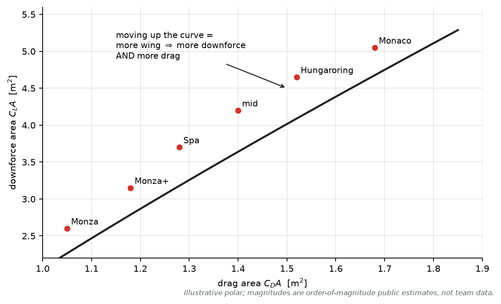
*Figure 3.1 — Each point is a wing/floor setting. Lap time, not downforce, is the objective: the right point depends on the circuit's straights and corners (Part VII).*

The trade-off is *why* aerodynamic development is an optimisation under constraints (regulations, cooling, stability) rather than a maximisation.

---

## 3.3 Ground proximity — the defining difference 🟡

An aircraft wing operates against the atmosphere "at infinity". An F1 car operates a few centimetres above a solid wall moving relative to it (in the car's frame, the road is a moving wall). Consequences:

1. **Underbody flow is forced through a converging–diverging channel** (floor tunnels, diffuser) — ground effect (Part V).
2. **Leakage paths are limited**, so underbody suction can be maintained — modern cars re-seal the edges with vortices where 1970s cars used physical skirts.
3. **The whole force map becomes a function of ride height, pitch, roll and yaw** — the car's *attitude* is an input to the aerodynamics, not just a result of them.

This is the deepest structural difference from aircraft aerodynamics: **the F1 car's aerodynamics is a closed loop with its suspension.**

---

## 3.4 Vehicle attitude: heave, pitch, roll, yaw 🟡

| Attitude | Definition | Primary aerodynamic consequence |
|---|---|---|
| Heave | uniform vertical motion/ride-height change | underbody volume changes → total load changes (strongest sensitivity) |
| Pitch | front vs rear ride-height difference (rake) | redistributes underbody expansion; shifts load front↔rear |
| Roll | lateral ride-height difference | one floor-edge seal opens, other tightens → balance shift |
| Yaw | car axis vs velocity vector | crossflow under/around the car; asymmetric wakes; edge-vortex weakening |

**F1 application:** teams measure full **aero maps** — force and moment coefficients over a matrix of heave/pitch/roll/yaw — in the tunnel and in CFD. A component that only works at one attitude is a liability; **robustness across the map** is a core design currency (Parts XI, XV).

---

## 3.5 Tyre loading: why downforce buys cornering speed 🟡

Tyre lateral force $F_y \approx \mu \, N$: grip scales with normal load $N$. Downforce raises $N$, so cornering speed for a given lateral limit rises:

$$a_{y,max} \approx \frac{\mu (mg + \tfrac12\rho V^2 C_L A)}{m}$$

The loop closes: $V \uparrow \Rightarrow$ downforce $\uparrow$ (with $V^2$) $\Rightarrow$ grip $\uparrow$ — fast corners are "aero-dominated" (lateral accelerations publicly quoted at 4–5 g in the fastest corners, vs ~1.5–2 g purely mechanical).

Two subtleties that make this engineering rather than arithmetic:

- **Tyre load sensitivity:** $\mu$ *falls* as load rises — grip grows sub-linearly with downforce. This shapes everything from weight distribution to aero balance (Part X).
- **Load transfer:** longitudinal/lateral acceleration shifts load between tyres; the aero pitch moment (drag acting above the ground, downforce distribution fore/aft) modifies that transfer at speed.

---

## 3.6 Centre of pressure, centre of mass, aero balance 🟡

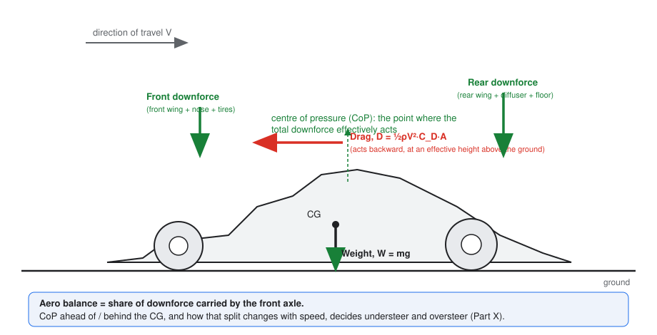
*Figure 3.2 — Weight acts at the CG; downforce acts at the centre of pressure (CoP); drag acts at an effective height. Their relative positions create moments that re-distribute tyre load with speed.*

- **Centre of mass (CG):** fixed by mass distribution (regulated minimum weight ~800 kg, current era — approximately, FIA figures; see Part IV sources).
- **Centre of pressure (CoP):** where the *total* aero force effectively acts. Its fore/aft position defines the **aero balance** (% of downforce on the front axle).
- The lever arm between CoP and CG, plus drag height, sets the aero pitch moment: at speed, braking stability, traction and steering feel all carry an aerodynamic contribution.

**Why the car is not simply "an upside-down airplane" — the compact list:**

1. The lifting surface that matters most (floor) is a *channel between two walls*, not a free wing; its performance is ride-height physics, not airfoil physics alone.
2. Wings operate at low aspect ratio, in **wakes from wheels and other components** — the inlet flow quality of every downstream device is a design variable.
3. Four exposed, rotating wheels create the dominant wakes and a large drag share; no aircraft has this problem.
4. The force map is **coupled to suspension state** (attitude), creating stability problems (porpoising) with no aircraft equivalent.
5. The optimisation target is lap time under strict geometric regulation — the designer shapes a *system*, not a wing.
6. Downstream devices must also *condition the wake* for the car behind (overtaking), a constraint no aircraft ever had.

---

## COMMON MISCONCEPTIONS (Part III)

> ❌ **"An F1 car is an upside-down airplane."** As a slogan, misleading: the load path (tyres), the ground plane, the wheels, the wakes and the suspension coupling make it a different discipline that merely shares equations.
>
> ❌ **"Downforce is always good."** It costs drag, tyre energy and mechanical stress; and above the underbody's stable range more load can trigger instability (Part V).
>
> ❌ **"Aero balance is fixed by the wing sizes."** It moves with speed (ride heights change), attitude (pitch/roll/yaw), and every upstream component's wake. Balance is a *map*, not a number (Part X).
>
> ❌ **"More downforce means more grip, linearly."** Tyre load sensitivity makes grip sub-linear in load — part of why the sport obsesses over *efficiency* of load generation, not just quantity.
>
> ❌ **"Drag only slows the car on straights."** Drag also unloads the car (high-speed traction), heats tyres, and its wake degrades following cars — part of the racing problem, not just the lap-time one.

---

## F1 ENGINEERING QUESTIONS (Part III)

**Conceptual**
- Why does a car that is "aero-limited" in fast corners still accelerate slower if you add drag-heavy downforce?
- Physically, why does yaw degrade floor performance more than it degrades a free wing's performance?

**Engineering**
- Given a fixed power, how would you decide between +2% $C_L A$ and −2% $C_D A$ for Monza? For Hungary? (Quantify with a lap-time argument.)
- What suspension properties would you choose to stabilise a car whose downforce curve steepens as ride height falls?

**CFD**
- Why must CFD of an F1 car be run over a matrix of attitudes rather than one "nominal" position?
- Which attitude variable would you sweep to understand roll behaviour of the floor-edge vortices?

**Design**
- A new floor adds downforce only below 150 km/h. Is that useful? Design a test to find where the load is going.
- If drag is acting too high (excessive pitch moment under braking), which components would you examine first?

---

## QUICK RECALL (Part III)

1. At approximately what speed does a modern F1 car's downforce equal its weight? What does that imply for fast corners?
2. Name four attitude variables and their dominant aerodynamic effects.
3. Why is the drag polar the "price list" of the sport?
4. Define aero balance; why is it speed-dependent?
5. How does tyre load sensitivity modify the naive "downforce = grip × μ" reasoning?
6. List three reasons "upside-down airplane" fails as a mental model.
7. What is an aero map and why is robustness across it valuable?
8. How does ground proximity change the underbody flow topology vs a free wing?
9. Why do fast corners produce 4–5 g but slow corners cannot?
10. Where does the drag force act relative to the ground, and why does that height matter?

### ANSWERS

1. Roughly 180–210 km/h depending on setup ($C_L A$ ≈ 3.5–5 m², public estimates). Fast corners are aero-dominated: grip available grows with $V^2$.
2. Heave — underbody volume/load; pitch (rake) — load shift + expansion geometry; roll — edge-seal asymmetry; yaw — crossflow, asymmetric wakes, weakened edge vortices.
3. Every downforce gain must be bought with drag (and tyre/cooling costs); the polar is the menu of legal trades.
4. Fraction of downforce on the front axle; moves with speed because ride heights/pitch change with aero load, shifting floor vs wing contributions.
5. μ decreases with load ⇒ grip rises sub-linearly ⇒ efficient (not just large) load generation matters; also sets balance targets.
6. Floor is a channel in ground proximity; wings work in wheel/component wakes; suspension-coupled force map (+ low AR wings, wake conditioning for racing, regulated shape).
7. Coefficients sampled over heave/pitch/roll/yaw; a component robust across the map survives real cornering, kerbs and fuel-load changes.
8. It creates a converging–diverging underbody channel with mass-flow/pressure coupling; leakage and edge sealing become first-order.
9. Fast corners have large $V$, so aero downforce multiplies tyre normal load far beyond the car's weight; slow corners have little aero load (μmg only).
10. At an effective height above the ground (roughly the aero force centroid); its moment about the contact patches redistributes wheel loads under acceleration/braking.

---

## SOURCES (Part III)

- Katz, J., *Race Car Aerodynamics*, Bentley (1995) — downforce/trade-off fundamentals, load sensitivity, attitude effects. [Tier 1]
- Hucho, W.-H. (ed.), *Aerodynamics of Road Vehicles*, SAE — bluff-body aerodynamics, ground proximity, attitude sensitivity. [Tier 1]
- Barnard, R. H., *Road Vehicle Aerodynamic Design*, MechAero — accessible treatment of vehicle vs aircraft differences. [Tier 2]
- FIA Formula 1 Technical Regulations (current) — mass and dimension limits cited as approximate. [Tier 1]
- Public team/press estimates of $C_L A$, $C_D A$, lateral g — used as ranges only (Tier 3, marked as estimates).


---

# PART IV — F1 Aerodynamic Architecture

**Purpose:** know the car component by component — but above all, understand it as **one coupled flow system**. The regulation framework referenced is the current ground-effect era (2022 regulations onward, refined through 2026); historical devices are included where they illuminate the physics.

**Course connection:** anchors: Katz ch. 5–6; McBeath ch. on front/rear wings and floors; FIA Technical Regulations Art. 3 (bodywork/aerodynamics) as the geometry reference. Module mapping: ____________

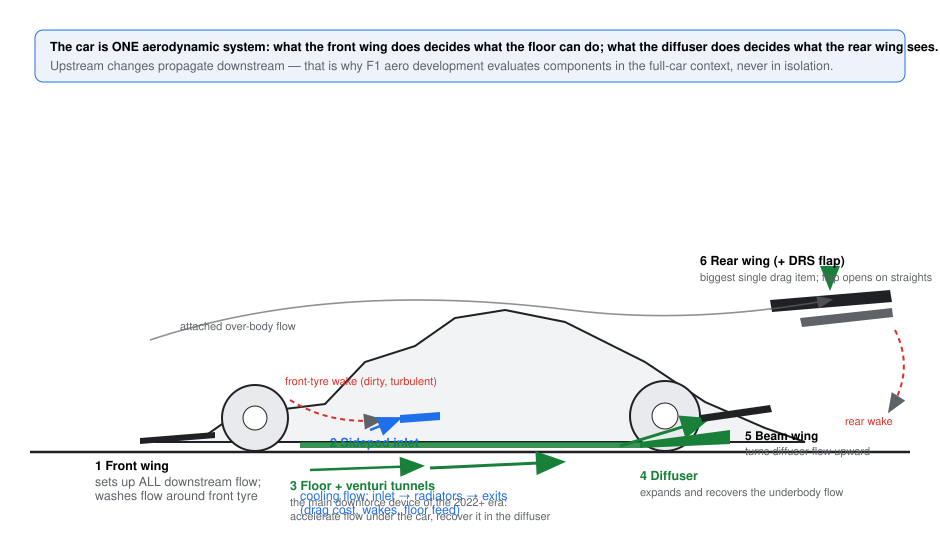
*Figure 4.1 — The flow system: front wing conditions everything downstream; the floor is the primary load generator; the diffuser and beam wing hand the flow to the rear wing; every exit condition becomes someone else's inlet condition.*

---

## 4.1 Front of the car 🟡

**Front wing.** Functions, in priority order:
1. **Generate front-axle load** — significant but *not* its dominant job in the modern era.
2. **Condition the front-tyre wake** — steer flow around the tyre ("outwash") so the wake does not smother the floor and sidepods.
3. **Feed the floor** — deliver mass flow and vorticity to the fences/tunnels on the correct trajectory.
4. **Manage its own tip and flap-edge vortices** deliberately, as flow-directing tools.

Since 2022 the front wing is *simplified by regulation* (a limited number of elements — four main elements in the 2022 rules; verify the current edition) with a neutral central section, explicitly to reduce its sensitivity to the disturbed flow when following another car. Endplates and flap-edge geometry shape the outwash vortex system; a wing that "looks" like it should make load but feeds the tyre wake badly is a *worse* wing in system terms.

**Nose.** Shapes the flow the wing receives, carries the wing's central structure, and (via its tip volume) influences how much mass flow dives under the nose toward the floor. Modern noses are slender and raised to let flow pass under/over deliberately.

**S-duct (where fitted).** A duct through the nose/chassis that re-energises and redirects flow over the cockpit. A flow-conditioning device, public since 2017, subject to detailed regulation.

**Front suspension.** Suspension members are aerodynamic bodies: they generate drag, shed wakes into the floor's inlet flow, and their geometry is shaped (and regulated) accordingly. Pushrod vs pullrod layouts change what wakes land where — a real packaging consideration, not just a mechanical one.

**ENGINEERING INTUITION**
> If you remember only one thing: the front wing is the *thermostat* of the whole car's flow system — change it and you change what the floor, sidepods and rear wing all receive.

---

## 4.2 Middle of the car 🟡

**Sidepods.** Contain the cooling package. The **inlet** is a flow meter and a compromise: too small starves the radiators (temperature = performance and reliability); too large adds drag and spills a messy wake downstream. The external shape (2022+ cars use raised-inlet, "downwashing" sidepod concepts) is designed to feed the floor and undercut while managing the cooling exit flow. Cooling drag is a real, billable cost (Part VIII).

**Floor — the primary downforce device (2022+ era).** Key regulated elements:
- **Venturi tunnels** (two, inboard of each side), formed between the reference plane and an outer "roof" surface: a throat that accelerates flow and generates the main suction, then a diffuser-like expansion toward the rear.
- **Fences** (a regulated number per side) shape the inlet vortex system and keep the tunnels fed at yaw and pitch.
- **Floor edge + floor-edge wing:** the outer boundary of the underbody. Its vortex system limits leakage of the suction (the "aerodynamic skirt" role, Part VI) and manages how the edge wake leaves.
- Public technical consensus: in this era the floor contributes on the order of **half or more of total downforce** (public engineering estimates — exact shares are team-specific and confidential).

**Bargeboards (historical).** Between 2017 and 2021, elaborate bargeboard/deflector packages conditionally reshaped the front-wheel wake and fed the floor's then-flat underbody. The 2022 regulations **removed them** — one of the biggest wake-reduction moves: less aggressive flow conditioning around the tyres means a less sensitive, less "dirty" car behind.

**Engine cover / airbox.** The roll-hoop inlet feeds the engine; the engine cover tapers ("coke-bottle" waist) to accelerate flow toward the beam wing/diffuser region and shrink frontal area. Cooling exits live here.

---

## 4.3 Rear of the car 🟡

**Diffuser.** The underbody's expansion section: recovers static pressure from the accelerated tunnel flow, sets the underbody's exit condition, and — critically — defines the *upwash* of the rear wake. Strakes (regulated number) control spanwise cross-flow and keep the expansion attached. Part V treats it properly.

**Beam wing.** A small, low-mounted rear wing element(s) working in the diffuser's outflow: it turns the underbody flow upward, helping pressure recovery *under* the car and pulling the diffuser jet up, away from the rear-tyre wake. It is the aerodynamic "handshake" between floor and rear wing.

**Rear wing.** The largest single drag item; generates substantial rear-axle load. The main plane + flap geometry is strictly regulated (span, height, chord limits). The **DRS** is a regulated adjustable flap: opening it (driver-activated in designated zones when within 1 s at the detection point — sporting regulations) rotates the flap to a flat, high-drag-reduction state. Public estimates put the drag reduction at a large fraction of the wing's drag and a top-speed gain of order 10–15 km/h; the wake also changes (fatter, straighter — part of why DRS helps overtaking beyond the speed gain alone).

**Rear crash structure & suspension.** The crash structure's fairing is shaped into the beam-wing region; suspension arms are aero-profiled and interact with the rear-tyre wake.

---

## 4.4 The system view 🟡→🔴

Follow one streamline family through the car and the coupling becomes obvious:

**Front wing tip vortex → around/over front tyre → floor fences → tunnel throat → diffuser → beam wing turn-up → rear wing lower surface → rear wake →** (for the car behind) **its front wing.**

Each stage's *exit condition* is the next stage's *inlet condition*. Practical consequences you will meet repeatedly:

- A "better" front wing can *reduce* total downforce if its outwash starves the floor fences.
- A bigger diffuser can hurt if the beam wing can no longer turn the extra flow.
- DRS changes the diffuser/rear-wing coupling — which is partly why DRS behaviour at different wing settings feels different to drivers.
- Following another car degrades *first* the devices with the longest upstream sensitivity chain (floor, then rear wing), which is exactly what the 2022 regulations targeted (public FIA rationale).

---

## COMMON MISCONCEPTIONS (Part IV)

> ❌ **"The rear wing makes most of the downforce."** Historically false, and in the ground-effect era doubly so: the floor is the largest contributor (public consensus: order of half or more), and the rear wing is as much a wake-management and balance device as a load device.
>
> ❌ **"Components can be evaluated in isolation."** A component test without the correct upstream flow (tyre wake, floor feed) measures a car that does not exist. System-context testing is the rule.
>
> ❌ **"Cooling is free."** Every litre of cooling flow is momentum taken from the car: inlet drag, radiator pressure loss, exit drag. Designing cooling is a performance exercise.
>
> ❌ **"Bargeboards were decoration / 2022 cars are less sophisticated."** The 2022 rules traded bargeboard-level "sorting" for underbody generation and wake robustness — a regulation-driven shift of mechanism, not of engineering depth.
>
> ❌ **"DRS just reduces drag."** It also unloads the rear axle and changes the wake — a handling and racing device, not merely a top-speed button.

---

## F1 ENGINEERING QUESTIONS (Part IV)

**Conceptual**
- Why did the FIA remove bargeboards *and* simplify the front wing in the same rule change? What single objective connects both?
- Why is the beam wing described as a "handshake"? What breaks if it is too small? Too big?

**Engineering**
- Your cooling exit dumps flow onto the rear-tyre wake. What three competing losses does that create?
- The floor edge is losing its vortex at 8° yaw. What upstream devices could restore it, and what would each cost?

**CFD**
- Where would you place survey planes to verify outwash is reaching the floor fences?
- How would you quantify "system sensitivity": the ΔCLA at the rear per unit ΔCLA at the front wing?

**Design**
- Redesign brief: +100 N front-axle load with zero change in floor performance. What are your three candidate mechanisms and their risks?
- You must shrink the sidepod inlets for a low-drag circuit. What must you verify before committing?

---

## QUICK RECALL (Part IV)

1. List the front wing's four jobs in priority order.
2. What are the main regulated elements of the 2022+ floor, and what does each do?
3. What was the bargeboard's role, and why were they removed?
4. What does the beam wing do, and what happens if it fails to do it?
5. Why is the rear wing called the biggest single drag item, and what does DRS do beyond reducing drag?
6. Name the flow chain from front wing to the car behind.
7. Why do sidepod inlets trade cooling against performance, and where does the cost appear?
8. What is "coke-bottle" shaping for?
9. What does the floor edge (edge wing) seal, and how?
10. Why must a front-wing upgrade be evaluated on the full car?

### ANSWERS

1. Front-axle load; front-tyre-wake conditioning (outwash); floor feeding; managing its own edge vortices.
2. Venturi tunnels (suction generation via throat acceleration), fences (feed/organise inlet flow at attitude), floor edge + edge wing (leakage sealing, edge-wake control), rear expansion into the diffuser (recovery).
3. They conditioned front-wheel wake and fed the (then flat) floor; removing them made the cars' wakes less aggressive and following-car performance less sensitive — the 2022 regulations' core intent.
4. Turns diffuser outflow upward, aids underbody recovery, lifts the jet over the rear-tyre wake; too small → floor can't realise its potential; too big → drag, and it can overload/misplace the rear-wing flow.
5. Largest single source of drag by device; DRS also unloads the rear axle and changes the wake structure (helps overtaking directly).
6. FW vortex → around tyre → fences → throat → diffuser → beam wing → rear wing → rear wake → following car's FW.
7. Inlet size sets cooling mass flow vs external drag; too large = drag + messy downstream wake; too small = temperatures rise, power/tyre life suffer.
8. Reduces engine-cover frontal area and accelerates flow toward the beam wing/diffuser region.
9. The underbody's low-pressure region; via an edge vortex system acting as an aerodynamic skirt against leakage.
10. Because its value is realised *through* downstream devices; an isolated test cannot see floor/diffuser reactions to its outwash.

---

## SOURCES (Part IV)

- FIA Formula 1 Technical Regulations, Art. 3 (Bodywork & Aerodynamics), current edition — geometry and element limits for wings, floor, diffuser, DRS. [Tier 1]
- FIA 2022 regulations announcements and technical presentations (fia.com, formula1.com, 2021–2022) — rationale for bargeboard removal, floor-centric design, wake targets. [Tier 1]
- Toet, W., "Aerodynamics and aerodynamic research in Formula 1", *The Aeronautical Journal* (2013) — component roles and system coupling from an F1 aerodynamicist. [Tier 2]
- Autosport / Racecar Engineering technical explainers (2017–2024) — S-ducts, outwash, floor-edge development (authors: J. Boxall-Legge, G. Piola, C. Scarborough). [Tier 2]


---

# PART V — Ground Effect

**Purpose:** the physics that makes an F1 car fast. Treated in depth: the underbody as a device, the diffuser as its pressure-recovery section, the ride-height force map, and porpoising as the instability where aerodynamics and suspension meet.

**Course connection:** anchors: Ranzenbach & Barlow (inverted airfoil in ground effect, 1990s); Zerihan & Zhang (wing in ground effect, *Journal of Aircraft*, 2000); Katz ch. 5; FIA 2022+ regulations (venturi tunnels). Module mapping: ____________

---

## 5.1 What "ground effect" actually is 🟡

Two distinct mechanisms share the name — you must keep them separate:

**Mechanism A — wing in ground effect (the "image" effect).** Any lifting surface near a solid boundary behaves as if a mirror-image vortex/airfoil existed below the wall (method of images). The image system increases the effective circulation for a given angle of attack and reduces the downwash-induced drag term. Net result at moderate proximity: **more load for the same geometry**, until very small clearances trigger losses (§5.4). Classic evidence: Ranzenbach & Barlow's inverted-airfoil studies and Zerihan & Zhang's single-element wing experiments — downforce rises as ride height falls, with a peak and a loss region at very low $h/c$.

**Mechanism B — underbody/venturi ground effect (the F1 floor).** The floor and reference plane form a **channel** (the 2022+ tunnels: floor, outer roof, ground). Mass conservation forces the flow to accelerate into the throat; the static pressure there falls well below ambient (strong suction over a large area); the diffuser then decelerates and recovers the pressure. This is a *designed* streamtube, and it is the main downforce generator of the modern car.

**Why proximity changes the flow at all:** the wall enforces the no-through-flow condition, so streamlines cannot escape downward; the effective flow area is geometry *and* clearance; and the wall kills vertical velocity — pressure fields become stronger and more two-dimensional than in free air.

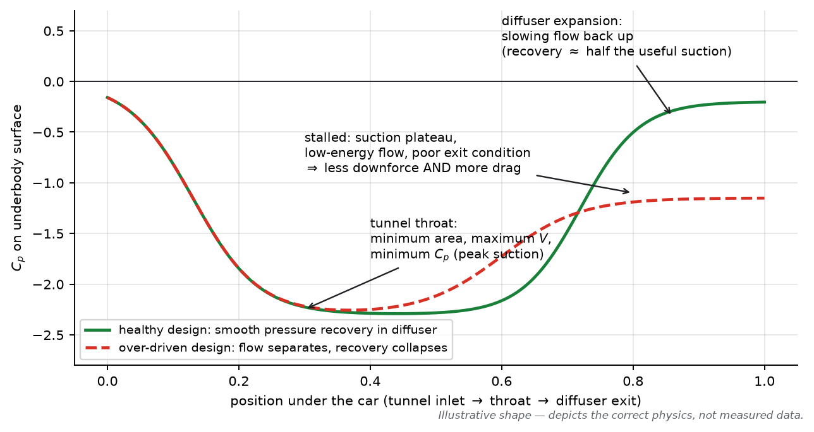
*Figure 5.1 — The underbody Cp trace: suction concentrated at the throat, recovered through the diffuser. The dashed line is the same car with an over-driven expansion: the separation that "stalls" the diffuser destroys the recovery.*

**COMMON MISCONCEPTIONS (venturi & Bernoulli)**
> ❌ **"The air speeds up so the pressure drops"** (as a mechanism). Reversed/teleological again: geometry + mass conservation set the velocity; momentum conservation sets the pressure that accompanies it. Bernoulli is the bookkeeping identity between them.
>
> ❌ **"The venturi effect and Bernoulli are two different forces."** Neither is a force. "Venturi effect" is the *name* of the coupled behaviour in a constriction; Bernoulli is one valid relation inside it. The physics is continuity + momentum, with the boundary layer deciding whether the pattern can exist at all.
>
> ❌ **"The diffuser creates the downforce."** The *whole underbody* is the suction surface; the diffuser's job is pressure recovery — it raises the pressure at the exit so the low pressure upstream can exist and be maintained. A diffuser alone, without throat suction upstream, is a fairing.
>
> ❌ **"Sealing is about airtightness."** No seal exists; the edge vortex *fluid-dynamically* limits leakage. Skirts (banned hardware) were the mechanical version of the same idea.

---

## 5.2 The underbody as a streamtube (mass conservation first) 🟡

Model the tunnel as a 1-D streamtube: inlet area $A_1$ (set by fences, inlet geometry and ride height), throat area $A_t$ (minimum), exit at the diffuser.

$$\rho A_1 V_1 = \rho A_t V_t = \rho A_2 V_2$$

Everything follows: squeeze $A_t$ (lower ride height, tighter tunnel) ⇒ $V_t$ rises ⇒ (momentum balance) static pressure at the throat falls ⇒ more downforce. **But** two hard limits exist:

1. **Inlet supply:** the throat can only pass what the inlet and upstream flow deliver; a starved throat separates on its roof.
2. **Recovery:** whatever you accelerate, you must decelerate (§5.3) or pay it back in drag and lost mass flow.

**Ground clearance** enters here: lowering the car reduces $A_t$ *and* changes the inlet's ability to swallow flow. That is why the force-vs-height map is non-monotonic (§5.4) — not because "suction gets stronger" indefinitely.

---

## 5.3 The diffuser: pressure recovery, and why it can separate 🟡→🔴

The diffuser is a **subsonic diffuser** — one of fluid mechanics' least forgiving components. Its boundary layer must survive a long adverse gradient. Governed concepts:

- **Area ratio** (exit/throat): too aggressive → separation, pressure recovery collapses (Figure 5.1 dashed line).
- **Pressure recovery coefficient** $C_p = (p_{exit} - p_{throat})/q_{throat}$: real automotive diffusers recover far less than the ideal (boundary layers + 3-D corner flows).
- **Strakes** control the corner-vortex system and delay spanwise stall; the beam wing and rear wing set the exit condition by "pulling" flow upward.
- **Stalled diffuser symptoms:** plateau in Cp, rising drag, sudden load loss with ride height — and, in the worst case, the oscillation loop of §5.6.

**ENGINEERING INTUITION**
> If you remember only one thing: the floor's tunnels write the cheque (suction), the diffuser cashes it (recovery). A diffuser that stalls bounces the cheque — you lose both the load *and* the exit condition that keeps the whole rear of the car working.

---

## 5.4 The force map: downforce vs ride height 🟡

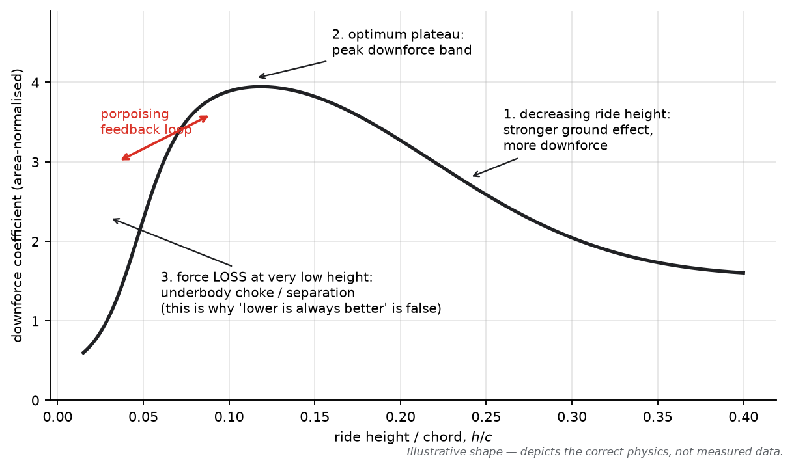
*Figure 5.2 — The canonical ground-effect map. Region 1: load rises as height falls (Mechanisms A+B reinforcing). Region 2: peak/plateau — the design target. Region 3: force *loss* at very low height — underbody choke/separation. The red arrow marks the porpoising feedback zone.*

Documented experimentally for isolated wings: Zerihan & Zhang measured force enhancement for clearances below $h/c \approx 0.2$–0.3, peak load around $h/c \approx 0.08$, and force *loss* below $h/c \approx 0.1$ (trailing-edge separation); their double-element follow-up found an **abrupt downforce discontinuity** at $h/c \approx 0.17$–0.24 caused by tip-vortex breakdown. Ranzenbach & Barlow traced the low-clearance loss to under-wing flow throttling as the wing and ground boundary layers merge. Teams re-create these regimes daily in full-car aero maps. The three regimes and their mechanisms:

1. **Force enhancement:** smaller clearance → stronger image effect + higher tunnel velocity ratio → more suction.
2. **Peak band:** the design ride heights; maximum stable load.
3. **Force loss:** at very low height the underbody/inlet chokes — the boundary layer fills the shrinking channel (blockage), separation appears on the tunnel roof or diffuser, and load *falls* with height.

**This is why "lower is always better" is false**, and why the mechanical setup (springs, bump stops, ride heights) is an aerodynamic instrument (Part X).

---

## 5.5 Pitch, roll, yaw sensitivity 🟡

- **Pitch (rake):** raising the front *and* keeping the rear low changes the underbody's effective expansion — rake generally moves load distribution rearward and changes total load non-monotonically. Teams run a few degrees of rake; the "correct" rake is a floor-geometry question.
- **Roll:** the loaded side's edge seal tightens (more load) while the unloaded side's opens (less) — a *balance* effect first, a load effect second.
- **Yaw:** crossflow weakens the inlet vortex system and edge sealing; tunnels starve asymmetrically. Yawed aero maps are where "eats its tyres in fast corners" problems are diagnosed (Part X).

All three sensitivities are measured (tunnel/CFD maps) and targeted: **low sensitivity = robust car = usable everywhere**.

---

## 5.6 Porpoising — the aero-structural instability 🔴

The mechanism, step by step (this is the negative-damping story, not a slogan):

1. Car runs low on the suspension; ride height enters the steep region of the force map.
2. A perturbation lowers the front slightly → downforce *rises* strongly (slope $dF/dh$ large and negative w.r.t. height) → springs compress further (positive feedback, negative aerodynamic damping/stiffness).
3. The underbody finally chokes/separates → load collapses → suspension rebounds → flow re-attaches → cycle repeats: a limit-cycle oscillation of the whole platform, typically a few hertz.
4. Consequences: driver exposure (2022 was severe on some cars), energy loss, tyre loading oscillation, data loss.

Countermeasures (all in public discussion/regulation in 2022–2023): raise the operating point (stiffer ride heights), increase suspension damping/stiffness so the aero slope is out-run, soften the force-map slope itself (floor edge geometry, tunnel inlet shaping), and the FIA's regulatory responses — the 2022 Technical Directive on oscillation limits (measured as a vertical-acceleration metric) and 2023 floor-edge/diffuser/plank geometry changes to move the map away from the unstable region.

**Why it is *not* "the car bouncing off bumps":** bumps force the car; porpoising is *self-excited* — the flow field is the spring-mass system's power source. That distinction is exactly why passive compliant suspensions can be unstable (a fixed body would never oscillate on a smooth road).

---

## 5.7 Aero platform stability & why the floor rules 🔴

A "stable platform" means: over the full attitude envelope, $dF/d(\text{attitude})$ has the *right signs* — load should decrease when the car goes lower past its design point, balance should not swing wildly with pitch/roll. Design levers: tunnel inlet shaping, throat position, diffuser area ratio, edge-wing geometry, and suspension tuning to sit in the stable band.

**Why the modern car relies on the floor:**
1. **Efficiency:** underbody suction acts over a large area with lower induced-drag cost than equivalent wing load (wings pay tip-vortex tax; tunnels are edge-sealed).
2. **Wake quality:** a floor-centric car sheds a more manageable wake than a wing-centric one — the 2022 regulations' racing-quality motive (public FIA rationale).
3. **Regulation:** the geometry is specified to make the floor the allowed big device; wings are deliberately constrained.

---

## F1 ENGINEERING QUESTIONS (Part V)

**Conceptual**
- Explain, in momentum terms, why underbody suction exerts downward force on the floor.
- Why does the same floor produce less load at the same height when the car yaws?
- What physically limits the pressure recovery a diffuser can achieve?

**Engineering**
- A car porpoises at one circuit only. List five candidate causes and a test to isolate each.
- You may spend 3 mm of ride height on either the front or the rear axle to fix understeer. Which force-map data decides?

**CFD**
- How would you detect underbody choke in a steady RANS solution? Which monitors?
- Why is steady RANS *questionable* for porpoising studies, and what would you run instead?

**Design**
- Redesign brief: move the force-loss knee to a lower ride height without losing peak load. Which geometry do you touch first, and what is the risk?
- The diffuser must grow for the floor upgrade. What must the beam wing and rear wing do to keep the exit condition?

---

## MINI PROBLEM (Part V)

**Problem — The throat cheque**
*Given:* tunnel throat area per side $A_t = 0.045\ \text{m}^2$; mean throat velocity $V_t = 55$ m/s at 250 km/h (69.4 m/s) car speed; throat static pressure corresponds to $C_p = -1.8$; floor planform area affected 1.6 m² total (both sides, plan-view). $\rho = 1.225$, $q = 2{,}951$ Pa (from Part II).
*Required:* (a) throat suction pressure; (b) rough downforce contribution of the tunnel region; (c) the mass flow through both tunnels.
*Solution:*
(a) $p_{suction} = C_p q = -1.8 \times 2{,}951 \approx -5.3\ \text{kPa}$ (gauge).
(b) With suction acting over the planform: $F \approx 5.3\ \text{kPa} \times 1.6\ \text{m}^2 \approx 8.5\ \text{kN}$ — *more than the car's weight*, from a strip of floor ~30 cm wide. (Order-of-magnitude demonstration, not a design claim; real distributions are 3-D and partly recovered.)
(c) $\dot m = \rho A_t V_t \times 2 = 1.225 \times 0.045 \times 55 \times 2 \approx 6.1\ \text{kg/s}$ through the tunnels.
*Engineering interpretation:* tiny geometries × large dynamic pressures = car-weight forces. This is why millimetres of ride height are worth tenths of seconds — and why the recovery section (diffuser) is treated as carefully as the suction section.

---

## QUICK RECALL (Part V)

1. State the two mechanisms called "ground effect" and where each applies on the car.
2. What sets throat velocity? What sets throat pressure?
3. Why does the diffuser exist, and what happens when it stalls?
4. Sketch (describe) the downforce-vs-ride-height map and its three regimes.
5. What is the porpoising feedback loop, in terms of $dF/dh$ and suspension?
6. Why is "lower is always better" false — give the two physical limits.
7. How do pitch, roll and yaw each alter floor performance?
8. What makes floor-generated load more "efficient" than wing-generated load?
9. What did the 2022 Technical Directive and 2023 floor changes target?
10. In a Cp plot under the car, where is the strongest suction and why?

### ANSWERS

1. Wing-in-ground effect (image effect — wings/elements near ground) and underbody/venturi effect (floor tunnels) — modern cars use both, tunnels dominate.
2. Mass conservation through the inlet/geometry (and upstream supply); momentum balance converts that velocity into the local static pressure.
3. Recovers static pressure so throat suction can exist and the exit condition is healthy; stalled → recovery collapses, drag rises, load falls, instability risk.
4. Rise (enhancement), peak/plateau (design band), loss (choke/separation) as height decreases — Figure 5.2.
5. Steep negative slope of load vs height + spring compressibility → positive feedback → separation-triggered limit cycle.
6. Underbody choke (boundary-layer blockage) and inlet starvation/separation — plus suspension/mechanical limits (the map turns over).
7. Pitch changes expansion geometry and shifts load; roll unbalances edge sealing; yaw starves tunnels asymmetrically and weakens edge vortices.
8. Large actuation area, edge-sealed (low leakage), less induced-drag penalty than a low-AR free wing.
9. Limiting aerodynamic oscillations (driver exposure) and moving the force map away from instability via floor-edge/diffuser/plank geometry.
10. At the tunnel throat — minimum flow area, maximum velocity, hence minimum static pressure (with boundary-layer effects deciding how low it actually gets).

---

## SOURCES (Part V)

- Zerihan, J. & Zhang, X., "Aerodynamics of a Single Element Wing in Ground Effect", *Journal of Aircraft* 37(6), 2000, pp. 1058–1064 (DOI: 10.2514/2.2711) — force enhancement/loss regimes vs $h/c$; tip-vortex breakdown. [Tier 1]
- Zhang, X. & Zerihan, J., "Aerodynamics of a Double-Element Wing in Ground Effect", *AIAA Journal* 41(6), 2003, pp. 1007–1016 (DOI: 10.2514/2.2057) — abrupt force discontinuity at low clearance from tip-vortex breakdown. [Tier 1]
- Ranzenbach, R. & Barlow, J., "Cambered Airfoil in Ground Effect — Wind Tunnel and Road Conditions", AIAA 95-1909 (1996; also SAE 942509, 1994) — under-wing throttling/force loss at low clearance. [Tier 1]
- Zhang, X., Toet, W. & Zerihan, J., "Ground Effect Aerodynamics of Race Cars", *Applied Mechanics Reviews* 59(1), 2006, pp. 33–49 (DOI: 10.1115/1.2110263) — the canonical review of downforce devices. [Tier 1]
- Gadola, M. et al., "Analyzing Porpoising on High Downforce Race Cars…", *Energies* 15(18):6677, 2022 (DOI: 10.3390/en15186677) — porpoising as aerodynamic instability; setup mitigations. [Tier 1]
- Katz, J., *Race Car Aerodynamics*, Bentley (1995) — underbody and diffuser fundamentals. [Tier 1]
- FIA Formula 1 Technical Regulations (2022+) and FIA technical communications 2022–2023 — venturi tunnels, oscillation directive, floor geometry changes. [Tier 1]
- Toet, W., "Aerodynamics and aerodynamic research in Formula 1", *The Aeronautical Journal* 117(1187), 2013 (DOI: 10.1017/S0001924000007739) — underbody/diffuser practice from F1 experience. [Tier 2]


---

# PART VI — Vortices and Flow Structures

**Purpose:** turn "vortex" from a paddock buzzword into a precise fluid-mechanical tool. By the end you can name what each major F1 vortex does, what generates it, what it costs, and how you would see it in CFD or the tunnel.

**Course connection:** anchors: Anderson ch. 3 (elementary flows, circulation), ch. 5 (finite-wing theory, induced drag); any vortex-dynamics chapter (Saffman, *Vortex Dynamics*, for depth). Module mapping: ____________

---

## 6.1 What a vortex is (and what vorticity means) 🟢

**TERM — Vortex / Vorticity**
- **Simple:** spinning fluid — like a whirlpool or tornado in the air.
- **Technical:** vorticity is $\vec{\omega} = \nabla \times \vec{V}$ — twice the local angular velocity of a fluid element. A *vortex* is a coherent, rotating flow structure; its strength is measured by its **circulation** $\Gamma = \oint \vec{V}\cdot d\vec{l}$ (units m²/s).
- **F1 relevance:** vortices are simultaneously the *price* of lift (induced drag), the *tool* of underbody sealing and flow conditioning, and the *contaminant* of downstream devices (wakes).

Vorticity is generated at **surfaces** — wherever viscosity and pressure gradients act on the boundary layer — and is then transported into the flow. Vorticity is not created "in the middle of nowhere": every F1 vortex you will meet was born in a boundary layer or at a sharp edge.

**Induced velocity.** A vortex carries momentum: it *drags* surrounding fluid with it. Outside its core, the swirl velocity falls off roughly as $v_\theta \approx \Gamma / 2\pi r$ (qualitatively — real cores are finite and viscous). This is why one component's vortex can do work on another component metres away: the vortex is a *remote actuator*. That single fact is the foundation of F1 flow-conditioning design.

**ENGINEERING INTUITION**
> If you remember only one thing: a vortex is a storage battery of angular momentum — some component paid to create it, and anything downstream can spend that momentum (for sealing, turning flow, or wrecking someone's pressure distribution).

---

## 6.2 How vortices are generated 🟡

Four generation mechanisms cover essentially everything on a race car:

1. **Pressure-driven edge leakage (tip vortices).** Fluid escapes from the high-pressure side to the low-pressure side around a finite tip or edge; conservation of angular momentum rolls it up into a concentrated core. *Every* finite-span wing pays this; the trailing vortex system is the visible form of induced drag (Part VII).
2. **Separation from sharp edges (leading-edge vortices).** A sharp, highly swept edge fixes separation; the shear layer rolls up into a stable LE vortex that can *add* lift (delta-wing "vortex lift"). On F1 cars, flap-edge and fence-edge vortices are cousins of this.
3. **Junction/horseshoe vortices.** Where a strut meets a surface, the endwall boundary layer separates ahead of the junction and wraps around it — on suspension legs, strakes, wing endplates.
4. **Bluff-body wakes (wheel wakes).** Massive separation sheds unsteady vortical debris (Part IX) — contaminant vortices.

**Vortex strength** is set by the pressure difference driving the leakage/separation — i.e., by load. A more loaded wing edge sheds a stronger vortex: the same load that makes downforce makes the wake. There is no free lunch, only management.

**Vortex breakdown.** A strong vortex entering an adverse axial pressure gradient can burst: the core suddenly decelerates, swells, and becomes turbulent. In F1 terms: a floor-edge vortex that breaks down *early* stops sealing; a rear-wing vortex that breaks down downstream is harmless. Designers manipulate the *pressure field along the vortex path* to choose where (or whether) it bursts.

**Vortex shedding.** Bluff bodies shed alternating vortices (Strouhal periodicity). On a car this appears as unsteady loads on tow hitch-like structures, mirrors, antennas — and as the broadband unsteadiness inside wheel wakes.

**Vortex–vortex interaction.** Co-rotating vortices spiral around each other and can merge; counter-rotating pairs (like a wing's trailing pair) move apart/downward together. F1 designers deliberately bring vortices together (e.g., pairing a wing-edge vortex with a fence vortex) to steer combined structures away from sensitive surfaces.

---

## 6.3 The F1 vortex inventory 🟡→🔴

| Vortex | Generated by | Job | Cost |
|---|---|---|---|
| Front-wing outwash | FW tip/flap edges | push flow around the front tyre; protect floor feed | induced drag; wake for the car behind |
| Front-wing Y250 (historical name) | the regulated 250 mm neutral central section | carried flow along the car's spine toward floor/fences | minor drag; largely legislated out by 2022 simplification |
| Floor-edge vortex | floor-edge wing/edge geometry | **seal** underbody suction against leakage; feed diffuser | edge drag; sensitivity to attitude |
| Fence vortices | floor fences | organise tunnel inlet flow at pitch/yaw | small; mis-set fences starve tunnels |
| Diffuser vortices | diffuser corners/strakes | stabilise expansion, delay stall | mixing loss |
| Beam-wing/rear-wing vortices | their edges/tips | turn diffuser flow up; carry rear-wing load | the dominant rear wake signature |
| Wheel wakes | rotating tyres (Part IX) | — contaminant — | large drag + downstream degradation |

**"Vortex sealing" — mechanism, precisely stated:** the underbody's low pressure *wants* to ingest high-pressure air from the sides. A strong floor-edge vortex, sitting right at the edge, acts as a rotating barrier whose swirl velocity opposes the cross-flow — the same aerodynamic job the banned sliding skirts did mechanically, and the same job the 2022+ floor-edge wing is shaped to do. *This is a confirmed mechanism* (visible in every published underbody flow study); the paddock shorthand "the vortex seals the floor" is fine — just remember it is leakage *limitation*, not a hermetic seal.

**Confirmed mechanism vs paddock shorthand — a necessary distinction:**

- ✅ **Confirmed:** tip vortices exist and cost induced drag; floor-edge vortices limit underbody leakage; wake structures degrade downstream wings/floors; vortices can be steered and merged.
- ⚠️ **Shorthand to handle carefully:** "outwash", "Y250", "vortex generator of downforce", "the car rides on its vortices". These compress real mechanisms into slogans; when you meet them in press, translate them back into the table above before reasoning.

---

## 6.4 Vortices and the car behind (wake management) 🟡

The 2022 regulations' stated objective (public FIA communications): make the wake *less aggressive* so a following car keeps more of its downforce — quoted numbers of order "46% downforce loss at one car length for 2021 cars, target ~18% for 2022 cars" circulated in FIA materials (verify exact wording/figures against FIA publications — see Engineering Audit). Mechanisms used:

- Simplified front wing + no bargeboards → less aggressive outwash structures.
- Floor-generated load → wake dominated by the *directed* diffuser/beam-wing upwash rather than chaotic wing-tip debris.
- Wheel covers and over-wheel geometry → cleaner tyre wakes.
- Rear wing/beam wing upwash → lifts the wake, letting a following car drive *under* the dirty flow (also the mechanism behind slipstream and DRS-era racing dynamics).

**ENGINEERING INTUITION**
> If you remember only one thing: every vortex on your car is either paying rent (sealing, conditioning, upwash) or committing vandalism (induced drag, dirty air). Development is moving vortices from the second column to the first — and the 2022 rules moved them for everyone at once.

---

## COMMON MISCONCEPTIONS (Part VI)

> ❌ **"Vortices create downforce directly."** Mostly wrong as stated. Vortices *modify the pressure field* of nearby surfaces (induced suction/sealing), which changes the surface pressure integral. Vortex lift on delta wings is the exception that proves the rule — and it is a pressure field too.
>
> ❌ **"Stronger vortices are better."** A vortex costs energy proportional to its strength. A vortex stronger than its job requires is pure loss — and a candidate for breakdown.
>
> ❌ **"You can see a vortex in a velocity contour."** Not reliably — vortices are best identified by swirling in-plane vectors, vorticity, or Q-criterion (Part XIV); a coloured blob is not a structure.
>
> ❌ **"Smoke streamlines in a vortex show closed loops."** Streaklines wind around the core but the core wanders; do not over-read single-shot visualisations.
>
> ❌ **"Vortex generators are for making vortices everywhere."** Real VGs are sized/placed to put *small* turbulence where a boundary layer needs energising — a medical dose, not a hurricane.

---

## F1 ENGINEERING QUESTIONS (Part VI)

**Conceptual**
- Trace the full life of the floor-edge vortex: where is its vorticity born, what feeds it, where does it go, and where does it die?
- Why does a vortex's sealing ability weaken in yaw? (Think: crossflow vs swirl velocity.)
- What determines where a leading-edge vortex sits stably rather than bursting?

**Engineering**
- Your floor-edge vortex bursts at 250 km/h. Options: reshape the edge wing, weaken the vortex, or move its path. What does each cost?
- How would you deliberately *weaken* the front-wing outwash (e.g., for wake compliance) without losing floor feed?

**CFD**
- Which post-processing quantity would you use to compare edge-vortex strength between two designs, and how would you normalise it?
- How would you check that a "sealing" improvement in CFD is a real mechanism and not a mesh artifact?

**Design**
- Design brief: strengthen the diffuser corner vortices without adding wing angle. What are your two candidate mechanisms?
- If a regulation removed the floor-edge wing, what alternate sealing mechanisms would you develop?

---

## QUICK RECALL (Part VI)

1. Define circulation, give its units, and its role in the Kutta–Joukowski theorem.
2. Name four vortex-generation mechanisms with one F1 example each.
3. What sets a tip vortex's strength?
4. Explain vortex sealing precisely — what is sealed, by what, and against what?
5. What is vortex breakdown, and what triggers it?
6. Why can a vortex act "remotely" on another component?
7. Which F1 vortices are tools, and which are contaminants?
8. How did the 2022 rules change the wake, mechanically?
9. What does induced velocity mean, and what is its approximate radial decay?
10. Why is "vortices create downforce" imprecise?

### ANSWERS

1. $\Gamma = \oint \vec V \cdot d\vec l$, m²/s; Kutta–Joukowski: $L' = \rho V_\infty \Gamma$ — circulation is the lift per unit span signature.
2. Edge leakage (FW tip vortex); sharp-edge separation (fence/LE vortices); junction flows (suspension horseshoe vortices); bluff-body shedding (wheel wakes).
3. The pressure difference across the edge — i.e., the wing/edge load.
4. The underbody's low pressure is protected from side leakage by the floor-edge vortex's swirl opposing the cross-flow — a fluid-dynamic skirt, not a seal.
5. A strong vortex in adverse axial pressure gradient loses core momentum, swells and goes turbulent — stops doing its job; triggered by the pressure field along its path.
6. Its swirl velocity field ($\propto \Gamma/2\pi r$) imposes velocity (hence pressure changes) on surfaces it passes.
7. Tools: outwash, floor-edge, fences, diffuser corners, beam-wing upwash. Contaminants: wheel wakes, excess tip vortices, junction debris.
8. Less aggressive outwash (no bargeboards, simpler FW), floor-dominated load with directed upwash, covered wheels — a following car loses less downforce (FIA target figures ~46%→~18% at close range, public materials).
9. The swirl velocity a vortex imposes on surrounding fluid; decays roughly $1/r$ outside the core.
10. Vortices modify nearby *pressure fields*; force always arrives through surface pressure/shear — vortices are agents, not the currency.

---

## SOURCES (Part VI)

- Anderson, J. D., *Fundamentals of Aerodynamics*, McGraw-Hill (6th ed., 2017) — circulation, Kutta–Joukowski, finite-wing/induced-drag theory. [Tier 1]
- Saffman, P. G., *Vortex Dynamics*, Cambridge University Press (1992) — vortex generation, breakdown fundamentals. [Tier 1]
- Zhang, X., Toet, W. & Zerihan, J., "Ground Effect Aerodynamics of Race Cars", *Applied Mechanics Reviews* 59(1), 2006 (DOI: 10.1115/1.2110263) — review of downforce devices, edge-vortex and diffuser behaviour. [Tier 1]
- Zhang, X. & Zerihan, J., "Aerodynamics of a Double-Element Wing in Ground Effect", *AIAA Journal* 41(6), 2003 — tip-vortex breakdown and load discontinuity. [Tier 1]
- Toet, W., "Aerodynamics and aerodynamic research in Formula 1", *The Aeronautical Journal* 117(1187), 2013 — F1 flow-conditioning practice. [Tier 2]
- FIA communications on 2022 regulations rationale — wake reduction targets. [Tier 1, figures to verify — see Engineering Audit]


---

# PART VII — Wings and Downforce

**Purpose:** connect airfoil theory to the specific, regulated, low-aspect-ratio, multi-element wings of F1 — and to the drag/downforce trade that defines every setup sheet.

**Course connection:** anchors: Anderson ch. 4 (thin-airfoil theory), ch. 5 (finite wings, induced drag); Katz ch. 5; McBeath ch. on wings. Module mapping: ____________

---

## 7.1 Airfoil theory in one page 🟢→🟡

For a 2-D airfoil in incompressible flow:

- **Thin-airfoil result:** $c_l = 2\pi(\alpha - \alpha_{L0})$ ($\alpha$ in radians), where $\alpha_{L0}$ is the zero-lift angle — set by **camber**. Inverted camber ⇒ negative $\alpha_{L0}$ ⇒ downforce at zero geometric α.
- **The pressure side / suction side picture** (Part II, Fig. 2.1) — all of the load comes from the $C_p$ difference between the two surfaces; the suction side usually dominates.
- **Limits:** at high $\alpha$ (or high flap deflection) the suction peak's adverse gradient defeats the boundary layer → separation → stall (Part II §2.5).
- **Circulation view:** $l' = \rho V \Gamma$; the starting vortex and Kelvin's theorem explain where $\Gamma$ comes from. (You don't need the mathematics — you need the causal chain.)

**2-D vs 3-D — the tax of finite span.** A 2-D section achieves its ideal $c_l$; a real finite wing sheds a trailing vortex system (Part VI) that tilts the local flow downward (**downwash**) and adds **induced drag**:

$$C_{D,i} = \frac{C_L^2}{\pi e \, AR}, \qquad AR = \frac{b^2}{S}$$

| Variable | Meaning | Units |
|---|---|---|
| $b$ | span | m |
| $S$ | planform area | m² |
| $e$ | span-efficiency factor (≤ 1; elliptic loading = 1) | — |

*Assumptions:* linear theory, moderate $C_L$, no separation. *Meaning:* induced drag grows with the *square* of load and falls with aspect ratio. *F1 application:* regulations limit span severely, so F1 wings are **low-AR** devices with heavy induced-drag taxes — a primary reason the car's overall L/D is ~3 and why endplates and edge shaping matter so much.

**Endplates — what they do and don't do.** They do not eliminate induced drag; they modify tip flow, allow deliberately strong edge vortices to be placed usefully, and (historically) support outwash shaping. Modern endplate design is as much about the *vortex path* as the plate itself.

---

## 7.2 Multi-element wings: boundary-layer management 🟡→🔴

A single highly cambered element stalls long before useful F1 loads. The solution is **slotted multi-element geometry**:

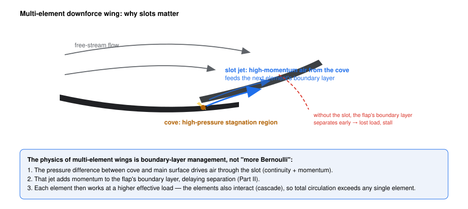
*Figure 7.1 — The slot: cove pressure drives a jet into the next element's boundary layer, delaying separation and letting each element carry more load.*

Mechanism, in physics order (this corrects the folk version):

1. The cove between elements is a **high-pressure stagnation region** (the flow decelerates into the slot's mouth).
2. That pressure drives air through the converging slot (continuity + momentum).
3. The **slot jet re-energises** the next element's boundary layer with momentum, delaying separation (Fig. 7.2 shows the velocity profiles).
4. Each element also *changes the effective flow direction* seen by the next (the cascade/interaction effect) — total circulation exceeds what any element could produce alone.
5. Result: element loads of 2–3× a single element's practical limit, at the cost of friction area, junction losses, and sensitivity (gap dimensions are critical — and heavily regulated).

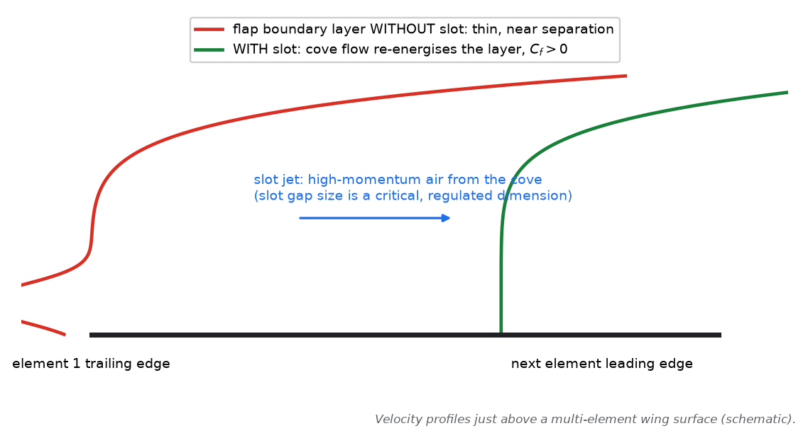
*Figure 7.2 — The slot's job in one picture: replace a starving boundary layer with one that has momentum to spend.*

**COMMON MISCONCEPTIONS (multi-element)**
> ❌ **"Slots work by restarting Bernoulli between elements."** Nothing "restarts"; the slot is a momentum *injection* device for a boundary layer (Part II §2.5). No slot, no high load — the flap separates.
>
> ❌ **"More elements = always more load."** Each element adds friction, junction and interference losses, and moves the stall mode to a new failure (flap stall, crossflow). Element count is regulated anyway.
>
> ❌ **"The flap only adds camber."** The flap also sets the slot jet, the cove pressure and the main-element loading — a change in flap angle reshuffles the *whole* pressure distribution.

---

## 7.3 F1 front and rear wings, concretely 🟡

**Front wing (current era, simplified by regulation — element count limited, neutral central section mandated).** Works close to the ground → wing-in-ground-effect physics (Part V Mechanism A) plus outwash duties (Part IV). Design tensions:
- Load vs. floor feeding: the strongest FW is not the best FW (Part IV §4.4).
- Ride-height sensitivity: FW load rises sharply as it nears the ground — a primary front-balance control (Part X).
- Kerb/attitude robustness: the wing must survive pitch/roll excursions without stalling.

**Rear wing.** Low aspect ratio (span regulated, ~limited to roughly 1 m class — check current dimensions), heavily loaded, the largest single drag item. The endplate is shaped to manage the tip vortex and interface with the beam-wing upwash. **DRS** rotates the flap open (gap regulated — 85 mm class; verify current figure in the regulations) to flatten the element and shed most of its load and drag: rear-wing drag reductions of order 50–80% are reported in open studies of DRS-type devices, with total-car drag cuts of tens of percent and lap-time gains of several tenths per lap (public/academic estimates — see sources). DRS also *changes the wake* — part of its racing effect beyond top speed.

**Gurney flaps.** A small right-angle strip at the trailing edge: increases trailing-edge loading (effectively higher circulation) cheaply, at a drag cost. A classic fine-trim tool for balance and load micro-adjustment.

---

## 7.4 The trade-off, quantitatively 🟡

The setup question — "how much wing for this circuit?" — is a lap-time integration problem. With total force coefficients dominated by the wing settings' contribution to $\Delta C_L A$ and $\Delta C_D A$:

- Fast circuits (long full-throttle fractions): drag costs top speed *every* straight; downforce helps only in a few corners ⇒ run low wing (Monza extreme).
- Slow/twisty circuits: downforce helps *every* corner, drag costs little ⇒ run maximum legal load (Monaco, Hungary).
- Everything else: optimise the power-limited/aero-limited balance per corner cluster; add tyre-degradation effects (more load = more lateral force = also more tyre energy).

**ENGINEERING INTUITION**
> If you remember only one thing: a wing setting is a *purchase*, and drag is the price tag. The aerodynamicist's job is not "maximum downforce" — it is buying each corner's grip at the cheapest possible straight-line price, under the regulations.

---

## F1 ENGINEERING QUESTIONS (Part VII)

**Conceptual**
- Why does induced drag scale with $C_L^2$? Explain with the trailing-vortex kinetic-energy picture.
- Why do F1 wings tolerate low aspect ratios that would be absurd on an aircraft?
- What physically limits how much load a multi-element wing can carry?

**Engineering**
- You need +2% rear load for one fast corner without losing top speed elsewhere. Candidates: main plane, flap angle, Gurney, beam wing. Rank them by drag-per-downforce and explain.
- DRS feels "lazier" on a high-downforce wing setting. Why?

**CFD**
- How would you verify the slot jet is working in your CFD post-processing? (Name two checks.)
- What does an induced-drag breakdown look like in CFD terms — which surface/region would you interrogate?

**Design**
- A rival's front wing generates equal load with visibly less span. What are three possible mechanisms?
- Design a rear wing "DRS-stratified" for a circuit with two DRS zones of different lengths — what geometry decisions follow?

---

## MINI PROBLEM (Part VII)

**Problem — The price of a wing trim**
*Given:* car at 300 km/h ($V = 83.3$ m/s, $q = 4{,}253$ Pa); a rear-wing trim adds $\Delta(C_L A) = 0.25\ \text{m}^2$ of downforce at a drag price $\Delta(C_D A) = 0.06\ \text{m}^2$. Car mass 800 kg, wing contributes to a corner where the lateral demand is $3.5g$.
*Required:* (a) extra downforce and drag force at 300 km/h; (b) is the trade "profitable" in the corner (does the added grip exceed the added drag penalty)? (c) At what speed does the extra drag equal 3% of the added downforce value?
*Solution:*
(a) $\Delta F_{DF} = q\,\Delta(C_L A) = 4{,}253 \times 0.25 \approx 1.06\ \text{kN}$; $\Delta D = 4{,}253 \times 0.06 \approx 255\ \text{N}$.
(b) In the 3.5g corner at some speed $V_c$, added grip $\approx \Delta F_{DF}$ (grows with $V_c^2$) vs added drag $\Delta D$ (also grows with $V_c^2$, but the *drag* only needs ~0.7 kN-scale to matter at top speed). At 250 km/h: $\Delta F_{DF} \approx 0.74$ kN of extra lateral capacity vs 178 N extra drag — the corner profits; on a straight the same trim costs ~178–255 N ≈ several km/h of top speed. The trade is circuit-dependent, exactly as §7.4 says.
(c) Engineering interpretation: trim decisions are made in this currency — kN of corner grip per 100 N of straight-line drag. The numbers above are illustrative orders of magnitude; real teams compute exactly this, per corner, per circuit.

---

## QUICK RECALL (Part VII)

1. Write the thin-airfoil lift relation; what sets $\alpha_{L0}$?
2. Write the induced-drag formula and explain each term's F1 implication.
3. What are the two effects that make multi-element wings work?
4. What does a Gurney flap do, mechanically?
5. Why is the front wing called the "thermostat" of the flow system?
6. What does DRS change, physically — list four effects.
7. Why is endplate design about vortex paths, not just blocking leakage?
8. Rank: which wing trim buys load cheapest in drag terms, and why?
9. Why does the optimum wing level differ between Monza and Hungary?
10. What limits a flap's load, and how does the slot postpone that limit?

### ANSWERS

1. $c_l = 2\pi(\alpha - \alpha_{L0})$; $\alpha_{L0}$ is set by camber (inverted camber → downforce at zero α).
2. $C_{D,i} = C_L^2/(\pi e AR)$: load² — F1 wings are heavily loaded; low regulated AR and low $e$ — big tax; hence floor-centric load generation.
3. Slot jet re-energises the next element's boundary layer (separation delay) + cascade interaction (each element sees modified effective flow).
4. A TE right-angle plate raising circulation/trailing-edge loading — cheap load, costs drag.
5. Its outwash and feed decide what every downstream device receives.
6. Flattens the flap: big rear drag cut; rear load drops; rear wake changes shape; rear axle unloads (handling + overtaking effects).
7. The edge vortex's *placement* does useful work (outwash, sealing); the plate just hosts it — designers shape where the vortex goes.
8. Generally beam wing / floor-adjacent devices (they add load with less direct free-stream drag and feed the rear wing) over main-plane/flap increases — hence "floor first" is the modern doctrine.
9. Corner-to-straight ratio: Hungary's corners reward load everywhere; Monza's straights punish drag everywhere.
10. Suction-peak adverse gradient defeating the boundary layer (stall); the slot injects momentum into that layer, postponing separation to higher loads.

---

## SOURCES (Part VII)

- Anderson, J. D., *Fundamentals of Aerodynamics*, McGraw-Hill (6th ed., 2017) — thin-airfoil theory, finite-wing/induced-drag theory. [Tier 1]
- Zhang, X. & Zerihan, J., "Aerodynamics of a Double-Element Wing in Ground Effect", *AIAA Journal* 41(6), 2003 — multi-element ground-effect loads; flap contributes 15–25% of total. [Tier 1]
- Katz, J., *Race Car Aerodynamics*, Bentley (1995) — race-car wing design, Gurney flaps, multi-element practice. [Tier 1]
- McBeath, S., *Competition Car Aerodynamics*, Veloce (3rd ed., 2015) — practical wing/trim development. [Tier 2]
- Loução, R. et al., "Aerodynamic Study of a Drag Reduction System…", *Fluids* (MDPI) 7(9):309, 2022; and Monash DRS studies — DRS drag/downforce magnitudes (wing-level ~50–80% drag cut; total-car estimates lower). [Tier 2]
- FIA Formula 1 Technical Regulations, Art. 3 — wing geometry, element counts, DRS aperture. [Tier 1]


---

# PART VIII — Drag

**Purpose:** a proper taxonomy of drag, an honest account of where an F1 car's drag actually comes from, and why "make everything smaller" is not a drag-reduction strategy.

**Course connection:** anchors: Anderson ch. 1 (drag categories) + ch. on boundary layers (friction/form split); Hucho (vehicle drag decomposition); Katz ch. 4–5. Module mapping: ____________

---

## 8.1 The taxonomy 🟢→🟡

| Category | Mechanism | Scales with | F1 relevance |
|---|---|---|---|
| **Pressure (form) drag** | Boundary-layer separation leaves a low-pressure wake; integrated pressure imbalance | frontal area, separation extent | dominant on wheels, bodywork, any stalled component |
| **Skin-friction drag** | Wall shear $\int \tau \, dA$ | wetted area, $Re$, transition state | real but secondary at car scale; matters on clean surfaces |
| **Induced drag** | Trailing-vortex kinetic energy (finite-span lift tax) | $C_L^2/AR$ | heavy: low-AR wings, heavily loaded floor edges |
| **Interference drag** | Junctions, close-proximity components; merging boundary layers/wakes | local geometry | everywhere: wing-body junctions, suspension, endplate/floor intersections |
| **Wave/compressibility drag** | Shocks, compressibility losses | $Ma \to 1$ | essentially absent at F1 free-stream Mach (~0.3 max) |

Total drag splits *functionally* too — never forget the second axis:

$$D = D_{\text{wings}} + D_{\text{wheels}} + D_{\text{body}} + D_{\text{cooling}} + D_{\text{induced}} + \ldots$$

Because the car is a system, these terms are coupled: cooling flow exits into the floor feed; wing wake changes what the diffuser swallows; wheel wakes load the floor edge.

---

## 8.2 Where F1 drag actually comes from 🟡

**Wheels and their wakes.** Four exposed, rotating, open wheels — each a bluff body with massive separation. Open literature on isolated racing wheels shows drag coefficients of order 0.5–1 depending on configuration; wheels and their wakes are widely regarded as a leading share of total car drag (public technical consensus; exact team splits are confidential). Rotation changes the wake (Part IX).

**Wings (especially the rear wing).** Low-AR, heavily loaded — large induced drag plus the profile drag of elements working near their limits. The rear wing alone can be a double-digit percentage of total drag (order-of-magnitude, public estimates).

**Cooling.** The internal flow path pays three times: momentum lost at the inlet (ram capture), pressure loss through radiators/ducts, and exit momentum deficit/wake. Cooling drag is a genuine fraction of total drag, and its size is a design choice (inlet/exit sizing, Part IV).

**Bodywork & interference.** Separation on the engine cover, mirrors, halo, suspension legs, crash structure; junction flows at every intersection; the "coke-bottle" waist exists precisely to reduce these losses where the flow must accelerate and turn.

**The wake as drag.** The momentum deficit left behind the car (Fig. 8.1) *is* the drag, seen from the momentum viewpoint (Part II §2.1): the engine's thrust work is the kinetic energy and heat left in the air.

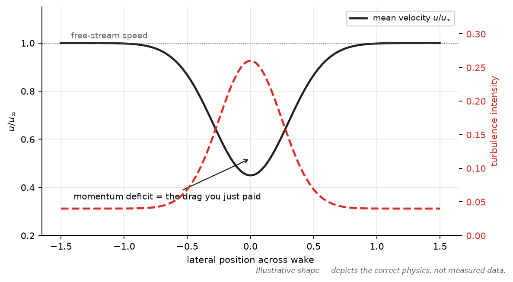
*Figure 8.1 — Drag from downstream: the momentum deficit is the bill; the turbulence is the "dirty air" that punishes the car behind.*

**ENGINEERING INTUITION**
> If you remember only one thing: drag is the energy you leave in the air. Every watt the engine makes that doesn't push the car forward ends up as heat and turbulence in the wake — the drag audit is an energy audit.

---

## 8.3 Why "make everything smaller" fails 🟡

1. **Wheels are fixed** by regulation — the biggest bluff bodies can't shrink.
2. **Cooling must pass a budget** — starve it and you lose power or the race; the optimum is a designed compromise, not zero.
3. **Flow conditioning needs geometry** — bargeboards (historically), fences, and edge wings *added* area but *reduced* total drag by keeping downstream devices attached. Local area is not total drag.
4. **Downforce is purchased with drag** (Part VII) — the induced-drag term is the *product* working.
5. **Separation beats size** — a small separated component can drag more than a large attached one. Surface shaping (pressure recovery) is the tool, not shrinking.

---

## F1 ENGINEERING QUESTIONS (Part VIII)

**Conceptual**
- Explain why induced drag is largest exactly where downforce is largest.
- Why does a separated flap produce *more* drag and *less* load than an attached one at higher deflection?
- What is the momentum-view definition of drag, and how does an aero rake exploit it?

**Engineering**
- Monza trim: list three drag sources you'd attack first and what each risks.
- Your cooling exit flow merges with the rear-tyre wake. Quantify conceptually the three losses you're paying.
- Why can adding a component (e.g., a small strake) *reduce* total drag?

**CFD**
- How would you decompose CFD drag by component and by mechanism (pressure vs friction vs induced)?
- What does an interference-drag audit look like in CFD? (Two bodies run separately vs together — what's the bookkeeping?)

**Design**
- The rear wing is 15% of total drag. Design two mechanisms to cut it without losing the corner it was bought for.
- A new mirror design saves 0.4% total drag but dirties the sidepod inlet flow. What data decides "keep or kill"?

---

## MINI PROBLEM (Part VIII)

**Problem — Power to overcome drag**
*Given:* $C_D A = 1.4\ \text{m}^2$ (mid-trim, public-order estimate), $\rho = 1.225$, speed 320 km/h (88.9 m/s). Ignore rolling resistance.
*Required:* (a) drag force; (b) power to overcome it; (c) top-speed sensitivity: how much extra speed does −2% $C_D A$ buy at fixed power?
*Solution:*
(a) $D = q\,C_D A = 0.5\times1.225\times88.9^2\times1.4 \approx 6.8\ \text{kN}$.
(b) $P = D \cdot V = 6.8\times10^3 \times 88.9 \approx 605\ \text{kW}$ — of order the total deployed power of a current power unit, which tells you the estimate class is right (rolling resistance and drivetrain losses add more).
(c) At fixed power $P = \tfrac12\rho C_DA\, V^3$: $V_{new}/V = (0.98)^{-1/3} \approx 1.0068$ ⇒ ~0.7% ≈ +2.3 km/h at 320. One to two car lengths per straight.
*Engineering interpretation:* cubic velocity scaling makes drag the currency of top speed; a 2% drag cut is worth more than most single-corner downforce gains at Monza-class circuits — and *less* at Hungary-class circuits. That asymmetry is the entire wing-level debate, quantified.

---

## QUICK RECALL (Part VIII)

1. Name the five drag categories and one F1 example of each (or note absence).
2. What is the momentum definition of drag, and how is it measured without touching the car?
3. Rank the F1 drag sources by likely share and justify the top item.
4. Why is cooling drag a "three-time payment"?
5. Why can added geometry reduce total drag?
6. What does the $V^3$ power law imply about trim choices for Monza?
7. Where does the engine's drag work end up, thermodynamically?
8. Why are wheels' wakes both a drag and a racing problem?
9. What is interference drag, physically?
10. Why is "smaller = less drag" a non-strategy in F1?

### ANSWERS

1. Pressure/form (wheels, stalled parts), skin friction (clean surfaces), induced (loaded low-AR wings/floor edges), interference (junctions, suspension), wave (essentially absent at Ma ≈ 0.3).
2. Net momentum flux deficit behind the body; measured by wake surveys/rakes integrating $\rho u (u_\infty - u)$.
3. Wheels/wakes and wings at the top (public consensus, order-of-magnitude); exact splits confidential.
4. Ram capture at the inlet, duct/radiator pressure loss, exit momentum deficit/wake.
5. Because flow conditioning keeps downstream devices attached and clean — total drag is a system outcome.
6. Drag costs scale with $V^3$ in power terms; long straights make every $C_D A$ point expensive ⇒ low wing.
7. As heat and turbulence in the wake (plus some as acoustic/unsteady energy) — the entropy bill of going fast.
8. They cost drag directly *and* degrade following cars' performance — the double role that shaped the 2022 rules.
9. Merging boundary layers and mutual flow disruption at junctions/proximities producing more drag than the sum of parts.
10. Wheels fixed; cooling required; conditioning devices pay for themselves; separation dominates size; downforce purchase is legitimate drag.

---

## SOURCES (Part VIII)

- Hucho, W.-H. (ed.), *Aerodynamics of Road Vehicles*, SAE International (4th ed., 1998) — vehicle drag decomposition, cooling drag. [Tier 1]
- Anderson, J. D., *Fundamentals of Aerodynamics*, McGraw-Hill (6th ed., 2017) — drag categories, friction/form split. [Tier 1]
- Katz, J., *Race Car Aerodynamics*, Bentley (1995) — race-car drag accounting. [Tier 1]
- Mears, A., Dominy, R. & Sims-Williams, D., "The Air Flow About an Exposed Racing Wheel", SAE 2002-01-3290 — isolated-wheel drag magnitude. [Tier 1]
- Axerio-Cilies, J. & Iaccarino, G., *ASME J. Fluids Eng.* 134(12), 2012 — rotating-wheel flow/drag. [Tier 1]
- Toet, W. (2013), *The Aeronautical Journal* — where F1 drag comes from, from practice. [Tier 2]


---

# PART IX — Tyres, Wheels and Wakes

**Purpose:** understand the exposed rotating wheel — the F1 car's hardest aerodynamic problem — and why every downstream component's performance depends on how well the wheel wakes are handled.

**Course connection:** anchors: Mears/Dominy/Sims-Williams (SAE 2002-01-3290); Axerio-Cilies & Iaccarino (ASME JFE, 2012); Hucho wheel chapters; Katz ch. 4. Module mapping: ____________

---

## 9.1 Why wheels are aerodynamically hostile 🟡

An exposed racing wheel is three problems in one body:

1. **Bluff body:** a blunt disc/tyre with massive, unsteady separation at high Reynolds number.
2. **Rotating:** the wall velocity is *non-zero* (no-slip on a moving surface), reversing the classic "stationary body" intuition; the ground blocks the flow at the contact patch.
3. **Deforming:** tyre load deflects the carcass — contact-patch bulge and sidewall squash change the local geometry with speed and load (secondary but real, and regulated geometry changes with 18-inch wheels changed the flow too).

No aircraft deals with any of these; road cars hide two of them behind wheel arches. In F1 they sit in the open, on the most performance-critical flow paths of the car.

---

## 9.2 The flow field of an isolated rotating wheel (documented structure) 🟡

The literature (Mears et al.; Axerio-Cilies & Iaccarino; McManus & Zhang; Knowles et al.) gives a consistent picture, sketched in Figure 9.1:

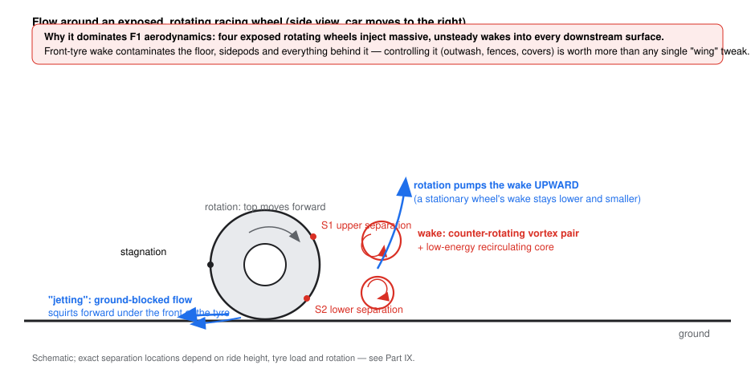
*Figure 9.1 — Documented structure of the isolated rotating-wheel flow (schematic after the cited studies).*

- **Stagnation and "jetting":** the ground blocks the oncoming flow at the front of the contact patch; pressure rises there and the blocked flow squirts *forward and around* the tyre sides — the jet. Rotation energises this jet (the ground vortex pair).
- **Separation:** top separation and side separations are strong and *shift with rotation* — the rotating surface drags the boundary layer further around before it lets go. Documented effect of rotation vs stationary: top separation location moves earlier by tens of degrees; the wake becomes **taller and narrower**; the recirculating core grows.
- **The wake: a counter-rotating vortex pair (CVP)** filling the wake behind the wheel, with **upwash** behind the wheel (rotation pumps the wake upward around hub height) — a wheel wake is not a passive deficit; it is an organized, rising, swirling structure.
- **Force effects of rotation (isolated-wheel studies, order-of-magnitude):** rotating wheels show *lower* drag than stationary ones (of order 10%+), drastically less upward lift (rotation + jetting change the underbody/ground-vortex behaviour), and different side-force behaviour.

**Why the wake is so damaging downstream:** it combines a *large momentum deficit* (drag, Part VIII), *strong organised vorticity* (the CVP bends and scours whatever it touches), and *high unsteadiness* (broadband turbulence that decorrelates everything behind it). A downstream floor edge, fence, or wing element sees its inlet conditions change in both space and time.

---

## 9.3 Front-wheel wake and its management 🟡→🔴

The front-tyre wake lands directly on the floor, sidepods, and everything aft. Management tools, in regulation and in practice:

- **Front wing outwash** (Part IV): steer clean flow *around* the tyre to shield downstream devices.
- **Floor fences:** the first floor inlets are placed and shaped to digest what the tyre wake delivers, and to keep the tunnels fed at yaw.
- **Wheel covers / over-wheel geometry (2022+):** regulated bodywork to reduce the tyre's wake messiness.
- **Suspension shaping:** arms positioned/shaped to avoid feeding the wake further downstream.

**ENGINEERING INTUITION**
> If you remember only one thing: the front wheels own the inlet conditions of the whole car. "Making the front wing better" almost always means "making the front-tyre wake matter less".

---

## 9.4 Rear-wheel wake 🟡

The rear-tyre wake interacts with the diffuser's exit flow, the beam wing, and the rear wing's lower surface. The diffuser/beam-wing upwash (Parts IV–V) exists partly to *lift the floor jet over* the rear-tyre wakes. Get this wrong and the rear wing's lower surface eats turbulent wake: load fluctuates, stall margins shrink, and the car's rear becomes speed- and attitude-sensitive. Tyre *deformation* matters here too: a squatted rear tyre at speed changes the wake geometry the rear wing was designed around.

---

## 9.5 Wheel wake and the car behind 🟡

Wheel wakes are the main reason following an F1 car is hard: they are unsteady, wide, and contain the strongest vorticity in the whole flow field. The 2022 regulations attacked this directly (wheel covers, removed bargeboards, floor-centric load) — the FIA's stated goal was a following car losing much less downforce at close range (public figures of order ~46% loss for 2021 cars vs ~18% target for 2022 cars circulated in FIA materials; see Engineering Audit for verification status).

---

## COMMON MISCONCEPTIONS (Part IX)

> ❌ **"Wheel drag is mostly skin friction on the tyre."** It is overwhelmingly pressure/form drag from separation and the wake. The tread's friction is a rounding error.
>
> ❌ **"A stationary-wheel CFD model is good enough."** Rotation changes separation positions, wake structure (taller, rising) and even the sign of some loads. The early literature's main lesson is exactly this difference.
>
> ❌ **"The wheel wake just blows backwards."** It rises (upwash around hub height) and contains an organised CVP — it bends *around and over* downstream components, which is what makes it so invasive.
>
> ❌ **"Slipstreaming an F1 car is like following a truck."** The wakes are narrower, vortical, and high-energy in different places; the benefit is real but the spatial structure is completely different — hence tow behaviour varies corner-by-corner.
>
> ❌ **"Tyre deformation is a mechanical footnote."** The deforming tyre *is* an aerodynamic body whose shape varies with load and speed — one reason aero maps at fixed geometry cannot fully represent reality.

---

## F1 ENGINEERING QUESTIONS (Part IX)

**Conceptual**
- Explain jetting in continuity terms: what is blocked, and where does the flow go?
- Why does rotation make the wheel wake *taller*? (Follow the surface velocities.)
- Why is the wheel wake's unsteadiness a bigger problem for a downstream wing than its mean deficit?

**Engineering**
- Your floor loses load when following. How would you decide whether front-tyre wake management or floor-robustness is the better investment?
- What would you change first to reduce front-tyre wake into the sidepods: FW outwash, fences, or wheel cover? Why?

**CFD**
- Why must the wheels rotate in your CFD (and the ground move) to trust underbody data?
- How would you compare two wheel-wake "treatments" — which metrics, which survey planes?

**Design**
- Brief: reduce the front-tyre wake's impact on the floor's first fence by 20% without adding drag. Sketch two mechanisms and their risk.
- How would you design the diffuser/beam-wing system to be more robust to rear-tyre wake wandering?

---

## QUICK RECALL (Part IX)

1. Name the three simultaneous problems an exposed F1 wheel presents.
2. What is jetting, and what structure does it leave near the ground?
3. Describe the isolated rotating wheel's wake in three features.
4. What changes (documented, order-of-magnitude) between rotating and stationary wheel flows?
5. Why do front wheels "own the inlet conditions" of the car?
6. Name three regulation/practice tools for front-tyre-wake management.
7. Why does the diffuser/beam-wing system care about the rear-tyre wake?
8. What made wheel wakes central to the 2022 rule changes?
9. Why is the wheel wake's CVP more damaging than its momentum deficit?
10. How does tyre deformation couple into the aero problem?

### ANSWERS

1. Bluff-body separation; rotation (moving wall); deformation under load.
2. Ground-blocked flow squirting forward/around at the contact patch, leaving a ground-vortex pair energised by rotation.
3. Counter-rotating vortex pair; upwash (rising wake); large unsteady recirculating core.
4. Top separation moves earlier (tens of degrees), wake taller/narrower, drag lower by ~10%+, upward lift drastically reduced (order-of-magnitude from isolated-wheel studies).
5. Their wakes set the flow quality delivered to floor, sidepods and everything downstream.
6. FW outwash shaping, floor fences, wheel covers/over-wheel bodywork (plus suspension shaping).
7. The rear-tyre wake sits where the diffuser jet and beam wing work; wake wandering changes the rear wing's inlet quality and stall margin.
8. They are the biggest unsteady vortical contaminant for following cars — the regs targeted wheel covers, bargeboard removal and floor-centric load to reduce sensitivity.
9. The CVP actively bends/organises the disturbance and scours surfaces — a structured intruder, not just a slow region.
10. Load and speed change the tyre's shape, hence the flow geometry the whole downstream system was tuned to.

---

## SOURCES (Part IX)

- Mears, A., Dominy, R. & Sims-Williams, D., "The Air Flow About an Exposed Racing Wheel", SAE 2002-01-3290, 2002 — isolated-wheel flow structure, jetting, wake. [Tier 1]
- Axerio-Cilies, J. & Iaccarino, G., "An Aerodynamic Investigation of an Isolated Rotating Formula 1 Wheel Assembly", *ASME J. Fluids Engineering* 134(12), 2012 — rotating vs stationary wheel flow and forces. [Tier 1]
- McManus, J. & Zhang, X., "A Computational Study of the Flow Around an Isolated Wheel in Contact with the Ground", *ASME J. Fluids Eng.* 128(4), 2006 — wake vortical structure. [Tier 1]
- Knowles, R. et al., "On the near wake of a Formula One front wheel", *Proc. IMechE Part D*, 2013 — front-wheel wake detail. [Tier 1]
- Hucho, W.-H. (ed.), *Aerodynamics of Road Vehicles*, SAE (4th ed., 1998) — wheel/tyre aerodynamics background. [Tier 1]
- Zhang, X., Toet, W. & Zerihan, J., "Ground Effect Aerodynamics of Race Cars", *Applied Mechanics Reviews* 59(1), 2006 — wheels in the ground-effect context. [Tier 1]


---

# PART X — Aero Balance

**Purpose:** connect the aerodynamic force system to the driver's steering wheel: what balance is, why it moves with speed and attitude, and how setup decisions play out at both axles.

**Course connection:** anchors: Katz ch. 5; Milliken & Milliken, *Race Car Vehicle Dynamics* (ch. on aerodynamics and vehicle dynamics); McBeath (setup chapters). Module mapping: ____________

---

## 10.1 Centre of pressure and aero balance 🟡

**Aero balance** = the fraction of total downforce acting at the front axle:

$$\%\,front = \frac{L_{front}}{L_{front} + L_{rear}} \times 100$$

It is the position of the **centre of pressure (CoP)** expressed in vehicle coordinates. Publicly quoted working ranges sit in the mid-40s percent front (engineering inference from team/press discussion; exact targets are team- and circuit-specific — no fake precision here).

Why the number is sacred: the tyres' grip envelope is set by *load*, and the two axles compete for the same lateral demand. Whichever axle saturates first sets the car's limit behaviour:

- **Front saturates first → understeer** (car runs wide).
- **Rear saturates first → oversteer** (rear slides).

Balance is therefore the primary aerodynamic lever on *character*, separate from total grip.

---

## 10.2 Why balance moves with speed 🟡→🔴

Balance is not a constant — it is a **map over the operating envelope**:

1. **Ride heights fall with speed** (aero load compresses the springs): the floor — a rear-biased device in the modern era — gains proportionally more than the wings ⇒ balance migrates rearward as speed rises.
2. **Pitch/rake changes** redistribute wing vs floor contributions (Part V §5.5).
3. **Ground-effect sensitivity** differs device by device: the FW near the ground gains load sharply (front-heavy influence at certain attitudes); the diffuser's recovery is attitude-sensitive.
4. **Wing settings** shift the whole map: more rear wing moves balance rearward at *all* speeds.

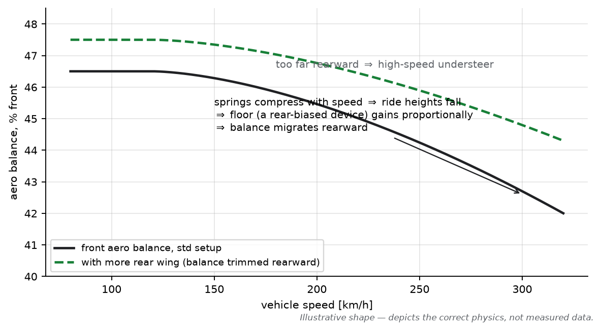
*Figure 10.1 — Balance as a map: the same car's balance at 120 km/h and at 300 km/h are different cars, dynamically speaking.*

A driver experiences this as *speed-dependent handling*: a car that turns in beautifully mid-corner at 150 km/h but pushes (understeers) at 280 km/h, or — worse — a car whose balance swings *through* neutral as it accelerates out of a corner (a "peaky" car is an unstable partner).

**ENGINEERING INTUITION**
> If you remember only one thing: the driver never feels "the balance number" — they feel how the balance *travels*. Aerodynamic development is as much about flattening the travel as about total load.

---

## 10.3 The two classic setup questions 🟡

**"What happens if the front wing produces more load?"**
Aerodynamically: front-axle grip rises relative to the rear; balance moves forward; understeer decreases (or oversteer appears at the limit); FW-induced drag is added cheaply compared to the rear wing. Mechanically: the front tyres carry more load → higher front-tyre temperatures and energy; front-left/right asymmetries amplify in ovals/circuits with direction bias. Second-order: a lower FW raises its ground-effect sensitivity — the car's *balance travel with speed* steepens.

**"What happens if the rear wing angle is increased?"**
Rear load rises, rear grip rises; balance moves rearward (high-speed understeer tendency, more stable entry); drag rises — top speed falls; the DRS effect strengthens (more to open); rear-tyre temperatures rise. If pushed too far, the front axle saturates everywhere: the car plows, front tyres overheat, entry feels dead.

Both answers come with the same caveat: because devices interact (Part IV), the *isolated* statement is only the first-order story — the floor's response to the changed upstream flow can offset part of it.

---

## 10.4 Setup levers and their fingerprints 🟡

| Lever | Primary effect | Secondary effect |
|---|---|---|
| FW flap angle / elements | front load, entry behaviour | floor feed; FW load-vs-speed sensitivity |
| RW flap angle / wing level | rear load, high-speed stability | drag/top speed; DRS magnitude; rear tyre temp |
| Rake | underbody expansion; balance shift | diffuser/recovery behaviour; FW ground proximity |
| Ride heights (front/rear) | force-map operating point (Part V) | porpoising margin; kerb behaviour |
| Gurney flaps | micro-trim of element load | cheap drag cost; edge-vortex changes |
| Suspension springs/damping | attitude trajectory through corners | *which part of the aero map* the car actually uses |

---

## COMMON MISCONCEPTIONS (Part X)

> ❌ **"Balance is a fixed number you set once."** It is a map over speed/attitude; setups choose *where on the map* the car lives and how steeply the map tilts.
>
> ❌ **"More front wing always fixes understeer."** It fixes *aero* understeer at the affected speeds, but if the understeer is mechanical (tyres, camber, slow corners with no aero load), the wing does nothing except add drag and front-tyre heat.
>
> ❌ **"Rear wing = only for fast circuits' straights trade."** The rear wing is also a *balance* and *stability* tool — teams run more wing than the straight-line optimum purely to place the balance and protect the rear tyres.
>
> ❌ **"Oversteer means the car is loose, so add rear downforce everywhere."** Oversteer at *one* speed band or *one* corner phase needs a targeted fix; global rear load may cure it while creating understeer elsewhere.
>
> ❌ **"Aero balance and weight distribution are independent."** They interact through total load and transfer: the *effective* axle load is weight share + aero share + transfer, and grip depends on all three (and on tyre load sensitivity, Part III).

---

## F1 ENGINEERING QUESTIONS (Part X)

**Conceptual**
- Why does aero balance usually migrate rearward with speed on ground-effect cars?
- Explain, in terms of $dF/dh$, why two cars with identical static balance can behave oppositely through a fast corner entry.

**Engineering**
- A driver reports entry oversteer only above 250 km/h. List the three most likely aerodynamic mechanisms and a diagnostic for each.
- You may add load only at the beam wing or only at the FW for one circuit. Which for a stop-go track? Which for a flowing track? Why?

**CFD**
- How would you extract balance from CFD in a way that matches the wind tunnel *and* the car (reference areas, moments, attitude sweep)?
- What CFD outputs would you use to diagnose "balance travel" rather than just static balance?

**Design**
- Design brief: flatten the balance-vs-speed curve without losing peak load. Which components and why?
- If regulation froze all wing angles, what aerodynamic levers would remain for balance?

---

## QUICK RECALL (Part X)

1. Define aero balance; state its typical working range and why precision is fake beyond that.
2. Why does balance move with speed? Give the two dominant mechanisms.
3. Driver reports high-speed understeer: what aerodynamic causes are most likely, and which data confirms?
4. What happens to balance, drag, top speed and tyre temps when rear wing angle increases?
5. Why is a "balance map" more honest than "balance number"?
6. How do tyres make balance sub-linear in load?
7. What does rake do to balance and to diffuser behaviour?
8. Why can adding FW load worsen front-tyre overheating even though grip "improved"?
9. Which setup lever manipulates *which part of the aero map* the car uses?
10. How do wing settings interact with DRS behaviour?

### ANSWERS

1. % of downforce on the front axle; mid-40s% typical (team/circuit-specific inference); beyond that, quoting decimals would be fake precision.
2. Ride heights fall with aero load (floor gains proportionally, rear-biased); attitude changes shift wing vs floor contributions.
3. Rear-biased balance travel (floor gaining too much), insufficient FW load at speed, FW losing its ground-effect margin; confirm with the aero map's balance-vs-speed data and driver's speed-band report.
4. Balance rearward, drag up, top speed down, rear tyres hotter, DRS effect stronger, stability up.
5. The car's handling is set by the balance *trajectory* through the corner (speed/attitude), not a single value.
6. Load sensitivity: μ falls as load rises, so each axle's grip doesn't scale linearly with its downforce share.
7. Rake changes underbody expansion → shifts load distribution and can change recovery/stall margin (Part V).
8. More load = more lateral force = more tyre energy and heat; grip rising ≠ tyre surviving.
9. Springs/damping (and ride heights) set the attitude trajectory → which map region is visited.
10. Bigger wing = bigger load swing when the flap opens: stronger DRS effect, bigger balance transient.

---

## SOURCES (Part X)

- Milliken, W. & Milliken, D., *Race Car Vehicle Dynamics*, SAE (1995) — load transfer, balance, tyre load sensitivity, aero-vehicle coupling. [Tier 1]
- Katz, J., *Race Car Aerodynamics*, Bentley (1995) — aero balance and setup practice. [Tier 1]
- McBeath, S., *Competition Car Aerodynamics*, Veloce (3rd ed., 2015) — practical balance/setup trade-offs. [Tier 2]
- Public team/press technical discussions of aero balance ranges — used as ranges only (Tier 3, marked as inference).


---

# PART XI — Wind Tunnel

**Purpose:** how a wind tunnel works, what it measures, where it lies, and how an F1 aerodynamic development programme actually uses it — including the FIA's restrictions on its use.

**Course connection:** anchors: Barlow, Rae & Pope, *Low-Speed Wind Tunnel Testing* (the canonical text); Katz ch. 8; Zhang/Toet/Zerihan review (moving-ground testing). Module mapping: ____________

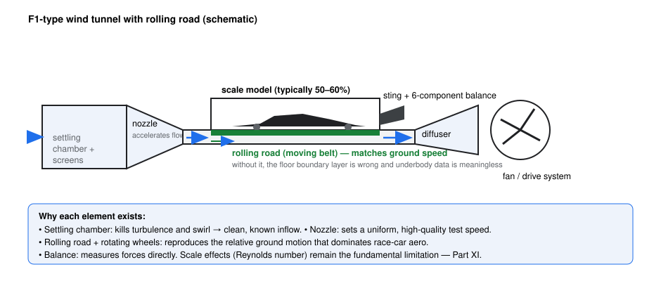
*Figure 11.1 — Elements of an F1-type tunnel. The rolling road and rotating wheels are not accessories; without them the underbody data is simply wrong (Part V).*

---

## 11.1 Why tunnel-test at all 🟢

A wind tunnel creates a controlled, repeatable, instrumented flow around a model, letting you: isolate variables (one geometry change at a time), measure forces precisely (balance), and see the flow (visualisation). Its purpose is *differential development* — quantifying deltas between designs far more accurately than absolute numbers.

F1 teams operate their own tunnels (team-specific sites, e.g., public knowledge: Toyota's former Cologne tunnel, Mercedes' Brackley facility, etc.) testing **scale models — commonly 50–60% scale** — on rolling roads with rotating wheels.

---

## 11.2 The similitude problem (scale effects) 🟡

Dynamic similarity requires matching $Re$ (and Mach, and Froude for free-surface effects — irrelevant here):

$$Re_{model} = \frac{\rho V_{model} L_{model}}{\mu} \stackrel{!}{=} Re_{full}$$

At 50% scale and equal velocity, $Re$ is only half of full scale; teams test at model speeds of tens of m/s (public: up to ~50 m/s class). You **cannot** close the gap fully (velocities are limited by model structural loads, drive power, and compressibility). Consequences and their standard handling:

- **Relatively thicker boundary layers** at lower $Re$ → margins differ; designers build correlation experience ("tunnel deltas vs track deltas").
- **Transition management:** without help, model boundary layers transition at different locations than full scale. Teams place **trip dots** to force transition where it would naturally occur on the full-scale car.
- **Stall/separation margins** shift — the tunnel is optimistic or pessimistic in known directions, per component, per team.

**ENGINEERING INTUITION**
> If you remember only one thing: the tunnel never gives you the track. It gives you *ranked deltas* — and the entire craft of testing is knowing how those deltas distort on the way to the car.

---

## 11.3 Making the ground real: rolling road & wheels 🟡

A fixed floor builds its own boundary layer, which the model would then fly through — physically wrong for a car whose ground is moving. The **moving belt (rolling road)**, matched to airspeed, plus **rotating wheels** (belt- or motor-driven, with regulated/vetted wheel rotation), reproduce the relative motion that dominates underbody and wheel-wake physics. Boundary-layer bleeding/suction ahead of the belt and careful belt-model gaps manage the seams. Every ground-effect concept in Part V was *born* in tunnels that got this right — and the historical moving-ground-facility literature (e.g., the Zhang/Toet/Zerihan review) documents how badly fixed-floor data distorts underbody forces.

---

## 11.4 Blockage and corrections 🟡

The tunnel walls constrain the flow (solid blockage) and the wake (wake blockage), inflating apparent dynamic pressure and forces relative to open air. Standard corrections (area-ratio based for solid blockage; wake-based for drag) are applied; F1 tunnels use large test sections relative to model size to keep corrections small. The same phenomenon — but infinitely worse — affects CFD domain sizing (Part XII); the physics is identical: boundaries that are too close flatter the design.

---

## 11.5 Instrumentation & flow diagnostics 🟡

- **Force & moment measurement:** a high-precision **internal six-component balance** (or under-floor external balance) gives the full force/moment vector; with model attitude actuators, teams sweep **aero maps** — heave, pitch, roll, yaw matrices (Part III §3.4).
- **Pressure taps:** hundreds of surface taps scan pressure distributions on wings/floor — the experimental Cp plots of Figure 2.1.
- **Flow visualisation:** tufts (surface flow direction), flow-vis paint (time-integrated surface streamlines), smoke wands (streaklines).
- **Particle image velocimetry (PIV):** laser-sheet imaging of seeded flow gives planar velocity fields — the experimental version of CFD slices; used for wake/vortex surveys (with restricted access windows and model-zone limitations).
- **Aero rakes:** pitot-tube combs traversed in the wake — direct CFD-correlation datasets (used on track too, publicly visible since ~2019).

---

## 11.6 The F1 development programme & its governor 🟡→🔴

A typical development use of the tunnel: validate the week's best CFD geometries → run aero maps (attitude sweeps) → compare deltas to baseline → flag robustness issues (map regions where the gain dies) → hand correlated upgrades to the track group.

The FIA **Aerodynamic Testing Regulations (ATR)** cap this activity: wind-tunnel *occupancy* and *runs*, and CFD *usage*, are allocated on a **sliding scale tied to championship position** (worse finish → more testing allowance), with further adjustments under cost-cap-era rules. The precise unit system (runs, hours, "tokens") is revised periodically; the *mechanism* — testing capped inversely to success, to slow the rich-get-richer spiral — is the durable fact. Check the current ATR edition for exact numbers.

**COMMON MISCONCEPTIONS (wind tunnel)**
> ❌ **"The tunnel is the ground truth that CFD is judged against."** The tunnel is a *measurement of a model* — with scale effects, support interference, belt seams and its own uncertainty bands. Tunnel↔track correlation is its own hard problem; the tunnel is one instrument among three (tunnel, CFD, track), none of which is "truth" alone.
>
> ❌ **"Model-scale numbers convert by scale factor."** Forces don't scale by $L^2$ naively across mismatched $Re$; coefficients transfer only with transition management and correlation experience.
>
> ❌ **"A fixed floor is fine for force testing."** For road cars with sealed underbodies, marginally; for ground-effect race cars, catastrophically wrong — the underbody is the engine of the car.
>
> ❌ **"Tunnels are unlimited resources."** ATR caps occupancy and CFD — the *allocation* of tunnel hours is a strategic team resource, planned like a budget.

---

## F1 ENGINEERING QUESTIONS (Part XI)

**Conceptual**
- Why does a rolling road change underbody *force*, not just flow pictures?
- What exactly does a trip dot replace, and why is it needed at model scale?
- Why is blockage worse for a wake-heavy body than a clean one?

**Engineering**
- Your tunnel says +1.5% $C_L A$, the track says −0.5%. List four candidate causes and one diagnostic each.
- How would you plan a tunnel session to *also* validate CFD, not just rank geometries?

**CFD**
- Which tunnel-related corrections have CFD analogues, and why does CFD still need its own discipline (Part XII)?
- What model-scale phenomena would you *deliberately* recreate in CFD to build correlation?

**Design**
- You have 8 hours of tunnel time and 20 candidate geometries from CFD. Design the screening strategy.
- Where would you place instrumentation to catch the floor-edge vortex failing (Part VI) on a 55% model?

---

## QUICK RECALL (Part XI)

1. State the dynamic-similarity condition for tunnel testing and why F1 tunnels can't fully match it.
2. What is a rolling road for, physically?
3. Name four instrumentation systems and what each measures.
4. What is blockage, and how do tunnels and CFD each handle it?
5. What does the ATR sliding scale do, and why?
6. Why are trip dots used on models?
7. What is an aero map, and which variables does it sweep?
8. Why is "tunnel = truth" wrong? Give two reasons.
9. What does flow-vis show that tufts don't?
10. What is the tunnel's real product — absolute numbers or something else?

### ANSWERS

1. Match $Re$ ($\rho V L/\mu$); at 50% scale, $V$ would need to double (limited by loads/power) — an order-of-magnitude gap remains in practice.
2. Reproduces relative ground motion; removes the fixed-floor boundary layer that falsifies underbody physics.
3. Six-component balance (forces/moments), pressure taps (surface Cp), PIV (planar velocity fields), aero rakes (wake surveys); plus tufts/flow-vis/smoke.
4. Walls constrain flow/wake, inflating forces; corrected in tunnels by formulas/large sections; in CFD by domain sizing — the same boundary-interference physics.
5. Caps tunnel occupancy/runs and CFD usage inversely to championship position — to limit the resource advantage of successful (rich) teams.
6. They force transition to the full-scale location, compensating the model's lower $Re$.
7. The force/moment response sampled over heave/pitch/roll/yaw — the car's aerodynamic personality.
8. It measures a scaled model (Re mismatch, transition, support/belt interference) and has its own uncertainty; it is one leg of a three-legged correlation stool.
9. Flow-vis gives time-integrated surface streamlines (where flow *went*); tufts show local direction behaviour live.
10. Ranked, repeatable *deltas* between designs — plus correlation currency for CFD and track.

---

## SOURCES (Part XI)

- Barlow, J. B., Rae, W. H. & Pope, A., *Low-Speed Wind Tunnel Testing*, Wiley (3rd ed., 1999) — blockage corrections, balance, testing practice. [Tier 1]
- Zhang, X., Toet, W. & Zerihan, J., "Ground Effect Aerodynamics of Race Cars", *Applied Mechanics Reviews* 59(1), 2006 — moving-ground testing and its importance. [Tier 1]
- Katz, J., *Race Car Aerodynamics*, Bentley (1995) — tunnel testing of race cars. [Tier 1]
- FIA Aerodynamic Testing Regulations (current edition) — testing restrictions mechanism. [Tier 1 — numbers periodically revised; see Engineering Audit]
- Toet, W. (2013), *The Aeronautical Journal* — tunnel/CFD/track roles from F1 practice. [Tier 2]


---

# PART XII — CFD Fundamentals

**Purpose:** build CFD from first principles so the F1 workflow (Part XIII) and result interpretation (Part XIV) rest on understanding rather than button-pushing. The chain to internalise: **physical problem → mathematical equations → numerical approximation → computational solution → engineering interpretation.**

**Course connection:** anchors: Versteeg & Malalasekera (the standard FVM text); Ferziger & Perić; Anderson, *CFD: The Basics with Applications*; Menter (1994) for turbulence models. Module mapping: ____________

---

## 12.1 What CFD actually does 🟢

CFD takes the conservation laws (Part I §1.7) and solves them numerically on a computer, replacing the continuous flow field with values stored at discrete points (cells). Nothing more, nothing less. Every CFD claim is only as good as the weakest link in: **equations → discretisation → mesh → boundary conditions → turbulence model → convergence → interpretation.**

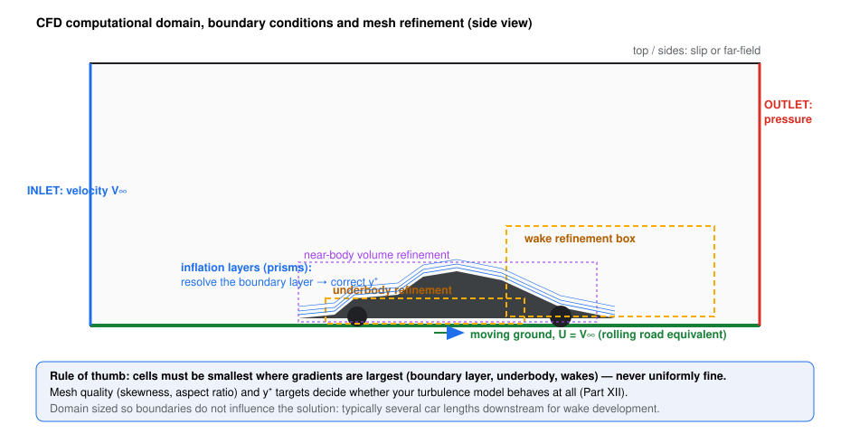
*Figure 12.1 — The computational stage: a domain, its boundary conditions, and a mesh concentrated where the physics lives.*

---

## 12.2 The governing equations 🟢→🟡

For a Newtonian fluid, the **Navier–Stokes equations** are mass + momentum + energy conservation written locally. For F1 aerodynamics (incompressible, near-constant temperature in the external flow), the essential system is:

**Continuity:** $\nabla \cdot \vec{V} = 0$

**Momentum (incompressible N–S):**
$$\underbrace{\rho\frac{\partial \vec{V}}{\partial t}}_{\text{inertia}} + \underbrace{\rho (\vec{V}\cdot\nabla)\vec{V}}_{\text{convection (nonlinear!)}} = \underbrace{-\nabla p}_{\text{pressure}} + \underbrace{\mu \nabla^2 \vec{V}}_{\text{viscous}} + \vec{f}$$

| Term | Meaning | F1 relevance |
|---|---|---|
| $\rho \partial \vec V/\partial t$ | local (temporal) acceleration | matters in URANS/LES; zero in steady RANS |
| $\rho(\vec V \cdot \nabla)\vec V$ | convective acceleration | the nonlinearity that creates turbulence and makes CFD hard |
| $-\nabla p$ | pressure force | the force currency (Part II) |
| $\mu \nabla^2 \vec V$ | viscous diffusion | boundary layers, wakes, everything Part II built |

*Assumptions above:* incompressible Newtonian fluid, constant $\mu$. *The energy equation* matters when heat transfer (cooling flows, brake ducts) is part of the question.

**Why turbulence breaks direct solution.** At F1 Reynolds numbers, the N–S solutions are turbulent: a continuum of eddies from car-size (metres) down to Kolmogorov scales (fractions of a millimetre). Resolving *all* of them (Direct Numerical Simulation, DNS) costs scaling ~$Re^3$ in time-stepped grid points — utterly impossible for a race car. **Every practical CFD is therefore a turbulence-modelled approximation.** This single sentence is the most important thing in this part.

---

## 12.3 Discretisation and the Finite Volume Method 🟡

The dominant industrial method is the **Finite Volume Method (FVM)**: integrate the equations over each cell; fluxes in minus fluxes out = accumulation. Gives conservative, geometry-flexible schemes.

- **Spatial discretisation:** gradients and fluxes via interpolations of cell-centred (or node) values. Convective schemes trade accuracy against stability: upwind-family schemes are robust but **numerically diffusive** (§12.7); central schemes are sharper but less stable.
- **Temporal discretisation:** explicit (cheap, stability-limited time step) vs implicit (larger steps, per-step solve); for steady RANS the "time" is a relaxation device.
- **Pressure–velocity coupling:** incompressible N–S has no standalone pressure equation — solvers iterate (SIMPLE/PISO/PIMPLE families or fully coupled schemes) so that velocity and pressure simultaneously satisfy momentum and continuity.
- **Linear solvers:** each step reduces to huge sparse linear systems (multigrid, Krylov methods) — the reason F1 CFD is an HPC problem (Part XIII).

---

## 12.4 Domain, mesh, boundary conditions 🟡

**Domain (Fig. 12.1):** must let the physics breathe — several car lengths downstream for the wake, enough upstream for the inlet condition to relax, walls far enough that they don't squeeze the flow (the CFD twin of wind-tunnel blockage, Part XI §11.4).

**Mesh:** the error budget lives here.
- **Refinement where gradients live:** boundary layers, underbody, wakes (Fig. 12.1's boxes) — uniform meshes waste everything.
- **Inflation/prism layers** hugging surfaces resolve the boundary layer; their count/height set your **y⁺** (§12.6).
- **Quality metrics:** skewness, aspect ratio, size jump. Bad cells locally corrupt solutions globally (transport equations carry the damage downstream).
- **Mesh count:** F1 full-car meshes run in the tens-to-hundreds of millions of cells (public statements across teams); the *distribution* matters more than the count.

**Boundary conditions (BCs):**
- Inlet: velocity (or total pressure) + turbulence quantities ($k$, $\omega$ or $\epsilon$ — inlet turbulence is a *choice* with consequences for wakes).
- Outlet: static pressure (with non-reflecting/zero-gradient conventions).
- Ground: **moving wall** at car speed (the rolling road, Part XI).
- Wheels: rotating walls / multiple reference frames or sliding meshes.
- Car surfaces: no-slip walls (+ roughness/transition treatments if modelled).
- Symmetry (halved domain — at the cost of modelling yawed/unsteady asymmetries) vs full domain.

**COMMON MISCONCEPTIONS (setup)**
> ❌ **"A bigger domain is always safer."** True only up to resolution: domain growth steals cells from the boundary layer. The domain is an *optimisation*, not a comfort blanket.
>
> ❌ **"Inlet turbulence doesn't matter."** It feeds the wake's turbulence model and decay; two designs can rank differently under different inlet turbulence. Match it to tunnel/track conventions.
>
> ❌ **"Symmetry halves the cost for free."** It forbids asymmetry — wheels' wakes are not symmetric; steady-state symmetry is a modelling decision with physics consequences.

---

## 12.5 Turbulence modelling: RANS, URANS, LES, DES 🟡→🔴

**The closure problem.** Reynolds-averaging the N–S (splitting velocity into mean + fluctuation) generates unknown **Reynolds stresses**; the model must express them via known quantities. The workhorse assumption (Boussinesq) makes turbulence act like an extra viscosity — the **eddy viscosity** $\mu_t$ — computed from transport equations:

- **RANS (steady):** time-averaged equations; one steady solution. The F1 workhorse: cheap per design point, statistics-laden but *stable*, and adequate for attached/weakly-unsteady flows. Under-predicts unsteady loading and can mishandle massive separation.
- **k-ε:** robust, wall-function oriented; poor in adverse pressure gradients — historically superseded for wings.
- **k-ω SST (Menter, 1994):** blends k-ω's near-wall accuracy with k-ε's freestream robustness; strong adverse-pressure-gradient/separation behaviour. *The de-facto motorsport standard.* Know why it's chosen, not just that it's chosen.
- **Spalart–Allmaras:** one transport equation, excellent for attached aerodynamic flows; used for wing-focused studies.
- **URANS:** unsteady RANS — time-stepped RANS resolving the *large* forced/mean unsteadiness (e.g., porpoising-scale motion) while modelling the rest.
- **LES:** resolves the energy-containing large eddies, models only subgrid scales. Brutally expensive at full-car $Re$; used in research slices (wheel, mirror, local separation), not weekly development.
- **DES / hybrid (DDES, IDDES):** RANS near walls, LES-like behaviour in separated regions — the practical middle ground for unsteady separated flows.

*Model choice is a physics decision:* attached-load deltas (RANS/SST), unsteady separation physics (URANS minimum, DES better), turbulence-decay-sensitive wake studies (watch RANS's eddy-viscosity over-diffusion — §12.7).

---

## 12.6 Wall treatment and y⁺ 🟡

$y^+ = \frac{y \, u_\tau}{\nu}$ — the distance of the first cell centre from the wall in wall units ($u_\tau = \sqrt{\tau_w/\rho}$). It decides which near-wall treatment is valid:

| Approach | y⁺ target | What it assumes |
|---|---|---|
| Wall-resolved (low-Re models) | ~1 (up to ~4–5 acceptable) | resolves the viscous sublayer directly; needs many prism layers |
| Wall functions | 30–300 (~30 ideal) | bridging laws assume a log-layer exists at that location |
| **The forbidden zone** | **5–30** | neither formulation valid — results silently wrong |

(CFD-Online's near-wall treatment guidance is the standard citation: y+ ≈ 1 for low-Re; 30–300 for wall functions; the buffer band 5–30 is covered by neither.)

The trap: y⁺ varies over the car with speed and attitude. A mesh fine at one speed is in the forbidden zone at another — teams manage per-project y⁺ maps. High-quality separations/wake predictions are wall-treatment-sensitive: a boundary layer modelled with wall functions at y⁺=60 near a suction peak behaves differently from a resolved one.

---

## 12.7 Convergence, residuals, numerical diffusion 🟡→🔴

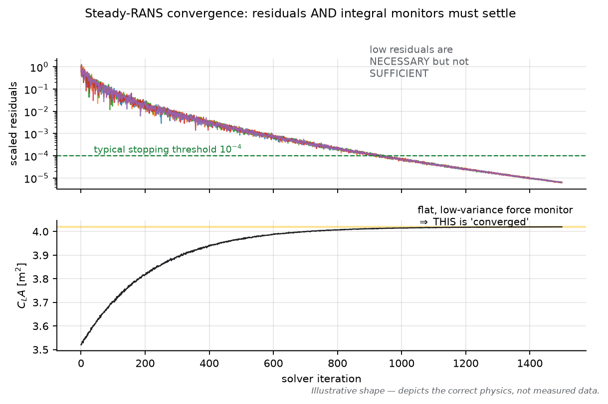
*Figure 12.2 — Residuals falling is necessary; the integral monitors (forces) flattening is the actual convergence criterion.*

- **Residuals** measure how well the discrete equations are satisfied *this iteration*. Falling residuals = the solution is settling. But low residuals with drifting forces (or vice versa) both happen; **converge on monitors** (forces, moments, mass-flow balances) with residuals as backup.
- **Steady RANS on inherently unsteady flow** (massively separated wheels/wakes) converges to an *artificial steady state* — a time-average-like compromise. Forces can wobble at low level; teams average monitor windows and standardise stopping criteria (consistent practice matters more than any single number).
- **Initialisation:** uniform freestream vs potential-flow/partial-map initialisation — affects path (and sometimes the local minimum reached), not the converged truth.
- **Numerical diffusion:** discretisation error that *smears* gradients like an artificial viscosity. Upwind schemes on coarse cells diffuse wakes and vortices; it can kill a vortex that reality keeps — making downstream devices look worse than they are. Countermeasures: better schemes (bounded central/second-order), refinement zones, mesh-quality discipline.
- **Under-relaxation/CFL:** stability knobs; too-aggressive settings invent "convergence" that isn't physical.

---

## 12.8 Mesh independence, verification, validation 🔴

**Mesh independence (grid convergence).** Refine the mesh systematically (e.g., ×1.5 in each direction) and watch target quantities settle. Formalise with Richardson extrapolation / the **Grid Convergence Index (GCI)** per the ASME procedure (Celik et al., 2008): report the *uncertainty band* of your discretisation, not just "we refined it".

**Verification vs validation — keep them separate:**
- **Verification:** "are we solving the equations right?" — code/solution accuracy: convergence studies, benchmarks.
- **Validation:** "are we solving the right equations (model)?" — comparison with experiment: tunnel forces, pressure taps, rakes.
A perfectly verified simulation of the wrong turbulence model is precisely-validated-nothing.

**ENGINEERING INTUITION**
> If you remember only one thing: CFD is an instrument with an error bar, like a wind tunnel — except its errors are *systematic, invisible and cheap to ignore*. The discipline is quantifying them (mesh, model, convergence) before believing a delta.

---

## COMMON MISCONCEPTIONS (Part XII)

> ❌ **"CFD solves the real equations, so it's exact."** It solves modelled, discretised equations — every stage adds error (§12.2–12.8). DNS at car scale would need exascale-era resources no team has.
>
> ❌ **"More cells = better."** More *well-placed* cells; a bigger uniformly-meshed domain is a worse instrument than a smaller graded one.
>
> ❌ **"Residuals at 10⁻⁶ mean converged."** Residuals are per-equation satisfaction; the design quantities must also be flat (Fig. 12.2). Engineers converge on Δ forces, not on residual vanity.
>
> ❌ **"k-ε / k-ω / SST are interchangeable."** Each encodes assumptions; in adverse gradients and wakes they disagree — sometimes enough to flip a design ranking.
>
> ❌ **"y⁺ is a post-processing check."** It's a *design input* for the mesh; discovering bad y⁺ after the run means re-meshing, and results from the buffer zone are not "a bit off" — they're structurally unsupported.
>
> ❌ **"Steady RANS captures wheel wakes."** It produces a frozen average; load interactions dependent on unsteadiness are under-represented. That's a modelling choice with known limits, not a truth.

---

## F1 ENGINEERING QUESTIONS (Part XII)

**Conceptual**
- Why is DNS impossible at car scale — quantify the scaling argument.
- What physical assumption does the Boussinesq eddy-viscosity hypothesis make, and where does it fail on an F1 car?
- Why does the pressure need an iterative coupling scheme at all?

**Engineering**
- Your team must choose SST vs SA for a front-wing campaign. What flow features decide, and what would you benchmark first?
- A colleague reports "converged" with residuals 10⁻⁵ but forces still drifting ±0.3%. Diagnose.

**CFD**
- Design the mesh strategy for a yaw sweep from 0° to 10°: what changes and what must stay fixed for fair deltas?
- How would you *measure* numerical diffusion of the wake in your own setup?

**Design**
- Build a validation ladder for a new floor concept: which experiment (tunnel forces, taps, rakes, track) validates which CFD claim?
- Your manager asks for LES "because it's more accurate". Compose the engineering reply.

---

## MINI PROBLEM (Part XII)

**Problem — First-cell height for wall-resolved y⁺**
*Given:* car speed 80 m/s; characteristic length 0.3 m (wing chord); ν = 1.46×10⁻⁵ m²/s. *Required:* first-cell height for y⁺ ≈ 1.
*Solution:*
$Re = VL/\nu = 80 \times 0.3 / 1.46\times10^{-5} \approx 1.64\times10^6$.
Flat-plate estimate: $C_f \approx 0.026/Re^{1/7} \approx 0.026/11.4 \approx 0.0023$; $u_\tau = V\sqrt{C_f/2} \approx 80 \times 0.034 \approx 2.7$ m/s.
$y = y^+ \nu / u_\tau = 1 \times 1.46\times10^{-5}/2.7 \approx 5.4\ \mu m$ — first cell centre ~5 µm off the wall, with growth ratio ~1.2 to leave the sublayer properly.
*Engineering interpretation:* wall-resolved meshes are *expensive* (micron first cells over every surface) — the reason wall functions (y⁺ 30–300) remain attractive, and why y⁺ discipline per project is a real engineering decision, not hygiene.

---

## QUICK RECALL (Part XII)

1. Write the incompressible N–S momentum equation and name each term.
2. Why can't pressure be solved directly in incompressible CFD?
3. What is the closure problem, and what does Boussinesq assume?
4. Compare RANS, URANS, LES, DES in one line each (cost + what's resolved).
5. Why is SST the motorsport default? What does "SST" blend?
6. Give the y⁺ bands and the forbidden zone.
7. What is numerical diffusion, and which schemes/regions suffer most?
8. Define verification vs validation with one example each.
9. What does the GCI formalise?
10. Why is steady RANS on a car an "artificial steady state"?

### ANSWERS

1. $\rho\partial_t \vec V + \rho(\vec V\cdot\nabla)\vec V = -\nabla p + \mu\nabla^2\vec V + \vec f$: temporal inertia, convection, pressure, viscous, body forces.
2. Only the continuity constraint links p to V (no state equation for p); solvers iterate pressure–velocity coupling (SIMPLE/PISO/coupled).
3. Averaging generates unknown Reynolds stresses; Boussinesq models them as an isotropic eddy viscosity — fails where turbulence is strongly anisotropic/curved (vortices, massive separation, junctions).
4. RANS: steady, cheapest, all turbulence modelled. URANS: time-resolved large unsteadiness, rest modelled. LES: resolves large eddies, models subgrid — huge cost. DES: RANS near walls + LES in separated zones — practical hybrid.
5. k-ω accuracy near walls + k-ε robustness freestream; best-in-class adverse-gradient/separation behaviour (Menter 1994).
6. Resolved ≈1 (up to ~5); wall functions 30–300 (~30 ideal); 5–30 covered by neither.
7. Discretisation error acting like artificial viscosity; upwind schemes on coarse cells; kills gradients/wakes/vortices — worst exactly where F1 physics lives.
8. Verification: solving equations right (mesh convergence study); validation: solving right equations (compare to tunnel forces).
9. Discretisation-uncertainty reporting (Richardson extrapolation standardised by Celik et al. 2008).
10. Wheels/wakes are unsteady; steady RANS freezes a time-averaged compromise that no instant of the real flow resembles.

---

## SOURCES (Part XII)

- Versteeg, H. K. & Malalasekera, W., *An Introduction to Computational Fluid Dynamics: The Finite Volume Method*, Pearson (2nd ed., 2007) — FVM, discretisation, pressure–velocity coupling. [Tier 1]
- Ferziger, J. H. & Perić, M., *Computational Methods for Fluid Dynamics*, Springer (3rd rev. ed., 2002) — numerics, error analysis. [Tier 1]
- Menter, F. R., "Two-Equation Eddy-Viscosity Turbulence Models for Engineering Applications", *AIAA Journal* 32(8), 1994, pp. 1598–1605 — SST model. [Tier 1]
- Spalart, P. R. & Allmaras, S. R., "A One-Equation Turbulence Model for Aerodynamic Flows", AIAA 92-0439 (1992); *La Recherche Aérospatiale* (1), 1994 — SA model. [Tier 1]
- Celik, I. B., Ghia, U., Roache, P. J. & Freitas, C. J., "Procedure for Estimation and Reporting of Uncertainty Due to Discretization in CFD Applications", *ASME J. Fluids Engineering* 130(7), 2008 — GCI procedure. [Tier 1]
- CFD-Online Wiki: "Y plus wall distance estimation" and "Near wall treatment for k-omega models" — y⁺ bands. [Tier 2]
- Anderson, J. D., *Computational Fluid Dynamics: The Basics with Applications*, McGraw-Hill (1995) — accessible first-principles treatment. [Tier 1]


---

# PART XIII — CFD for F1

**Purpose:** walk through a realistic aerodynamic CFD workflow end-to-end, then catalogue the failure modes that produce confident nonsense. This is the operational companion to Part XII's theory.

**Course connection:** anchors: a CFD-project lab course; Versteeg & Malalasekera ch. on implementation; Ferziger & Perić ch. on practical accuracy. Module mapping: ____________

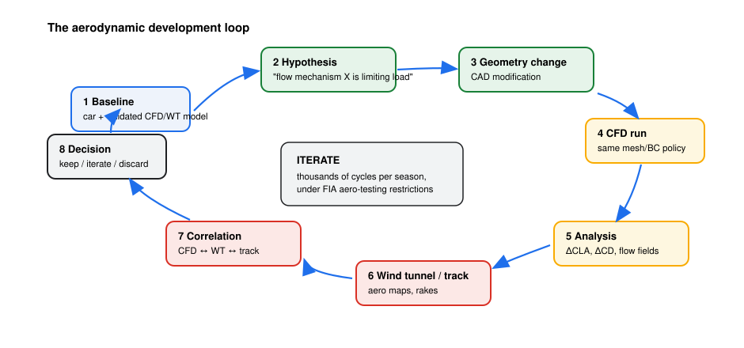
*Figure 13.1 — The loop each geometry travels (Part XV expands the engineering decisions inside it).*

---

## 13.1 The workflow, stage by stage 🔴

**1–2. CAD preparation & geometry cleanup.** Design surfaces arrive as CAD; regulations-derived envelopes, negative-volume gaps, tiny slivers and leak artifacts are cleaned. Cleanup is where real-world CFD dies quietly: an unresolved 0.1 mm gap can leak mass flow and corrupt an entire underbody. The virtual model must represent the *regulated, real* geometry — including regulation-mandated items (plank, skids, wheel covers).

**3. Domain creation.** Sized so boundaries don't influence the solution: several car lengths downstream (wake development), enough upstream/sideways for inlet relaxation; ground as a moving wall; symmetry only if the campaign can afford its assumptions (Part XII §12.4).

**4. Meshing.** The error budget: surface mesh resolves curvature; inflation layers hit the project's y⁺ policy; wake/underbody refinement boxes follow the gradients (Fig. 12.1). Mesh *policy* is frozen across a campaign so deltas are geometry-driven, not mesh-driven.

**5. Boundary conditions.** Freestream velocity/pressure, ground and wheel motions, inlet turbulence matched to the project's tunnel/track conventions (Part XII). At yaw, the domain or the reference frame is rotated — the choice must be consistent across the campaign.

**6–7. Solver setup & turbulence model.** Steady, pressure-based RANS with k-ω SST is the motorsport default (Part XII §12.5); discretisation schemes second-order in the far field, more robust near separation; project-standard relaxation/CFL. Unsteady campaigns (URANS/DES) declare their time-step/CFL policy and averaging windows up front.

**8. Initialisation.** Uniform freestream or a previous solution ("warm start"). Warm-starting saves cost but can *bias toward the previous design's flow structures* — dangerous when the question is "does the new geometry change the topology?"

**9. Convergence.** Monitors: forces/moments per component (front/rear wing, floor...), mass-flow through tunnels/inlets, residuals as backup (Part XII §12.7, Fig. 12.2). Stopping criteria are standardised *per campaign*; unsteady runs standardise averaging windows. Everything measurable is written down: mesh version, BCs, model, iteration count.

**10–12. Extraction: forces, pressures, flow visualisation.** Component force breakdown; Cp maps along elements/floor; survey planes (velocity, vorticity, Q-criterion, TKE) at the stations the hypothesis cares about (Part XIV teaches the reading).

**13. Design comparison.** The currency is the **delta**: ΔC_L A (total and per axle), ΔC_D A, Δ balance, plus *mechanism evidence* (which surface pressure changed, which vortex moved). Deltas are evaluated at matched attitude and, ideally, across a small map (heave/yaw) for robustness.

**14. Validation against experiment.** Laddered: tunnel forces (same scale model conventions) → pressure taps (distribution-level) → wake/aero rakes (field-level) → track (lap-time/correlation level). A delta that survives the ladder is a design; one that dies is a lesson.

**15. Engineering decision.** Ship / iterate / park — with the *reason* documented (Part XV).

**ENGINEERING INTUITION**
> If you remember only one thing: an F1 CFD campaign is an *instrument calibration* problem wearing a design competition's clothes — freeze everything that isn't the geometry, and freeze the geometry's evaluation recipe too.

---

## 13.2 Failure modes: how good engineers produce wrong numbers 🔴

| Failure | Mechanism | Symptom / defence |
|---|---|---|
| **Bad mesh** | poor quality cells, insufficient prism layers, coarse wakes | results flip between mesh versions; defence: quality gates + GCI (Part XII) |
| **Wrong BCs** | fixed ground, static wheels, mismatched inlet turbulence | underbody deltas that die in the tunnel; defence: BC checklist per project |
| **Poor convergence** | forces still drifting when "stopped" | deltas smaller than monitor noise; defence: monitor-window protocol |
| **Wrong turbulence model** | SST on massively separated transient flow, or model switched mid-campaign | mechanism "explanations" that don't replicate; defence: model frozen + validated per campaign |
| **Numerical diffusion** | coarse cells + upwind smearing wakes/vortices | downstream devices underperform vs tunnel; defence: scheme policy + refinement zones |
| **Insufficient resolution** | features (slot jets, edge vortices) unresolved | designs ranked by mesh artifact; defence: resolution studies on the *feature*, not just forces |
| **Unrealistic geometry** | leaks, simplified wheels, missing regulation details | magnitudes right, deltas wrong; defence: geometry audits |
| **Plot worship** | judging "colourful = better" | Part XIV's whole subject; defence: integrals + mechanism evidence |
| **Optimising numerical noise** | chasing deltas smaller than run-to-run repeatability | "gains" vanish on re-run; defence: repeatability quantified, minimum meaningful delta defined |

The last row deserves emphasis: repeatability (same input, re-run) sets the floor of meaningful delta. A 0.1% gain on an instrument with 0.3% noise is not a gain — it is a decision to be fooled.

---

## COMMON MISCONCEPTIONS (Part XIII)

> ❌ **"CFD setup is engineering; meshing is IT work."** The mesh *is* the physics budget; most silent failures are mesh failures.
>
> ❌ **"Warm-starting is free speed."** It can anchor the flow topology to the old design — the one thing you're testing.
>
> ❌ **"If CFD and tunnel disagree, one is broken."** They disagree *systematically*; the disagreement map (which component, which attitude) is itself engineering data.
>
> ❌ **"Unsteady always beats steady."** URANS/DES costs order-of-magnitude more; for attached-flow deltas, steady RANS answers the question. Match the tool to the hypothesis.
>
> ❌ **"The simulation validated the design because the forces went up."** Force deltas validate nothing by themselves; only the tunnel/track ladder does (Part XV).

---

## F1 ENGINEERING QUESTIONS (Part XIII)

**Conceptual**
- Why must mesh policy be frozen across a campaign, and what breaks if it isn't?
- What is the difference between "converged" and "repeatable", and why do you need both?

**Engineering**
- You inherit a campaign where every design was meshed individually. What can you still trust, and how do you find out?
- A new floor shows +0.8% total load in CFD but the rear-wing component shows −0.3%. What do you investigate first?

**CFD**
- Write the checklist you would run before believing a new geometry's first result.
- How would you design the repeatability experiment (same input twice) for a steady-RANS campaign?

**Design**
- Budget: 48 h wall-clock on the cluster for one design point. Steady RANS ×8 attitudes, or URANS ×1 attitude? Justify by the hypothesis you'd write.
- A component looks excellent in CFD but the tunnel can't see it. Compose the investigation plan.

---

## QUICK RECALL (Part XIII)

1. List the 15 workflow stages in order (compressed to their key verbs).
2. Name five failure modes and one defence for each.
3. Why is geometry cleanup safety-critical for underbody simulations?
4. What does "deltas at matched policy" mean, and why does it matter?
5. What is the validation ladder, in order?
6. Why can warm-starting bias a topology question?
7. What sets the minimum meaningful delta in a campaign?
8. Why are per-component force monitors more informative than total only?
9. What must an unsteady campaign declare before running?
10. Why is "colourful plot" not an acceptance criterion?

### ANSWERS

1. Clean CAD → domain → mesh (policy frozen) → BCs → solver/model → initialise → converge (monitors) → extract forces/pressure/flow → compare deltas → validate → decide.
2. Bad mesh→quality gates/GCI; wrong BCs→checklist; poor convergence→monitor protocol; wrong model→freeze+validate; plot worship→integrals+mechanism (any five).
3. A sub-mm leak or sliver corrupts mass flow/pressure integration — the floor's whole signal.
4. Same mesh policy, BCs, model, stopping rule for baseline and variant → the delta is attributable to geometry alone.
5. Tunnel forces → pressure taps → wake/rake surveys → track correlation.
6. The initial flow field carries the old design's structures; a genuinely new topology may be masked.
7. Run-to-run repeatability (numerical noise floor) of the whole pipeline.
8. Total gain can hide redistribution (e.g., front gains, rear losses = balance change).
9. Time step/CFL, averaging window, model (URANS/DES), stopping criteria — so deltas are comparable.
10. Plots are post-processing views; acceptance is integrated deltas + mechanism + validation (Part XIV).

---

## SOURCES (Part XIII)

- Versteeg, H. K. & Malalasekera, W., *An Introduction to Computational Fluid Dynamics* (2nd ed., Pearson, 2007) — implementation practice. [Tier 1]
- Ferziger, J. H. & Perić, M., *Computational Methods for Fluid Dynamics* (3rd rev. ed., Springer, 2002) — accuracy/convergence practice. [Tier 1]
- Celik, I. B. et al., *ASME J. Fluids Engineering* 130(7), 2008 — discretisation-uncertainty reporting. [Tier 1]
- Toet, W. (2013), *The Aeronautical Journal* 117(1187) — F1 CFD/tunnel/track workflow from practice. [Tier 2]
- Public team/engineering talks on F1 CFD practice (mesh scales, OpenFOAM-based toolchains) — Tier 2/3, used qualitatively; see Engineering Audit for verification status.


---

# PART XIV — Reading CFD Results

**Purpose:** teach engineering judgment over visualisation worship: for each standard output — what it *can* tell you, what it *cannot*, and what question it answers. The rule of the whole part: **a beautiful picture is a hypothesis generator; an integral is a decision-maker.**

**Course connection:** anchors: CFD post-processing chapters (Versteeg & Malalasekera ch. on solution interpretation is thin — pair with journal-figure reading); any Q-criterion/vertex-detection reference. Module mapping: ____________

---

## 14.1 Pressure coefficient (Cp) 🟡

**What it is:** the force currency made visible (Part II §2.2).

**Can tell you:**
- *Where* load is generated and where it is lost — suction peaks, recovery quality, separation signatures (a Cp plateau/flatline in the recovery region = stalled flow, Fig. 5.1 & 14.1).
- *Mechanism evidence*: did the new floor edge move the suction peak, or the recovery?
- Device-level integration sanity: $\int C_p \, dA$ ≈ the component force you measured.

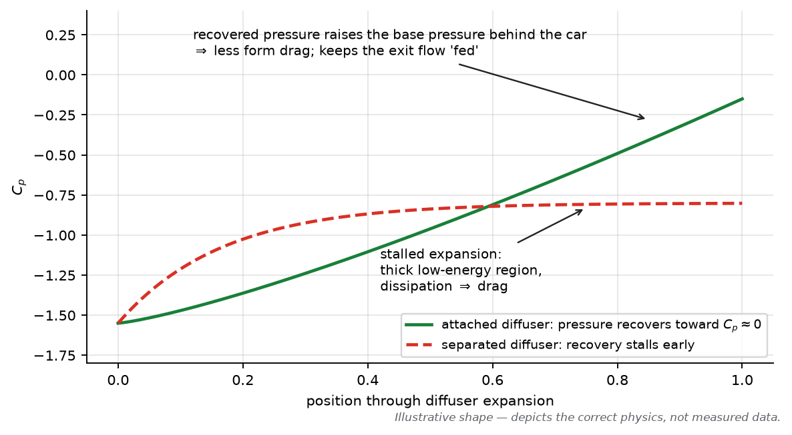
*Figure 14.1 — The same expansion, two stories: recovery (green) vs stall (dashed). Cp traces diagnose separation before any picture does.*

**Cannot tell you:**
- Total merit without integration *over the real surface with real areas* — big local suction on a small patch ≠ big force.
- Anything about unsteadiness (steady RANS Cp is a frozen average).
- Comparison across plots with different colour scales — always normalise the legend range before comparing two designs.

---

## 14.2 Velocity contours 🟡

**Can tell you:** where the flow is fast/slow (mass-flow squandered or delivered), wake extents, jetting, throttle-like behaviour of ducts; good for *spatial bookkeeping* (is the tunnel fed?).

**Cannot tell you:** whether the design is better. Two designs can swap slow/fast regions while their integrals move oppositely. Colour maps also exaggerate: human eyes read saturated red/blue as "important". And a slice hides the third dimension — a beautiful slice can sit inside an ugly volume (always ask "what's out of plane?").

---

## 14.3 Streamlines and particle tracks 🟡

**Can tell you:** topology of transport — what feeds what (FW → fences; diffuser → beam wing), where flow *originating* somewhere ends up. Surface-restricted streamlines (limiting streamlines) are the *separation map*: converging lines mark separation, diverging mark attachment.

**Cannot tell you:** time history (in steady RANS they are solution-integral curves, not particle paths); vorticity content (a streamline can pass through a vortex without showing it); "the flow pattern" — seeding/cropping choices manufacture stories. In unsteady data, instantaneous streamlines are not paths at all (Part I §1.10).

---

## 14.4 Vorticity and Q-criterion 🟡→🔴

**Vorticity magnitude:** shows rotation rate density — wakes, shear layers, vortex cores. **Caveat:** vorticity is a *vector* — magnitude maps hide direction/structure, and shear layers (velocity gradients) light up too, not just real vortices.

**Q-criterion (iso-surfaces):** the standard vortex identifier — regions where rotation dominates strain. The workhorse for the Part VI inventory (edge vortices, wake CVPs, outwash).

**Can tell you:** structure *location/coherence*: did the floor-edge vortex survive? Did the wake pair merge? Where does the outwash land?

**Cannot tell you:** strength without additional measurement (circulation — integrate velocity around the core), and *importance*: threshold choice manufactures the picture (a lower iso-threshold "finds" more vortices). Compare two designs at the *same* threshold and with circulation numbers, or you are comparing art.

---

## 14.5 Turbulent kinetic energy (TKE) 🟡

**Can tell you:** where the model expects unsteadiness/mixing — wake cores, separation zones, the "dirty air" map (Part VIII Fig. 8.1). In RANS, TKE is *modelled*, not measured: it is the model's opinion of fluctuation energy.

**Cannot tell you:** actual spectra or frequencies (RANS has none), and validity in sensitive regions depends on the turbulence model's honesty (Part XII). Following-car studies live or die on TKE plausibility — which is exactly why the 2022 wake-robustness claims needed validation beyond pretty TKE blobs.

---

## 14.6 Wall shear stress / Cf 🟡

**Can tell you:** separation and reattachment *precisely* (Cf crossing zero — Part II §2.5); transition treatment effects; where the boundary layer is healthy (positive, finite Cf).

**Cannot tell you:** forces by itself (shear is a minor part of drag, Part VIII) — it is a *diagnostic* of flow state, not a scoreboard. Also mesh/y⁺-sensitive: a wall-function mesh makes near-wall shear semi-quantitative at best (Part XII §12.6).

---

## 14.7 Force coefficients and integrals 🔴

**Downforce, drag, moments, balance** — the decision quantities. Rules of professional use:

1. **Deltas, not absolutes:** ΔC_L A vs a validated baseline, per component and total.
2. **With uncertainty:** mesh/GCI band + convergence window + repeatability noise (Parts XII–XIII) — a delta below its own error bar is a rumour.
3. **Across the map:** a delta that exists only at nominal attitude is a mirage (Parts III, V, X).
4. **With mechanism:** what changed in the pressure/vortex story explains the integral — otherwise you may be optimising noise or a mesh artifact.

**ENGINEERING INTUITION**
> If you remember only one thing: every plot is a *claim*, and every claim needs its error bar and its mechanism. The professional question is never "which picture looks better?" but "which delta survives uncertainty, and what physics explains it?"

---

## 14.8 The interpretation checklist (use it on every result) 🔴

1. What was the hypothesis? (If there wasn't one, stop.)
2. Are the deltas above the noise floor? (repeatability, GCI, convergence window)
3. Did anything change upstream that shouldn't have? (mesh policy, BCs, iteration count)
4. What is the mechanism? (Cp moves, vortex path, wake change — one consistent story)
5. Does it survive attitude? (2–3 map points minimum)
6. What does the tunnel/track ladder need to confirm it? (Part XIII §14)

---

## COMMON MISCONCEPTIONS (Part XIV)

> ❌ **"A cleaner-looking wake means a better car."** Not necessarily — the wake's *content* (momentum, vorticity, where it lands) matters more than its appearance.
>
> ❌ **"Q-criterion pictures show downforce."** They show coherent rotation. A car can gain load with fewer visible structures or lose it with more.
>
> ❌ **"Velocity contours prove flow is faster = better."** Faster where, fed by what, at what pressure cost? Local speed is not merit.
>
> ❌ **"The colour scale is neutral."** Legend range, slicing plane and seeding are editorial choices. The same solution can be made to look brilliant or broken.
>
> ❌ **"RANS TKE map = measured turbulence."** It is the turbulence model's estimate — an opinion with assumptions (Part XII §12.5).
>
> ❌ **"Surface streamlines show particle paths."** In steady solutions they are integral curves of the surface shear field; separation lines yes, trajectories no.

---

## F1 ENGINEERING QUESTIONS (Part XIV)

**Conceptual**
- Why is Q-criterion threshold choice an editorial act, and how do you make it defensible?
- Why can a Cp plot reveal stall that a force monitor misses until later?

**Engineering**
- Two floors: A gains 1.2% load with a messier wake; B gains 0.9% with a cleaner wake. Define the data that picks the winner for (a) single-car pace, (b) race pace in traffic.
- Your new FW shows equal load, lower drag, and a shifted outwash. What downstream checks before you celebrate?

**CFD**
- Build the minimal post-processing set (5 outputs) that supports or kills the hypothesis "the edge vortex seals better at low ride height".
- How would you quantify circulation of the floor-edge vortex from your solution?

**Design**
- A sponsor asks for "a picture that shows the upgrade is better". What do you send instead, and why?
- You suspect a beautiful new wing result is mesh-driven. Design the two-run experiment that settles it.

---

## QUICK RECALL (Part XIV)

1. Which plot diagnoses separation *earliest*, and what signature do you look for?
2. What three pieces of data turn a Q-criterion image into engineering evidence?
3. Why are steady-RANS streamlines not particle paths?
4. What does a Cp plateau in a recovery region mean?
5. Why must legend ranges match before comparing Cp plots?
6. What is RANS TKE, epistemically?
7. Why is wall shear a diagnostic rather than a scoreboard?
8. Define the four properties of a decision-grade delta.
9. What does a slice hide, and what do you always ask?
10. Which output would you *never* use alone to approve a design, and why?

### ANSWERS

1. Wall shear / surface limiting streamlines: Cf→0, converging separation line — earlier and more local than force monitors.
2. Same threshold between designs; a strength measure (circulation); the associated force/pressure change.
3. They are integral curves of an instantaneous (frozen) field; unsteady reality has no such fixed paths.
4. The expansion has separated — recovery stalled (Figs. 5.1, 14.1).
5. Otherwise you compare colour scales, not physics; renormalise to common Cp limits.
6. The turbulence model's estimate of fluctuation energy — modelled opinion, not measurement.
7. Shear's contribution to force is small; its value is flow-state diagnosis (separation/attachment).
8. Above noise floor; at matched policy; across attitudes; with an explained mechanism.
9. The third dimension/out-of-plane gradients — ask "what does the volume integral say?"
10. Any single picture (Q-criterion, contours, streamlines) — pictures are claims; only integrals + mechanism + validation approve designs.

---

## SOURCES (Part XIV)

- Versteeg, H. K. & Malalasekera, W. (2007) — solution interpretation practice. [Tier 1]
- Ferziger, J. H. & Perić, M. (2002) — error-aware post-processing. [Tier 1]
- Jeong, J. & Hussain, F., "On the identification of a vortex", *J. Fluid Mech.* 285 (1995) — the Q-criterion's origin and caveats. [Tier 1]
- Toet, W. (2013), *The Aeronautical Journal* — how F1 consumes flow-field diagnostics. [Tier 2]


---

# PART XV — F1 Aerodynamic Development

**Purpose:** put every previous part inside the loop the sport actually runs — and rehearse the *thinking* with worked case studies, each carried from problem to decision.

**Course connection:** anchors: Toet (2013) for the development culture; team technical debriefs in the press; your course's project module if it has one. Module mapping: ____________


*Figure 15.1 — Baseline → Hypothesis → Geometry → CFD → Analysis → Test → Correlation → Decision → repeat, thousands of times per season, under testing restrictions (Part XI §11.6).*

---

## 15.1 How an aerodynamicist thinks 🔴

The unit of thought is the **mechanism-carrying delta**. Not "is this wing bigger?" but "*what does it do to the flow, what does that change downstream, by how much, at what cost, and how do I know?*" The loop's steps decode as:

- **Baseline:** a validated, frozen reference — geometry, mesh policy, tunnel correlation state. Without a defended baseline, every delta is fiction.
- **Hypothesis:** a *flow* statement ("the fence starves at yaw because the FW tip vortex sits too low"), not a *part* statement ("let's try a bigger fence").
- **Geometry change:** the minimal edit that tests the hypothesis — one variable at a time where possible.
- **CFD:** run at matched policy; deltas with uncertainty (Parts XII–XIV).
- **Analysis:** integrals + mechanism; kill anything without a consistent story.
- **Test:** tunnel first (maps), rakes for field evidence.
- **Correlation:** does the CFD delta survive tunnel and (for big items) track? Update the correlation memory — this is compounding organisational knowledge.
- **Decision:** ship / iterate / park — *documented with the reason*, so the mechanism becomes institutional.

**ENGINEERING INTUITION**
> If you remember only one thing: the loop is a hypothesis-testing machine, and its speed is capped by the *weakest* instrument's honesty — that's why Part XII–XIV discipline is not academic fussiness; it is the throttle on the whole programme.

---

## 15.2 Worked case studies 🔴

*These are engineering-instruction case studies: realistic mechanisms composed from public physics and practice, explicitly labelled as constructed for teaching — not accounts of any team's confidential programme.*

### Case 1 — High-speed entry oversteer

- **Problem:** car is unstable on entry above ~250 km/h; drivers report the rear "stepping" as the front bites.
- **Hypothesis:** as speed rises, ride heights fall onto the steep part of the floor's force map; the rear gains load *late* in the entry (hysteresis via suspension) and the balance transiently over-fronts.
- **Design change:** floor-edge wing reshaped to flatten d(rear load)/d(heave) near the operating point; +1 mm rear static ride height as a control.
- **Expected mechanism:** gentler force-map slope → smaller balance travel (Part V §5.4, Part X §10.2).
- **CFD result:** rear map slope −18% at nominal heave; total rear load −0.4%; front unchanged; edge-vortex Q-criterion shows the same structure with less ride-height wander.
- **Unintended consequence:** the reshaped edge wing feeds the diffuser slightly differently — rear load −0.4% must be recovered or accepted.
- **Validation:** tunnel aero-map confirms slope and magnitude; track: driver entry-confidence report + high-speed delta-v analysis.
- **Decision:** ship edge-wing change; reject the ride-height control (costs peak load without fixing the slope).

### Case 2 — Porpoising onset at one circuit

- **Problem:** sustained platform oscillation above ~280 km/h at a bumpy, low-grip circuit only.
- **Hypothesis:** bumps + low damping push the car into the force-map's unstable band; separation-collapse triggers the limit cycle (Part V §5.6).
- **Design change:** soften the map knee — tunnel-inlet leading edge raised 3 mm; secondary: stiffer third-element spring.
- **Expected mechanism:** move the force-loss knee to a lower ride height so the operating band stays stable.
- **CFD/URANS result:** knee at −6 mm lower heave; oscillation in transient runs decays instead of growing (damped limit cycle → stable operation).
- **Unintended consequence:** −0.6% peak floor load; inlet more sensitive at 8° yaw.
- **Validation:** tunnel heave sweep reproduces the softer knee; track: oscillation amplitude below threshold.
- **Decision:** ship inlet change; accept the load loss; file the yaw sensitivity as a watch item.
- *(Public anchor: this class of problem and the regulatory responses — 2022 oscillation directive, 2023 floor-edge geometry changes — are documented; team-level specifics here are constructed for teaching.)*

### Case 3 — Cooling drag too high for a low-drag circuit

- **Problem:** top speed deficit ≈ 4 km/h vs projection; sidepod inlets sized for hot-weather margin nobody needs on this circuit.
- **Hypothesis:** smaller inlets + re-routed exits recover drag *without* starving the radiators at ambient temperatures expected (~18 °C).
- **Design change:** inlet aperture −12%; exit lips re-aimed to merge exits into the low-pressure sidepod shoulder region.
- **Expected mechanism:** less captured momentum + cleaner exit → ΔC_D A < 0 at equal cooling mass flow target (Part VIII §8.2).
- **CFD result:** ΔC_D A −1.1%; radiator mass flow −3% (within margin); sidepod-shoulder Cp improved; no floor-feed degradation (fence-plane surveys unchanged).
- **Unintended consequence:** exit flow now lands closer to the rear-tyre wake — watch rear-wing lower-surface Cp scatter.
- **Validation:** tunnel (with instrumented radiator mock) confirms drag and mass flow; track: power-unit thermal lap simulation.
- **Decision:** ship for this circuit family; retain hot-weather bodywork variant.

### Case 4 — Front-tyre wake smothering the floor after a FW upgrade

- **Problem:** new FW gains +1.0% front load in isolation runs but the *full car* gains only +0.2%.
- **Hypothesis:** the new outwash trajectory dumps the front-tyre wake onto the first floor fence, starving the tunnel inlet (Part IX §9.3).
- **Design change:** FW flap-edge gurney + endplate lip re-profiled to lift the outwash over the tyre wake.
- **Expected mechanism:** restore fence-plane total pressure; restore tunnel inlet condition.
- **CFD result:** fence-plane total-pressure recovery +7%; floor +0.5%; FW keeps +1.0%; total +1.4% vs old baseline.
- **Unintended consequence:** outwash now clips the sidepod inlet lip region — inlet Cp margin reduced.
- **Validation:** tunnel confirms full-car delta (the 5× multiplier vs the isolated run is the story); rakes confirm fence-plane recovery.
- **Decision:** ship; schedule sidepod-lip reinforcement for next iteration.
- **The lesson this case teaches:** components are hypotheses; the car is the experiment (Part IV §4.4).

---

## 15.3 Public case studies (documented) 🟡→🔴

**Ground effect, act I — Lotus 78/79 (1977–78).** Team Lotus (Chapman with Peter Wright and Tony Rudd) turned the underbody into shaped venturi sections with sliding skirts sealing the edges; the 79 dominated 1978. Publicly documented; the founding demonstration of Part V Mechanism B. Consequences: skirts banned (1981), flat bottom mandated (1983) — regulation reacting to performance, the sport's recurring loop.

**The fan car — Brabham BT46B (1978).** A fan extracting air from under the car won its only race and was withdrawn; a public example of "sealing" taken to its regulatory edge (how much was fan suction vs slipstream mythology is debated — treat the details with care; the *principle* is documented).

**Flat bottom + plank era.** 1983 flat-floor rules (with small diffusers) shaped a generation of floor-edge/fence ingenuity; 1994 added the plank after Imola (safety-driven, ride-height related). Documented in regulations history.

**2009 double diffuser.** Interpretation of the diffuser regulations' central section allowed an extra underbody channel (Brawn/Toyota/Williams implementations public); legal, exploited by others mid-season, closed by 2011. A masterclass in *regulation text as design space*.

**Blown diffusers (2010–2011) and their restriction.** Exhaust-gas energisation of the diffuser (engine-map "blowing") generated load off-throttle; restrictions followed (documented regulatory timeline). Mechanism: external energy injected into the underbody's exit flow — Part V physics with an engine assist.

**DRS (2011–).** Adjustable rear-wing flap to enable overtaking; sporting rules (zones, detection gap) plus the physics covered in Part VII §7.3. Public estimates: wing-level drag cuts of order 50–80%, lap gains of several tenths — magnitude depends on wing setting and circuit.

**2022 ground-effect regulations.** Venturi floors, simplified wings, no bargeboards, wheel covers; FIA's stated aim: closer racing by making the wake less harmful (public figures ~46% → ~18% downforce loss when following circulated in FIA communications — see Engineering Audit for verification status). The season's porpoising saga then demonstrated Part V §5.6 publicly, leading to the 2022 oscillation directive and 2023 floor changes — regulation, physics and safety interacting in real time.

**2017–2021 "aero arms race" era.** Widened cars, complex front wings and bargeboards producing aggressive outwash: maximum single-car performance, poor following quality — the counter-example that motivated 2022. Documented in FIA rationale and technical press.

---

## 15.4 The development loop's economics 🔴

Under testing restrictions, the loop's currency is *validated information per hour*. That shapes practice: aggressive CFD screening (cheap, noisy) feeding selective tunnel time (expensive, precise); "minimum meaningful delta" gates; correlation memory as the multiplier. When you read that a team "brought an upgrade", you are seeing one visible loop iteration of thousands — and the upgrade that *beat* the others on mechanism + robustness, not merely peak number.

---

## F1 ENGINEERING QUESTIONS (Part XV)

**Conceptual**
- Why is the baseline's defence more important than the new design's brilliance?
- Why do regulation changes (2022) act as "mechanism resets" for the whole grid?

**Engineering**
- Construct the full loop (hypothesis → decision) for "rear wing stalls in DRS closure at 300 km/h".
- Which of the four §15.2 cases would you expect to need URANS rather than steady RANS, and why?

**CFD**
- Define the "minimum meaningful delta" for your campaign — what three numbers compose it?
- How would correlation memory change your next campaign's mesh policy?

**Design**
- Pick a 2026-style constraint (active aero). Sketch the new loop: what replaces the DRS hypothesis space?
- You have budget for one tunnel day or one week of CFD. Which, and what do you owe the other instrument afterwards?

---

## QUICK RECALL (Part XV)

1. Recite the eight loop stages with one-sentence definitions.
2. What makes a hypothesis "flow" rather than "part"?
3. Name the five public case studies and one lesson each.
4. Why did 2022 remove bargeboards *and* simplify wings — in loop terms?
5. What is "correlation memory" and where does it live?
6. In Case 4, why did the isolated FW run mislead?
7. What closed the double-diffuser loophole, and when?
8. Why is the porpoising fix a *map* fix, not a damping-only fix?
9. What three instruments does the loop alternate between, and what does each contribute?
10. What is the loop's real scarce resource, and what does that prioritise?

### ANSWERS

1. Baseline (validated reference); hypothesis (flow mechanism); geometry (minimal edit); CFD (matched-policy deltas); analysis (integrals+mechanism); test (tunnel/rakes); correlation (survival across instruments); decision (documented ship/iterate/park).
2. It names the flow mechanism to test, not the part to draw.
3. Lotus 78/79 (underbody works); BT46B (sealing taken to the regulatory edge); 2009 double diffuser (regulation text is design space); DRS (overtaking as aero spec); 2022 regs (wake quality as a design objective).
4. Both moves traded single-car aero aggressiveness for wake quality — the loop's objective function was redefined by regulation.
5. The organisation's bank of CFD↔tunnel↔track bias knowledge per component/attitude; lives in correlation databases and people.
6. It omitted the downstream interaction the FW actually influences — the full car is the system of record.
7. Regulation change (2011), after the 2009–2010 exploitation window.
8. Damping moves the operating point; the map's slope (dF/dh) decides stability — soften the slope or avoid the unstable band.
9. CFD (coverage/cost), tunnel (precision/maps), track (truth, slow, noisy) — each calibrated against the others.
10. Validated information per hour; it prioritises instrument honesty (Parts XII–XIV) and aggressive-but-noise-aware screening.

---

## SOURCES (Part XV)

- Toet, W., "Aerodynamics and aerodynamic research in Formula 1", *The Aeronautical Journal* 117(1187), 2013 — development-loop practice. [Tier 2]
- FIA publications on the 2022 regulations rationale; 2022 technical directive on aerodynamic oscillations; 2023 floor changes. [Tier 1 — verify exact figures in current documents]
- Contemporary technical press on the 2022 porpoising season (Autosport, Motorsport Magazine, Racecar Engineering). [Tier 2]
- Regulation-history records: skirts ban (1981), flat bottom (1983), plank (1994), double diffuser window (2009–2010), DRS (2011–), blown diffuser restrictions (2011–2012). [Tier 1/2]
- The §15.2 constructed cases are teaching composites (engineering inference), labelled as such — not confidential team data.


---

# PART XVI — Aerodynamics Knowledge Map

The complete dependency structure of the subject. Each arrow means: *you must own the upper concept before the lower one makes sense.*

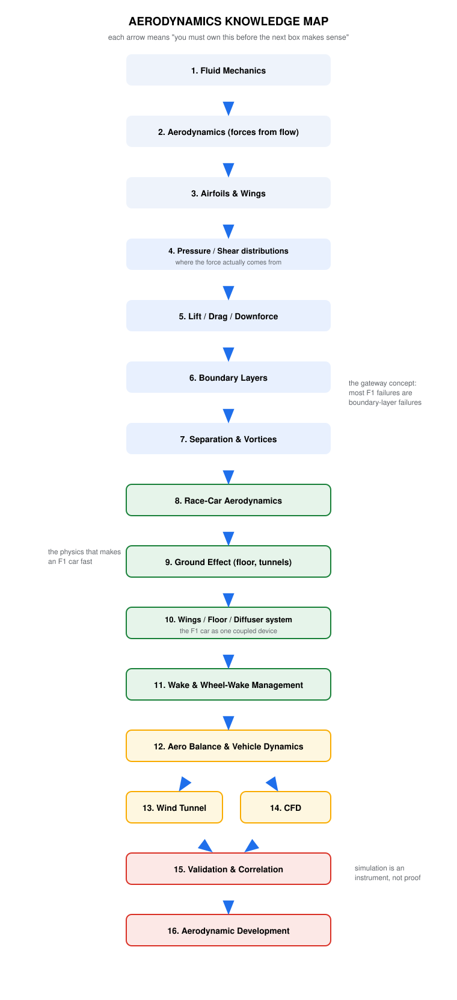
*Figure 16.1 — The full chain from fluid mechanics to aerodynamic development.*

## 16.1 The chain, in text

```text
Fluid Mechanics (ρ, p, T, μ; continuity; momentum; energy)
        ↓
Aerodynamics (force = ∮ pressure + shear over the surface)
        ↓
Airfoils & Wings (Cp distributions; camber; α; circulation)
        ↓
Pressure / Shear distributions (where force actually comes from)
        ↓
Lift / Drag / Downforce (coefficients; C_L A, C_D A; the polar)
        ↓
Boundary Layers (laminar vs turbulent; transition; Cf)
        ↓
Separation & Vortices (adverse gradients; stall; Γ; induced drag)
        ↓
Race-Car Aerodynamics (ground proximity; attitude; tyres; balance)
        ↓
Ground Effect (venturi tunnels; diffuser recovery; force map)
        ↓
Wings / Floor / Diffuser SYSTEM (exit conditions = inlet conditions)
        ↓
Wake & Wheel-Wake Management (outwash; sealing; dirty air)
        ↓
Aero Balance (CoP vs CG; balance maps; vehicle dynamics)
        ↓
Wind Tunnel  ──┬──  Validation & Correlation
CFD  ──────────┘
        ↓
Aerodynamic Development (hypothesis-driven loop; decisions)
```

## 16.2 The micro connection maps (cause chains)

These are the chains to be able to draw from memory — they appear throughout the handbook and are the fastest self-test of understanding.

**Speed chain**
```text
Velocity ↑  →  q = ½ρV² ↑  →  aero forces ↑ (∝V²)  →  tyre loading ↑
→  ride heights ↓ (springs compress)  →  floor force-map position moves
→  balance migrates rearward  →  handling changes with speed
```

**Ride-height chain (the one that explains porpoising)**
```text
Ride height ↓  →  tunnel area ↓  →  throat velocity ↑ (continuity)
→  throat Cp ↓ (momentum)  →  downforce ↑  →  springs compress further
→  (steep dF/dh: positive feedback)  →  choke/separation
→  downforce collapses  →  rebound  →  LIMIT CYCLE = porpoising
```

**Front-wing chain (the one that explains system coupling)**
```text
FW geometry change  →  outwash vortex path shifts
→  front-tyre wake lands elsewhere  →  floor fence inlet total pressure changes
→  tunnel mass flow changes  →  rear load & balance change
→  "a front-wing upgrade is a whole-car experiment"
```

**Drag trade chain**
```text
More wing load  →  induced drag ↑ (∝C_L²)  +  profile drag ↑
→  top speed ↓ (P ∝ V³)  →  straight-line time ↑
BUT  corner speeds ↑ (grip ∝ load, sub-linearly via tyre load sensitivity)
→  optimum = circuit-dependent purchase, not a maximum
```

**CFD trust chain**
```text
Physical problem → equations (N–S + turbulence model assumption)
→ discretisation + mesh (error budget) → convergence (monitors, not residuals)
→ post-processing (integrals + mechanism, not pictures)
→ validation ladder (tunnel → track) → decision
```

## 16.3 Prerequisite cross-reference

If you struggle with… …revisit:

| Symptom | Prerequisite to revisit |
|---|---|
| porpoising / force-map logic | Part I §1.7 continuity + Part II §2.5 separation |
| why slots work | Part II §2.5 (momentum injection into boundary layers) |
| induced drag | Part VI §6.2 (edge leakage → trailing vortices) |
| diffuser stalls | Part II §2.5 + Part V §5.3 (adverse gradient over expansion) |
| y⁺ discipline | Part II §2.5 + Part XII §12.6 (boundary-layer scaling) |
| balance travel | Part V §5.4–5.5 (force map) + Part X |
| why tunnel ≠ track | Part XI §11.2 (Reynolds mismatch) |
| "CFD says X" skepticism | Parts XII–XIV (error budget + interpretation) |

---

## SOURCES (Part XVI)

- Composite of the whole handbook's structure; no external sources beyond those cited in the respective parts.


---

# PART XVII — Final Engineering Checklist

## "Can I Actually Understand F1 Aerodynamics Yet?"

Work through this list honestly. For each item: ✅ (explain it aloud, in your own words, with the mechanism), ⚠️ (partially — review needed), ❌ (not yet). For any ❌/⚠️, the right column names the prerequisite to revisit. Rule of thumb: you are ready for LEVEL 3 work (development reasoning, Part XV) when nothing is ❌ and fewer than five are ⚠️.

| # | Can I… | Prerequisite if not |
|---|---|---|
| 1 | Explain where aerodynamic forces come from (both mechanisms, and how they relate)? | Part II §2.1 |
| 2 | Explain a pressure distribution and integrate it (mentally) into force? | Part II §2.2 |
| 3 | Explain the boundary layer, its two states, and what depletes its momentum? | Part I §1.11, Part II §2.5 |
| 4 | Explain separation, its signature in Cf and Cp, and reattachment? | Part II §2.5, Part XIV §14.1–14.6 |
| 5 | Explain lift correctly — and refute "equal transit time" and "fast air = low pressure" as causes? | Part II §2.1 misconceptions |
| 6 | Explain drag's full taxonomy with an F1 example of each? | Part VIII §8.1 |
| 7 | Explain downforce as a purchase (the polar) and why maximum ≠ optimal? | Part III §3.2, Part VII §7.4 |
| 8 | Explain ground effect's two mechanisms and keep them separate? | Part V §5.1 |
| 9 | Explain the diffuser's job as pressure recovery, and what "stalled diffuser" means? | Part V §5.3 |
| 10 | Explain vortex generation (four mechanisms), sealing, and breakdown? | Part VI §6.2–6.3 |
| 11 | Explain the wheel wake's documented structure and why it dominates the car's flow? | Part IX §9.2 |
| 12 | Explain aero balance, why it travels with speed, and its handling consequences? | Part X §10.1–10.2 |
| 13 | Explain ride-height sensitivity using the force map's three regimes? | Part V §5.4 |
| 14 | Explain porpoising as a feedback loop (dF/dh + suspension)? | Part V §5.6 |
| 15 | Explain the CFD workflow end-to-end (15 stages) and why each exists? | Part XIII §13.1 |
| 16 | Read Cp plots, Q-criterion, TKE and streamlines — with their "cannot tell you" limits? | Part XIV |
| 17 | Explain convergence properly (monitors vs residuals) and numerical diffusion? | Part XII §12.7 |
| 18 | Explain mesh quality, refinement strategy and y⁺ bands (incl. the forbidden zone)? | Part XII §12.4, §12.6 |
| 19 | Explain RANS/URANS/LES/DES at a conceptual level — cost vs what's resolved? | Part XII §12.5 |
| 20 | Distinguish simulation, verification, validation and correlation? | Part XII §12.8, Part XI |
| 21 | Reason about a drag/downforce trade-off for a named circuit, quantitatively? | Part VII §7.4, Part VIII mini-problem |
| 22 | Form an aerodynamic hypothesis that is a *flow* statement, not a part statement? | Part XV §15.1 |
| 23 | Design a basic CFD investigation (policy, monitors, deltas, validation ladder)? | Part XIII, Part XV §15.2 |
| 24 | Explain why the tunnel measures a model, and how Reynolds mismatch is handled? | Part XI §11.2 |
| 25 | Explain the 2022 regulation philosophy (wake quality) and what it changed mechanically? | Part IV, Part VI §6.4, Part XV §15.3 |

---

## Scoring guide

- **All ✅ / few ⚠️:** you have the conceptual backbone the course will now fill with detail and practice. Move to working the mini-problems *without* looking at solutions, and start reading real Cp/Q-criterion figures (Part XIV checklist in hand).
- **⚠️ cluster in 1–14 (physics):** the fix is Parts I–II, slowly, with the misconception boxes — everything downstream is downstream for a reason.
- **⚠️ cluster in 15–23 (CFD/development):** the fix is Parts XII–XIV discipline; re-derive the y⁺ mini-problem and the convergence criteria until they're reflexes.
- **❌ anywhere:** revisit the named prerequisite *before* the part that depends on it (dependency table in Part XVI §16.3) — sequence matters more than speed.

## The one-paragraph final exam

If you can write this paragraph, with every clause defensible, you have what this handbook was built to give you:

> "An F1 car generates force by redistributing pressure over its surfaces (and paying skin friction), in a flow field constrained by a moving ground and contaminated by four rotating wheels' wakes. Its dominant device is a venturi underbody whose load depends on ride height through a non-monotonic force map, recovered by a diffuser, sealed by vortices, and coupled through suspension to vehicle dynamics — which is why balance travels with speed and why porpoising exists. Wings add load at induced-drag cost, so every setup is a circuit-specific purchase on the drag polar. Development is a hypothesis loop run across CFD, tunnel and track — three instruments, none of which is truth alone, ranked by how honestly their errors are known."

---

## SOURCES (Part XVII)

- Composite self-assessment; maps directly onto Parts I–XV.


---

# PART XVIII — Engineering Audit

The final audit required by the handbook's method: where the evidence is strong, where it is weak, where public information is incomplete, and what to verify yourself. Honesty here is the difference between a reference and a rumor-mill.

## 18.1 Verification status by claim class

**✅ VERIFIED (checked against primary/reputable sources during construction)**

- Ground-effect force behaviour vs ride height: enhancement regime, peak near $h/c \approx 0.08$–0.1, force loss below ~0.1, abrupt double-element discontinuity at $h/c \approx 0.17$–0.24 (Zerihan & Zhang 2000, *J. Aircraft* 37(6); Zhang & Zerihan 2003, *AIAA J.* 41(6); Ranzenbach & Barlow AIAA 95-1909 / SAE 942509) — DOIs in bibliography.
- The canonical review: Zhang, Toet & Zerihan, *Applied Mechanics Reviews* 59(1), 2006.
- Rotating-wheel flow structure (CVP, jetting, upwash, rotation effects incl. ~10%+ drag reduction vs stationary): Mears/Dominy/Sims-Williams SAE 2002-01-3290; Axerio-Cilies & Iaccarino *ASME JFE* 134(12), 2012; McManus & Zhang 2006.
- All textbook citations (editions/years/publishers): Katz 1995; McBeath 3rd ed. 2015; Hucho 4th ed. 1998; Barnard 2nd ed. 2001; Anderson 6th ed. 2017; Versteeg & Malalasekera 2007; Ferziger & Perić 2002; Barlow/Rae/Pope 3rd ed. 1999; Milliken & Milliken 1995.
- CFD canon: Menter 1994 (*AIAA J.* 32(8), pp. 1598–1605); Spalart–Allmaras (AIAA 92-0439; *La Recherche Aérospatiale* (1), 1994); Celik et al. 2008 (*ASME JFE* 130(7)) — the GCI procedure.
- y⁺ bands (≈1 wall-resolved; 30–300 wall functions; 5–30 uncovered): CFD-Online wiki pages, fetched directly.
- Toet (2013), *The Aeronautical Journal* 117(1187) — citation and scope verified.
- Porpoising mechanism literature: Gadola et al., *Energies* 15(18):6677, 2022; Kutz et al., arXiv:2211.11748 (heaving-wing normal-form analysis).
- DRS aerodynamic magnitudes at wing level (~50–80% wing-drag cut): Loução et al., *Fluids* 7(9):309, 2022; Monash DRS studies (partially verified).

**⚠️ PUBLICLY CIRCULATED, VERIFICATION PENDING (regulation specifics)**

*A dedicated regulation-verification pass was attempted but could not be completed within this build (source-check quota exhausted). The following figures are widely reported in reputable technical media and FIA communications, and are used in this handbook with explicit "verify" flags. Before relying on any of them in your own work, confirm against the current FIA documents:*

- DRS open-flap gap dimension (85 mm class) and current sporting-regulation usage detail (detection gap, zone rules).
- The FIA's 2022 wake figures ("~46% following-car downforce loss for the previous cars vs ~18% target/achieved at ~1 car length") — exact wording, distance and attribution vary between retellings; treat as order-of-magnitude until read in an FIA document.
- 2022 Technical Directive on aerodynamic oscillation (metric, measurement location, threshold) and the 2023 geometry changes (floor-edge raise ~15 mm class, diffuser/plank adjustments) — direction and intent are well documented; exact millimetres should be read from the regs.
- 2022 front-wing element count, floor-fence count, tunnel-count specifics.
- Aerodynamic Testing Restrictions current numbers (occupancy hours/runs, CFD tokens) — mechanism (sliding scale by championship position) is stable and documented; the numbers are revised periodically.
- Minimum weight (~800 kg class) and dimensions of the current cars.
- 2026 active-aero specifics (modes, actuation rules) — direction documented in FIA communications; detail still settling as of this handbook's construction.

**🏷️ ENGINEERING INFERENCE / TEACHING CONSTRUCTION (labelled as such in-text)**

- All numeric "orders of magnitude" for car-level $C_L A$ (3.5–5 m²), $C_D A$ (1.0–1.7 m²), L/D ≈ 2.5–3.5, component drag shares, aero-balance ranges (mid-40s % front), downforce-equals-weight speed (~180–210 km/h): consistent with public technical discussion, but *no team publishes these*. Use as calibration for scale, never as data.
- The four Part XV §15.2 case studies: constructed composites demonstrating the method; not accounts of any team's actual programme.
- All figure curves (venturi, Cp shapes, force map, polar, balance-vs-speed, convergence): illustrative shapes drawn to depict correct physics, annotated as such on each figure.
- The "typical" mesh sizes (tens–hundreds of millions of cells) and OpenFOAM-derived toolchain claims: public statements by engineers over the years; qualitative only.

## 18.2 Known simplifications (and why they're acceptable here)

1. **Bernoulli used pedagogically, not causally** — the handbook repeatedly separates bookkeeping from mechanism; some course material will blur this (flag it when you meet it).
2. **1-D streamtube model of the floor** (Part V): the real tunnel is strongly 3-D with edge leakage; the model is for mechanism, not prediction.
3. **Flat-plate boundary-layer estimates** (y⁺ mini-problem): real wings have pressure gradients; treat the 5 µm answer as an order-of-magnitude design input.
4. **Steady-RANS framing dominates Parts XII–XIV** because it dominates industry practice; LES/DES get conceptual treatment only. A dedicated turbulence-modeling course is the next step if that's your direction.
5. **Tyre modelling**: tyre load sensitivity is introduced as a fact of tyre mechanics without its physical derivation (rubber friction physics) — a whole subject of its own (Pacejka).
6. **Cooling-flow thermodynamics** simplified to momentum bookkeeping; real cooling design couples heat exchangers, pumps and power-unit efficiency.
7. **Vehicle dynamics** reduced to load transfer and balance; full treatment is Milliken & Milliken's book.

## 18.3 Where sources disagree (and what this handbook did)

- **"Ground effect = the air speeds up"** vs the momentum/continuity account: resolved in favour of the causal account throughout (Part I §1.8, Part V §5.1) — this is the academic consensus position.
- **Vortex "sealing" language**: between the paddock's confident shorthand and the literature's careful "leakage limitation", the handbook keeps the shorthand but defines it precisely (Part VI §6.3).
- **Porpoising attributions** (2022 season): press narratives variously blamed stiff suspensions, floor concepts or tyres; the peer-reviewed mechanism (aerodynamic negative damping via the force map) is what Part V teaches — suspension choices modulate, the map decides.
- **L/D and force-multiple figures** vary across public sources by setup and era; ranges, never point values, are quoted.

## 18.4 Recommended next steps (study plan)

1. **Verify the pending regulation items** directly in the FIA documents (fia.com → regulations; change logs per season). One focused evening closes the whole ⚠️ list above.
2. **Pair this handbook with your course**, annotating each part's *Course connection* line as you reach the matching module.
3. **Work a real geometry**: a simplified open-wheel body in OpenFOAM (or similar) at 3 attitudes × 2 yaw angles, applying Parts XII–XIV discipline end-to-end — the single highest-value exercise in this guide.
4. **Read one paper properly**: Zerihan & Zhang (2000) start-to-finish with the handbook open at Part V. Then Zhang/Toet/Zerihan (2006) as the survey.
5. **Follow one season's technical press** (Racecar Engineering, Autosport technical, Motorsport Magazine) with Part IV/XV as your decoder ring — and note which claims your handbook lets you now question.

## 18.5 Contradiction and consistency checks performed

- Cross-part terminology audit: Cp conventions (inverted-y axis for Cp plots flagged), downforce sign conventions, $C_L A$ vs $C_L$ usage — consistent as defined in README §6.
- Figure/text consistency: every figure's caption matches the mechanism described in its part; illustrative-figure status marked on each.
- Number audit: mini-problem arithmetic re-checked (dynamic pressure, Re, y⁺, power/drag examples).
- Citation audit: all Tier-1 citations above carry verified DOIs or publication details from the source-checking pass.

---

*This audit is itself versioned by the handbook's date of construction (September 2026); regulations and team practices move — treat the ⚠️ list as your personal verification queue.*


---

# Appendix A — Notation and Units

SI throughout. Vectors in bold or with arrows. Dimensionless quantities marked (—).

## Latin symbols

| Symbol | Quantity | Units | First met |
|---|---|---|---|
| $A$ | reference area / area | m² | Part I |
| $AR$ | aspect ratio, $b^2/S$ | — | Part VII |
| $a$ | speed of sound, $\sqrt{\gamma RT}$ | m/s | Part I |
| $b$ | span | m | Part VII |
| $C_D$, $C_L$ | drag / lift coefficient | — | Part II |
| $C_D A$, $C_L A$ | drag area / downforce area | m² | Part II |
| $C_f$ | skin-friction coefficient, $\tau_w/q$ | — | Part II |
| $C_M$ | moment coefficient | — | Part II |
| $C_p$ | pressure coefficient, $(p-p_\infty)/q_\infty$ | — | Part II |
| $c$ | chord | m | Part II |
| $D$ | drag force | N | Part II |
| $e$ | span efficiency factor | — | Part VII |
| $F$ | force | N | Part I |
| $g$ | gravitational acceleration (9.81) | m/s² | Part I |
| $h$ | ride height (also $h/c$ ride-height ratio) | m (—) | Part V |
| $k$ | turbulent kinetic energy | m²/s² | Part XII |
| $L$ (lift) / $L$ (length) | lift force / characteristic length | N, m | context |
| $l'$ | lift per unit span | N/m | Part II |
| $Ma$ | Mach number, $V/a$ | — | Part I |
| $\dot m$ | mass flow rate, $\rho A V$ | kg/s | Part V |
| $N$ | normal load (tyre) | N | Part III |
| $P$ | power | W | Part VIII |
| $p$ | static pressure | Pa | Part I |
| $p_0$ | stagnation (total) pressure | Pa | Part I |
| $q$ | dynamic pressure, $\tfrac12\rho V^2$ | Pa | Part I |
| $Re$ | Reynolds number, $\rho VL/\mu = VL/\nu$ | — | Part I |
| $S$ | planform / reference area | m² | Part II |
| $T$ | temperature | K | Part I |
| $u_\tau$ | friction velocity, $\sqrt{\tau_w/\rho}$ | m/s | Part XII |
| $V$, $\vec V$ | velocity (field) | m/s | Part I |
| $y$ | wall-normal distance | m | Part XII |
| $y^+$ | wall distance in wall units, $y u_\tau/\nu$ | — | Part XII |

## Greek symbols

| Symbol | Quantity | Units |
|---|---|---|
| $\alpha$ | angle of attack | rad (deg) |
| $\Gamma$ | circulation, $\oint \vec V\cdot d\vec l$ | m²/s |
| $\gamma$ | ratio of specific heats (1.4 air) | — |
| $\delta$ ($\delta_{99}$) | boundary-layer thickness | m |
| $\mu$ | dynamic viscosity | Pa·s |
| $\nu$ | kinematic viscosity, $\mu/\rho$ | m²/s |
| $\omega$ (vorticity) / $\omega$ (turb. model) | $\nabla\times\vec V$ / specific dissipation | 1/s, 1/s |
| $\rho$ | density | kg/m³ |
| $\tau$ | shear stress | Pa |
| $\tau_w$ | wall shear stress | Pa |

## Handy constants (ISA sea level, 15 °C)

- $\rho = 1.225$ kg/m³; $p = 101{,}325$ Pa; $T = 288.15$ K
- $\mu \approx 1.79\times10^{-5}$ Pa·s; $\nu \approx 1.46\times10^{-5}$ m²/s
- $a \approx 340$ m/s; $R_{air} = 287$ J/(kg·K)

## Conventions used in this handbook

- **Downforce positive-down**; where an aviation sign convention is inherited (e.g., $C_L$), the text says so.
- **Cp plots inverted y-axis** (suction up) per aerodynamic convention — flagged on each figure.
- Speeds quoted in km/h with m/s in parentheses in worked problems.
- "≈" for engineering estimates; "order of" for magnitudes; explicit flags (estimate / inference / verify) per README §5.


---

# Appendix B — Formula Sheet

One page, in dependency order. Assumptions stated compactly — an equation without its assumptions is a trap.

## Fluid mechanics

| # | Relation | Assumptions / notes |
|---|---|---|
| F1 | $\rho = m/V$; $p=\rho RT$ | ideal gas |
| F2 | $q = \tfrac12\rho V^2$ | definition — "the currency" |
| F3 | $p_0 = p + q$ | incompressible; along streamline, no loss |
| F4 | $A_1V_1 = A_2V_2$ | steady, incompressible streamtube |
| F5 | $p + \tfrac12\rho V^2 + \rho gz = $ const | steady, incompressible, inviscid, along streamline (z negligible in air) |
| F6 | $Re = VL/\nu$ | dynamic similarity |
| F7 | $Ma = V/a$, $a=\sqrt{\gamma RT}$ | incompressible OK for $Ma \lesssim 0.3$ |
| F8 | $\tau = \mu\,\partial u/\partial y$; no-slip at walls | Newtonian fluid |

## Force generation

| # | Relation | Assumptions / notes |
|---|---|---|
| F9 | $\vec F = \oint_S(-p\vec n + \vec\tau)\,dS$ | the only two mechanisms |
| F10 | $C_p=(p-p_\infty)/q_\infty$ | stagnation $=+1$ |
| F11 | $C_L = L/(qS)$; $C_D = D/(qS)$; F1 quotes $C_LA$, $C_DA$ [m²] | reference-area convention |
| F12 | $c_l = 2\pi(\alpha-\alpha_{L0})$ | thin-airfoil, incompressible, small α |
| F13 | $L' = \rho V_\infty\Gamma$ | Kutta–Joukowski, 2-D |
| F14 | $C_{D,i} = C_L^2/(\pi e\, AR)$ | lifting-line; low AR hurts (F1!) |
| F15 | $AR = b^2/S$ | — |

## Ground effect / underbody

| # | Relation | Assumptions / notes |
|---|---|---|
| G1 | $\dot m = \rho A V$ through inlet/throat/exit | 1-D streamtube model |
| G2 | suction $\Delta p \approx q_\infty\,|C_{p,min}|$ at throat | ideal; BL reduces it |
| G3 | force map: $F(h/c)$ rises → peaks (~0.08–0.1) → falls (choke) | measured (Z&Z 2000; R&B) |
| G4 | stability: flat/positive $dF/dh$ at operating point | porpoising criterion (Part V) |

## Vehicle / balance

| # | Relation | Assumptions / notes |
|---|---|---|
| V1 | $a_{y,max} \approx \mu(mg + qC_LA)/m$ | grip from load; μ sub-linear in reality (load sensitivity) |
| V2 | $\%front = F_{DF,front}/(F_{DF,front}+F_{DF,rear})$ | aero balance |
| V3 | $D = q\,C_DA$; $P = D\cdot V \propto V^3$ | the top-speed law |
| V4 | $\Delta V/V = (\Delta C_DA / C_DA)\cdot(-1/3)$ at fixed P | 2% drag cut ≈ +0.7% speed |

## Turbulence / CFD

| # | Relation | Assumptions / notes |
|---|---|---|
| C1 | N–S: $\rho\partial_t\vec V + \rho(\vec V\cdot\nabla)\vec V = -\nabla p + \mu\nabla^2\vec V + \vec f$ | incompressible, Newtonian, constant μ |
| C2 | $y^+ = y u_\tau/\nu$; $u_\tau=\sqrt{\tau_w/\rho}$ | targets: ~1 resolved; 30–300 wall-fn; **5–30 forbidden** |
| C3 | $C_f \approx 0.664/\sqrt{Re_x}$ (lam) / $\approx 0.059\,Re_x^{-1/5}$ (turb) | flat plate — for estimates |
| C4 | $\delta \approx 5x/\sqrt{Re_x}$ (lam) / $\approx 0.37x\,Re_x^{-1/5}$ (turb) | flat plate |
| C5 | GCI per Celik et al. (2008) | mesh-uncertainty reporting |
| C6 | convergence = flat force monitors (+ low residuals), at matched policy | Part XII |

## Numbers worth memorising

- $\rho = 1.225$ kg/m³ (ISA SL); $\nu = 1.46\times10^{-5}$ m²/s; $a ≈ 340$ m/s.
- $q$ at 300 km/h ≈ 4.25 kPa.
- $Re$ (0.25 m chord, 80 m/s) ≈ 1.4×10⁶.
- F1 car class: $C_LA ≈ 3.5$–5 m²; $C_DA ≈ 1.0$–1.7 m²; L/D ≈ 2.5–3.5 (public estimates).
- Downforce ≈ weight at ~180–210 km/h (setup-dependent).
- Wall-resolved first cell at F1 speeds: **~5 µm** (the reason wall functions exist).


---

# Bibliography

Sources used in constructing this handbook, with what each was used for. Confidence tiers per README §7. Items marked ⚠️ were not re-verifiable during construction — see Engineering Audit §18.1.

## Peer-reviewed papers [Tier 1]

- **Zerihan, J. & Zhang, X.** (2000). "Aerodynamics of a Single Element Wing in Ground Effect." *Journal of Aircraft* 37(6), pp. 1058–1064. DOI: 10.2514/2.2711.
  *Used for:* wing-in-ground-effect force behaviour vs ride height; enhancement/loss regimes; tip-vortex breakdown threshold (Parts V, VII).
- **Zhang, X. & Zerihan, J.** (2003). "Aerodynamics of a Double-Element Wing in Ground Effect." *AIAA Journal* 41(6), pp. 1007–1016. DOI: 10.2514/2.2057.
  *Used for:* multi-element ground-effect loads; abrupt load discontinuity via tip-vortex breakdown; flap load share (15–25%) (Parts V, VII).
- **Zhang, X., Toet, W. & Zerihan, J.** (2006). "Ground Effect Aerodynamics of Race Cars." *Applied Mechanics Reviews* 59(1), pp. 33–49. DOI: 10.1115/1.2110263.
  *Used for:* the canonical survey — underbody, diffusers, wheels, moving-ground testing (Parts V, IX, XI).
- **Ranzenbach, R. & Barlow, J.** (1994). "Two-Dimensional Airfoil in Ground Effect, An Experimental and Computational Study." SAE 942509; and (1996) "Cambered Airfoil in Ground Effect — Wind Tunnel and Road Conditions." AIAA 95-1909.
  *Used for:* low-clearance force loss via under-wing throttling (Part V).
- **Mears, A., Dominy, R. & Sims-Williams, D.** (2002). "The Air Flow About an Exposed Racing Wheel." SAE 2002-01-3290. DOI: 10.4271/2002-01-3290.
  *Used for:* isolated-wheel wake structure, jetting (Part IX).
- **Axerio-Cilies, J. & Iaccarino, G.** (2012). "An Aerodynamic Investigation of an Isolated Rotating Formula 1 Wheel Assembly." *ASME Journal of Fluids Engineering* 134(12), 121101.
  *Used for:* rotating vs stationary wheel flow; wake structure; rotation force effects (Part IX).
- **McManus, J. & Zhang, X.** (2006). "A Computational Study of the Flow Around an Isolated Wheel in Contact with the Ground." *ASME J. Fluids Eng.* 128(4).
  *Used for:* wheel-wake vortical structure (Part IX).
- **Knowles, R. et al.** (2013). "On the near wake of a Formula One front wheel." *Proc. IMechE Part D*. DOI: 10.1177/0954407013491903.
  *Used for:* front-wheel wake detail (Part IX).
- **Toet, W.** (2013). "Aerodynamics and aerodynamic research in Formula 1." *The Aeronautical Journal* 117(1187). DOI: 10.1017/S0001924000007739.
  *Used for:* F1 aero development practice, tool roles, component system behaviour (Parts II, IV–VI, VIII, XI, XIII, XV).
- **Menter, F. R.** (1994). "Two-Equation Eddy-Viscosity Turbulence Models for Engineering Applications." *AIAA Journal* 32(8), pp. 1598–1605. DOI: 10.2514/3.12149.
  *Used for:* SST turbulence model rationale (Part XII).
- **Spalart, P. R. & Allmaras, S. R.** (1992/1994). "A One-Equation Turbulence Model for Aerodynamic Flows." AIAA 92-0439; *La Recherche Aérospatiale* (1), 1994, pp. 5–21.
  *Used for:* SA model context (Part XII).
- **Celik, I. B., Ghia, U., Roache, P. J. & Freitas, C. J.** (2008). "Procedure for Estimation and Reporting of Uncertainty Due to Discretization in CFD Applications." *ASME J. Fluids Engineering* 130(7), 078001. DOI: 10.1115/1.2960953.
  *Used for:* GCI / mesh-independence procedure (Parts XII, XIII).
- **Jeong, J. & Hussain, F.** (1995). "On the identification of a vortex." *J. Fluid Mechanics* 285, pp. 69–94.
  *Used for:* Q-criterion basis and caveats (Part XIV).
- **Gadola, M., Chindromo, D., Magri, P. & Sandrini, G.** (2022). "Analyzing Porpoising on High Downforce Race Cars: Causes and Possible Setup Adjustments to Avoid It." *Energies* 15(18), 6677. DOI: 10.3390/en15186677.
  *Used for:* porpoising instability mechanism and setup mitigations (Part V).
- **Kutz, J. N. et al.** (2022). "Universal Dynamics of Damped-Driven Systems…" arXiv:2211.11748.
  *Used for:* porpoising as a normal-form instability (Part V).
- **Loução, R. et al.** (2022). "Aerodynamic Study of a Drag Reduction System and Its Actuation Effect on the Aerodynamic Balance of a Formula Student Vehicle." *Fluids* 7(9), 309.
  *Used for:* DRS magnitude context (wing-level CD cut ~78% class) (Part VII).
- **Babinsky, H.** (2003). "How do wings work?" *Physics Education* 38, pp. 497–503.
  *Used for:* lift-mechanism corrections (Part II misconceptions).

## Textbooks [Tier 1]

- **Anderson, J. D.** (2017). *Fundamentals of Aerodynamics.* 6th ed., McGraw-Hill. — fluid mechanics, airfoil/finite-wing theory, boundary layers (Parts I–II, VI–VII).
- **Anderson, J. D.** (1995). *CFD: The Basics with Applications.* McGraw-Hill. — first-principles CFD (Part XII).
- **Katz, J.** (1995). *Race Car Aerodynamics: Designing for Speed.* Bentley Publishers. — race-car aerodynamics throughout (Parts III–XI).
- **Hucho, W.-H. (ed.)** (1998). *Aerodynamics of Road Vehicles.* 4th ed., SAE International. — vehicle drag decomposition, cooling drag, wheels (Parts III, VIII–IX).
- **Barnard, R. H.** (2001). *Road Vehicle Aerodynamic Design.* 2nd ed., MechAero Publishing. — vehicle vs aircraft framing (Part III).
- **McBeath, S.** (2015). *Competition Car Aerodynamics.* 3rd ed., Veloce Publishing. — practical wing/setup/floor development (Parts II, IV, VII, X).
- **Versteeg, H. K. & Malalasekera, W.** (2007). *An Introduction to Computational Fluid Dynamics: The Finite Volume Method.* 2nd ed., Pearson. — FVM, discretisation, solving (Parts XII–XIII).
- **Ferziger, J. H. & Perić, M.** (2002). *Computational Methods for Fluid Dynamics.* 3rd rev. ed., Springer. — numerics, error estimation (Parts XII–XIV).
- **Barlow, J. B., Rae, W. H. & Pope, A.** (1999). *Low-Speed Wind Tunnel Testing.* 3rd ed., Wiley. — tunnel practice, corrections, instrumentation (Part XI).
- **Milliken, W. F. & Milliken, D. L.** (1995). *Race Car Vehicle Dynamics.* SAE. — load transfer, balance, tyre load sensitivity (Part X).
- **Saffman, P. G.** (1992). *Vortex Dynamics.* Cambridge University Press. — vortex physics depth-reference (Part VI).

## Regulations & official material [Tier 1 — specifics flagged ⚠️ pending direct re-verification]

- **FIA Formula 1 Technical Regulations** (current edition, fia.com) — geometry, wings, floor/diffuser, DRS aperture, wheels (Parts IV–VII).
- **FIA Formula 1 Sporting Regulations** — DRS usage rules (Part IV).
- **FIA Aerodynamic Testing Restrictions** — sliding-scale mechanism (Parts XI, XV).
- **FIA 2022 regulation announcements/technical presentations** — wake-reduction rationale and figures (~46%→~18% class; wording to verify) (Parts IV, VI, IX, XV).
- **FIA Technical Directive on aerodynamic oscillation (2022) and 2023 floor geometry changes** — porpoising governance (Part V).

## Technical press & practice [Tier 2]

- **Racecar Engineering**; **Autosport** (technical, incl. G. Piola); **Motorsport Magazine**; **J. Boxall-Legge / C. Scarborough technical analysis** — component development narratives, aero-rake usage, 2017–2026 evolution (Parts IV, XI, XV).
- **CFD-Online Wiki** — "Y plus wall distance estimation"; "Near wall treatment for k-omega models" (fetched; y⁺ bands) (Part XII).
- **Wordley/Monash DRS studies** (partial verification) — DRS magnitude context (Part VII).
- **Public team/engineering talks on F1 CFD practice** (mesh scales, toolchains) — qualitative context (Part XIII).

## Constructed content (not sources — labelled in-text)

- All illustrative figure curves (see each figure's annotation).
- Part XV §15.2 case studies (teaching composites).
- All order-of-magnitude car-level numbers ($C_L A$, $C_D A$, L/D, balance %, speeds) — public-domain calibration ranges, engineering inference.
